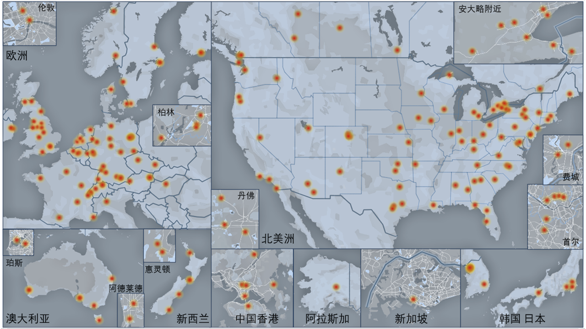

# GIS-Info院校指南

**(更新时间 2023 年 11 月)**

此网站已迁移至  [gisphere.info/school](https://gisphere.info/school) 

请访问新地址获取最新信息，本页面内容不再维护

**(更新时间 2022 年 12 月)**

本站地址：[GIS-Info.github.io](https://gis-info.github.io/)

GitHub文档地址：[https://github.com/GIS-Info/GIS-Info.github.io](https://github.com/GIS-Info/GIS-Info.github.io)

联系我们：[作者名单（网页版）](https://gis-info.github.io/pages/about)，[作者名单（文档版）](https://github.com/GIS-Info/GIS-Info.github.io/blob/master/pages/about.md)

## 项目介绍

本项目2019年9月发起成立，最新更新时间为2022年12月，目的是提供及时且全面的GIS留学选校信息。院校信息的提供人来自世界各地GIS专业名校，均为在读学生、近期毕业校友或青年教师，内容主要包括各院系的主打科研方向、开设学位和导师信息。希望这份指南能为GIS专业有留学意向的朋友们提供帮助和支持。

由于时间和精力所限，难免有疏漏。若有更正、建议和补充，欢迎[在这里留言](https://github.com/GIS-Info/GIS-Info.github.io/issues)。如果喜欢的话，欢迎大家支持，分享，点赞，star[本项目](https://github.com/GIS-Info/GIS-Info.github.io/)！

本文仅供参考，未来会长期更新，欢迎更多的有志者一同参与和维护这个项目，未来会不断添加和更新相关的资料。更全面的信息也可以关注[AAG Geography Program](http://www.aag.org/guide)。

**在此特别感谢[所有作者](https://github.com/GIS-Info/GIS-Info.github.io/blob/master/pages/about.md)的辛苦付出！**

## 社区
为了方便大家交流，我们组织了两个微信群，欢迎大家按需加入讨论。一个是**GISpace海外留学群**，主要针对有意向出国出境留学的GIS相关专业同学；另一个是**GISpace海外志愿者和交流群**（目前为邀请制，需验证真实身份，请联系作者），为GIS及相关专业的海外学者和学生提供交流平台。

**GISpace海外留学群**的入群方式：
- 因为群里人数较多，需要管理员手动发送邀请链接。
- 请扫下方的二维码，关注我们的**GISphere**公众号，并在后台留言“留学群”，可添加管理员好友并获得入群邀请链接。

本文档中各个学校顺序不分先后,如果需要了解学校的综合排名等情况，请查询[Times](https://www.timeshighereducation.com/world-university-rankings), [QS](https://www.topuniversities.com/qs-world-university-rankings), [USNews](https://www.usnews.com/education/best-global-universities/rankings), [ARWU](http://www.shanghairanking.com/)等大学排名以及各个大学的官网。

## 版权

本文档遵循CC BY-NC 4.0许可，如需**非商业转载**或**修改**，请给出署名；**商业转载** 请务必联系作者获得授权。

 This work is licensed under a <a rel="license" href="http://creativecommons.org/licenses/by-nc/4.0/">Creative Commons Attribution-NonCommercial 4.0 International License</a>.

## 目录
因篇幅所限，并且GIS由于其交叉性学科的特点，我们难以涵盖所有境外学校的GIS项目。本指南包含以下学校：

北美洲82所：[美国67所](#美国)，[加拿大15所](#加拿大)

亚洲18所：[中国香港6所](#中国香港特区)，[新加坡1所](#新加坡)，[韩国7所](#韩国)，[日本4所](#日本)

大洋洲12所：[澳大利亚7所](#澳大利亚)，[新西兰5所](#新西兰)

欧洲73所：[英国13所](#英国)，[德国20所](#德国)，[荷兰5所](#荷兰)，[瑞士6所](#瑞士)，[瑞典5所](#瑞典)，[挪威2所](#挪威)，[芬兰2所](#芬兰)，[丹麦2所](#丹麦)，[奥地利3所](#奥地利)，[比利时3所](#比利时)，[意大利1所](#意大利)，[爱尔兰2所](#爱尔兰)，[法国6所](#法国)，[捷克2所](#捷克)，[匈牙利1所](#匈牙利)

_地图暂未包括2020年12月15日以后添加的学校_

#### 美国

_因隐私问题，美国学校的导师信息暂缺，请查看院系的官网链接，或加入我们组建的海外留学群共同交流。_

- [丹佛大学 (DU)](#丹佛大学)
- [乔治梅森大学 (GMU)](#乔治梅森大学)
- [亚利桑那大学 (UAZ)](#亚利桑那大学)
- [亚利桑那州立大学 (ASU)](#亚利桑那州立大学)
- [亚拉巴马大学 (UA)](#亚拉巴马大学)
- [伊利诺伊大学香槟分校 (UIUC)](#伊利诺伊大学香槟分校)
- [佐治亚大学 (UGA)](#佐治亚大学)
- [佐治亚理工学院 (Ga Tech)](#佐治亚理工学院)
- [佛罗里达大学 (UFL)](#佛罗里达大学)
- [佛罗里达州立大学 (FSU)](#佛罗里达州立大学)
- [南佛罗里达大学 (USF)](#南佛罗里达大学)
- [俄亥俄州立大学 (OSU)](#俄亥俄州立大学)
- [俄克拉荷马大学 (OU)](#俄克拉荷马大学)
- [俄克拉荷马州立大学 (Ok State)](#俄克拉荷马州立大学)
- [俄勒冈大学 (Oregon)](#俄勒冈大学)
- [俄勒冈州立大学 (Oregon State)](#俄勒冈州立大学)
- [克拉克大学 (Clark)](#克拉克大学)
- [内华达大学 (Nevada)](#内华达大学)
- [内布拉斯加大学林肯分校 (UNL)](#内布拉斯加大学林肯分校)
- [加州大学伯克利分校 (Berkeley)](#加州大学伯克利分校)
- [加州大学圣巴巴拉分校 (UCSB)](#加州大学圣巴巴拉分校)
- [北卡罗来纳大学 (UNC)](#北卡罗来纳大学教堂山分校)
- [北卡罗来纳州立大学 (NC State)](#北卡罗来纳州立大学)
- [华盛顿大学 (UW)](#华盛顿大学)
- [南加州大学 (USC)](#南加州大学)
- [南卡罗来纳大学 (SC)](#南卡罗来纳大学)
- [印第安纳大学 (IUB)](#印第安纳大学)
- [圣迭戈州立大学 (SDSU)](#圣迭戈州立大学)
- [堪萨斯大学 (KU)](#堪萨斯大学)
- [天普大学 (Temple)](#天普大学)
- [奥本大学 (Auburn)](#奥本大学)
- [威斯康辛大学麦迪逊分校 (Wisc)](#威斯康辛大学麦迪逊分校)
- [宾夕法尼亚大学 (UPenn)](#宾夕法尼亚大学)
- [宾夕法尼亚州立大学 (PSU)](#宾夕法尼亚州立大学)
- [密歇根大学 (UMich)](#密歇根大学)
- [密歇根州立大学 (MSU)](#密歇根州立大学)
- [密歇根理工大学 (MTU)](#密歇根理工大学)
- [康奈尔大学 (Cornell)](#康奈尔大学)
- [康涅狄格大学 (UConn)](#康涅狄格大学)
- [弗吉尼亚理工大学 (VT)](#弗吉尼亚理工大学)
- [德克萨斯农工大学 (TAMU)](#德克萨斯农工大学)
- [德克萨斯大学奥斯汀分校 (UT Austin)](#德克萨斯大学奥斯汀分校)
- [德克萨斯大学达拉斯分校 (UT Dallas)](#德克萨斯大学达拉斯分校)
- [德克萨斯州立大学 (Texas State)](#德克萨斯州立大学)
- [新墨西哥大学 (UNM)](#新墨西哥大学)
- [明尼苏达大学双城分校 (UMN)](#明尼苏达大学双城分校)
- [爱达荷大学 (Idaho)](#爱达荷大学)
- [爱荷华大学 (UI)](#爱荷华大学)
- [爱荷华州立大学 (ISU)](#爱荷华州立大学)
- [犹他大学 (Utah)](#犹他大学)
- [田纳西大学 (UTK)](#田纳西大学)
- [科罗拉多大学 (CU Boulder)](#科罗拉多大学波尔德分校)
- [科罗拉多矿业学校 (Mines)](#科罗拉多矿业学校)
- [纽约城市大学 (CUNY)](#纽约城市大学研究生中心)
- [纽约州立大学奥尔巴尼分校 (UAlbany)](#纽约州立大学奥尔巴尼分校) <!-- - [纽约州立大学宾厄姆顿分校 (Binghamton)](#纽约州立大学宾厄姆顿分校) -->
- [纽约州立大学水牛城分校 (UB)](#纽约州立大学水牛城分校)
- [缅因大学 (Maine)](#缅因大学)
- [肯塔基大学 (UKY)](#肯塔基大学)
- [肯特州立大学 (Kent State)](#肯特州立大学)
- [西弗吉尼亚大学 (WVU)](#西弗吉尼亚大学)
- [路易斯安纳州立大学 (LSU)](#路易斯安纳州立大学)
- [辛辛那提大学 (Cincinnati)](#辛辛那提大学)
- [阿拉斯加大学 (UAF)](#阿拉斯加大学费尔班克斯分校)
- [阿肯色大学 (UARK)](#阿肯色大学)
- [雪城大学 (Syracuse)](#雪城大学)
- [马里兰大学 (UMD)](#马里兰大学)
- [普渡大学 (Purdue)](#普渡大学)

#### 加拿大
- [不列颠哥伦比亚大学 (UBC)](#不列颠哥伦比亚大学)
- [卡尔加里大学 (Calgary)](#卡尔加里大学)
- [圭尔夫大学 (Guelph)](#圭尔夫大学)
- [多伦多大学 (UToronto)](#多伦多大学)
- [布洛克大学 (Brock)](#布洛克大学)
- [滑铁卢大学 (UWaterloo)](#滑铁卢大学)
- [约克大学 (York)](#约克大学)
- [维多利亚大学 (UVic)](#维多利亚大学)
- [萨斯喀彻温大学 (USask)](#萨斯喀彻温大学)
- [西安大略大学 (UWO)](#韦仕敦大学)
- [西蒙弗拉塞尔大学 (SFU)](#西蒙弗拉塞尔大学)
- [阿尔伯塔大学 (Alberta)](#阿尔伯塔大学)
- [马尼托巴大学 (Manitoba)](#马尼托巴大学)
- [麦克马斯特大学 (McMaster)](#麦克马斯特大学)
- [麦吉尔大学 (McGill)](#麦吉尔大学)

#### 中国香港特区
- [香港城市大学 (CityU)](#香港城市大学)
- [香港中文大学 (CUHK)](#香港中文大学)
- [香港大学 (HKU)](#香港大学)
- [香港浸会大学 (HKBU)](#香港浸会大学)
- [香港理工大学 (PolyU)](#香港理工大学)
- [香港科技大学 (HKUST)](#香港科技大学)

#### 新加坡
- [新加坡国立大学 (NUS)](#新加坡国立大学)

#### 韩国
- [成均馆大学 (SKKU)](#成均馆大学)
- [高丽大学 (KU)](#高丽大学)
- [安养大学 (Anyang)](#安养大学)
- [庆一大学 (KIU)](#庆一大学)
- [首尔大学 (SNU)](#首尔大学)
- [首尔市立大学 (UOS)](#首尔市立大学)
- [延世大学 (Yonsei)](#延世大学)

#### 日本
- [京都大学 (KyotoU)](#京都大学)
- [筑波大学 (Tsukuba)](#筑波大学)
- [东京都立大学 (TMU)](#东京都立大学)
- [千叶大学 (Chiba)](#千叶大学)

#### 澳大利亚
- [塔斯马尼亚大学 (UTas)](#塔斯马尼亚大学)
- [墨尔本大学 (UMelbourne)](#墨尔本大学)
- [阿德莱德大学 (UAdel)](#阿德莱德大学)
- [西澳大利亚大学 (UWA)](#西澳大利亚大学)
- [科廷大学 (Curtin)](#科廷大学)
- [弗林德斯大学 (Flinders)](#弗林德斯大学)
- [昆士兰大学 (UQ)](#昆士兰大学)

#### 新西兰
- [坎特伯雷大学 (UC)](#坎特伯雷大学)
- [奥克兰理工大学 (AUT)](#奥克兰理工大学)
- [奥塔哥大学 (Otago)](#奥塔哥大学)
- [惠灵顿维多利亚大学 (VUW)](#惠灵顿维多利亚大学)
- [梅西大学 (Massey)](#梅西大学)

#### 英国
- [伦敦大学学院 (UCL)](#伦敦大学学院)
- [利兹大学 (Leeds)](#利兹大学)
- [南安普顿大学 (Southampton)](#南安普顿大学)
- [曼彻斯特大学 (Manchester)](#曼彻斯特大学)
- [格拉斯哥大学 (Glasgow)](#格拉斯哥大学)
- [爱丁堡大学 (Edinburgh)](#爱丁堡大学)
- [纽卡斯尔大学 (Newcastle)](#纽卡斯尔大学)
- [谢菲尔德大学 (Sheffield)](#谢菲尔德大学)
- [伦敦国王学院 (KCL)](#伦敦国王学院)
- [伯明翰大学 (UoB)](#伯明翰大学)
- [兰卡斯特大学 (LU)](#兰卡斯特大学)
- [利物浦大学 (UOL)](#利物浦大学)
- [诺丁汉大学 (UoN)](#诺丁汉大学)

#### 德国
- [亚琛工业大学 (RWTH Aachen)](#斯图加特大学)
- [卡尔斯鲁厄理工学院 (KIT)](#卡尔斯鲁厄理工学院)
- [哥廷根大学 (Uni-Goettingen)](#哥廷根大学)
- [奥格斯堡大学 (Uni-Augsburg)](#奥格斯堡大学)
- [弗莱堡大学 (Uni-Freiburg)](#弗莱堡大学)
- [德累斯顿工业大学 (TU Dresden)](#德累斯顿工业大学)
- [慕尼黑大学 (LMU)](#慕尼黑大学)
- [慕尼黑工业大学 (TUM)](#慕尼黑工业大学)
- [斯图加特大学 (Uni-Stuttgart)](#斯图加特大学)
- [明斯特大学 (Uni-Muenster)](#明斯特大学)
- [柏林工业大学 (TUB)](#柏林工业大学)
- [柏林洪堡大学 (HUB)](#柏林洪堡大学)
- [柏林自由大学 (FU Berlin)](#柏林自由大学)
- [汉堡大学 (Uni-Hamburg)](#汉堡大学)
- [汉诺威大学 (Uni-Hannover)](#汉诺威大学)
- [波恩大学 (Uni-Bonn)](#波恩大学)
- [波茨坦大学 (Uni-Potsdam)](#波茨坦大学)
- [海德堡大学 (Uni-Heidelberg)](#海德堡大学)
- [科隆大学 (Uni-Koeln)](#科隆大学)
- [耶拿大学 (Uni-Jena)](#耶拿大学)

#### 荷兰
- [乌特勒支大学 (Utrecht)](#乌特勒支大学)
- [代尔夫特理工大学 (TU Delft)](#代尔夫特理工大学)
- [格罗宁根大学 (Groningen)](#格罗宁根大学)
- [特温特大学 (Twente)](#特温特大学)
- [阿姆斯特丹自由大学 (VU Amsterdam)](#阿姆斯特丹自由大学)

#### 瑞士
- [苏黎世联邦理工学院 (ETH Zurich)](#苏黎世联邦理工学院)
- [苏黎世大学 (UZH)](#苏黎世大学)
- [洛桑联邦理工学院 (EPFL)](#洛桑联邦理工学院)
- [洛桑大学 (Unil)](#洛桑大学)
- [伯尔尼大学 (Unibe)](#伯尔尼大学)
- [日内瓦大学 (Unige)](#日内瓦大学)

#### 瑞典
- [隆德大学 (Lund)](#隆德大学)
- [瑞典皇家理工学院 (KTH)](#瑞典皇家理工学院)
- [斯德哥尔摩大学 (SU)](#斯德哥尔摩大学)
- [哥德堡大学 (GU)](#哥德堡大学)
- [耶夫勒大学 (HIG)](#耶夫勒大学)

#### 挪威
- [奥斯陆大学 (UiO)](#奥斯陆大学)
- [挪威科技大学 (NTNU)](#挪威科技大学)

#### 芬兰
- [赫尔辛基大学 (UH)](#赫尔辛基大学)
- [阿尔托大学 (Aalto)](#阿尔托大学)

#### 丹麦
- [哥本哈根大学 (KU)](#哥本哈根大学)
- [奥尔堡大学 (AAU)](#奥尔堡大学)

#### 奥地利
- [维也纳大学 (UWien)](#维也纳大学)
- [维也纳工业大学 (TU Wien)](#维也纳工业大学)
- [萨尔茨堡大学 (Uni-Salzburg)](#萨尔茨堡大学)

#### 比利时
- [荷语鲁汶大学 (KU Leuven)](#荷语鲁汶大学)
- [荷语布鲁塞尔自由大学 (VUB)](#荷语布鲁塞尔自由大学)
- [根特大学 (UGhent)](#根特大学)

#### 意大利
- [米兰理工大学 (POLIMI)](#米兰理工大学)

#### 爱尔兰
- [国立都柏林大学 (UC Dublin)](#国立都柏林大学)
- [梅努斯大学 (MU)](#梅努斯大学)

#### 法国
- [巴黎东马恩河谷大学 (UPEM)](#巴黎东马恩河谷大学)
- [勃艮第大学 (UBFC)](#巴黎东马恩河谷大学)
- [图卢兹第二大学 (Tlse2)](#图卢兹第二大学)
- [雷恩第二大学 (UR2)](#雷恩第二大学)
- [圣埃蒂安大学 (USE)](#圣埃蒂安大学)
- [蔚蓝海岸大学 (UCA)](#蔚蓝海岸大学)

#### 捷克
- [查尔斯大学 (CUNI)](#查尔斯大学)
- [帕拉茨基大学 (UPOL)](#帕拉茨基大学)

#### 匈牙利
- [罗兰大学 (ELTE)](#罗兰大学)

## 学校信息

### 丹佛大学
**University of Denver (DU)**

美国，科罗拉多州，丹佛市

GIS相关系所：[地理与环境系](https://science.du.edu/geography)

丹佛大学始建于1864年，是科罗拉多州建校最早的一所私立大学。该校地理与环境系（Department of Geography and the Environment）到今年（2020）已有75年历史。该系自然地理，环境科学，GIS/RS，人文地理等教学与科研方向齐全。GIS主要有两个硕士项目和一个博士项目：MS GIS，MS GIS (Online)，PhD Geography。MS GIS是传统的硕士项目，课程多为面授；MS GIS (Online)主要面向已经从业但需要继续学习的学生，全部课程可在线修读。已取得硕士学位的同学可申请PhD Geography项目，跟随GIS方向导师继续深造。GIS/RS相关课程有cartography, spatial statistics, environmental/GIS modeling, ecological economics, spatial database, geovisualization, web GIS等。丹佛是美国西南部的交通枢纽和信息产业中心城市，很多GIS相关的联邦机构（USGS，USDA）和大公司（ESRI）都在此设有分部，DU很多毕业生在这些机构就业，因此GIS学生的实习机会很多。另外，丹佛地处美国中部大平原和落基山脉过渡地带，海拔1600米以上，昵称The Mile High City，全年晴天天数300+，附近有很多国家公园和滑雪胜地。

### 乔治梅森大学
**George Mason University (GMU)**

美国，弗吉尼亚州，费尔法克斯市

GIS相关系所：[地理与地理信息科学系](https://science.gmu.edu/academics/departments-units/geography-geoinformation-science)

乔治梅森大学是美国的一所公立高校，距离华盛顿DC只有三十分钟，其地理系具有强劲的地理信息计算科学和数据科学的实力。该系的硕士研究生项目有三类，包含地理信息系统，地球科学，和地理与制图学三个方向的硕士学位。博士生项目只有一个：地球系统与地理信息科学博士学位，本科毕业生也可以申请，以上均为STEM。

### 亚利桑那大学
**University of Arizona (UAZ)**

美国，亚利桑那州，图森市

GIS相关系所：[地理、发展和环境系](https://geography.arizona.edu/)

亚利桑那大学地理系授予MA和PhD学位。MA是两年制研究型硕士，PhD是四年制博士项目，需要在入学前已获得硕士学位。此外该校还有MGIST（地理信息科学技术硕士）的授课型硕士学位，时长为一年半，该项目不需要GRE。

### 亚利桑那州立大学
**Arizona State University (ASU)**

美国，亚利桑那州，坦佩

GIS相关系所：[地理科学和城市规划学院](https://sgsup.asu.edu/)

亚利桑那州立大学地理与城市规划系在空间分析、空间统计、城市气象学等方面实力强劲。目前有三名美国科学院院士。主要研究方向下分为三个研究中心 [SPARC空间分析中心](https://sgsup.asu.edu/SPARC)、[GDCS全球发现与保护科学中心](https://gdcs.asu.edu) 和 [UCRC城市气候研究中心](https://sustainability.asu.edu/urban-climate/) 。GIS相关项目包括[研究性硕士和PhD]( https://sgsup.asu.edu/degree-programs/graduate-degrees/phd-geography), 以及[授课型硕士]( https://sgsup.asu.edu/degree-programs/graduate-degrees/master-gis) (1到2年, STEM)。

### 亚拉巴马大学

**University of Alabama (UA)**

美国，亚拉巴马州，塔斯卡鲁萨

GIS相关系所：[地理系](https://geography.ua.edu/)

亚拉巴马大学拥有美国南方最古老的地理系（成立于1903年）。这个系有MS和PhD学位的研究生项目，研究生科研内容分为地球系统科学、环境和资源、环境和社会、地理信息科学4大方向，而地理信息科学的科研方向主要包括空间建模、地理信息系统和计算机制图学。

### 伊利诺伊大学香槟分校
**University of Illinois at Urbana-Champaign (UIUC)**

美国，伊利诺伊州，香槟市

GIS相关系所：[地理与地理信息科学系](https://ggis.illinois.edu/)

伊利诺伊大学香槟分校地理与地理信息科学系于时空间分析，地理大数据分析，人文地理，与水文方向实力强劲。该系GIS主要有两个硕士项目，分别是偏向传统地理学习的2年硕士与偏向GIS应用的Professional Science Master项目。

### 佐治亚大学
**University of Georgia (UGA)**

美国，佐治亚州，雅典市

GIS 相关系所：[地理系](https://geography.uga.edu/)

佐治亚大学是美国最早建立的公立大学，其地理系历史悠久， 是有关地球景观和人类与环境之间关系的主要学术研究中心，主要开设三个方向：1) Earth, Environment, and Climate, 2) Geographic Information Science, 3) People, Place, and Identity。该系开设硕士项目M.S./M.A. in Geography，博士项目Ph.D. in Geography和Integrative Conservation (ICON) Ph.D. Program。GIS的课程有geospatial analysis、Programming for GIS、transportation modeling and GIS等。同时感兴趣的在读研究生还可修读关于atmospheric sciences、urban and metropolitan studies的Graduate Certificates。

### 佐治亚理工学院
**Georgia Institue of Technology (Ga Tech)**

美国，佐治亚州，亚特兰大

GIS相关系所：[城市规划系](https://planning.gatech.edu/)

佐治亚理工没有专门的地理系。GIS的部分放在城市规划下面，仅有一个一年的硕士学位，比较适合想要快速学习GIS知识并就业的同学。GIS硕士学位也可以与城市规划学位搭配，三年(甚至两年，如果你课修得够快的话)可以同时拿GIS和城市规划的硕士学位。硕士毕业可以申请修4年博士。其GIS项目主要包含Introduction to GIS, Transportation & GIS, Socioeconomic GIS, Programming in GIS等课程。佐治亚理工的规划部门整体偏quantitative modeling和data analytics。

### 佛罗里达大学
**University of Florida (UFL)**

美国，佛罗里达州，盖恩斯维尔市

GIS相关系所：[地理系](https://geog.ufl.edu)

佛罗里达大学是美国的顶尖公立高校，被誉为公立常春藤。其地理系综合实力强劲，包含地理信息系统、健康地理、自然地理、人文地理四个方向。

### 佛罗里达州立大学

**Florida State University (FSU)**

美国，佛罗里达州，塔拉哈希

GIS相关系所：[地理系](https://geography.fsu.edu/)

FSU的地理系的科研重点包括社会地理、空间分析和自然环境。该系研究生项目有MS/MA，MGIS和PhD。其中，MS/MA又分为课程型和论文型两类，时长都是两年。课程型需要上30个学分的指定课程，其中以地理学理论、方法论和地理思维的训练为主，论文型需要在一个教授组成的委员会的辅导下完成一个课题。MGIS是另一种课程型的硕士，和前一种课程型硕士的区别是其规定的课程更偏向于GIS及其应用，且其时长只有一年。PhD项目一般需要4到5年。

### 南佛罗里达大学  

**University of South Florida (USF)**

美国，佛罗里达州，坦帕市

GIS相关系所：[地球科学系]( http://hennarot.forest.usf.edu/main/depts/geosci/)

南佛罗里达大学始建于1956年，是一所位于美国佛罗里达州的公立研究型大学。USF地球科学系是一所综合地理学、大地测量学、地球化学、地球物理学和水力学等多个学科的综合院系。GIS相关研究生项目主要包括地理硕士项目 （M.A. Geography），博士项目（PhD in Geography, Environmental Science and Policy）和一个15个学分的硕士证书项目 (GIS Graduate Certificate)。 学生可以选择包括地理信息科学、空间数据科学、公共健康地理信息系统和其它领域的课程来完成学位。

### 俄亥俄州立大学

**Ohio State University (OSU)**

美国，俄亥俄州，哥伦布市

GIS相关系所：[地理系](https://geography.osu.edu/)

俄亥俄州立大学的地理系国际学生占比很高。地理系研究生有地理和大气科学这两个项目。硕士项目一般两年，博士一般四年，研究生攻读方向分为：环境和社会，GIS和空间分析，自然地理和气候研究，城市、区域和全球研究。该系大部分毕业生都往学术界发展，硕士毕业后一般都继续留在本系或者去其他高校攻读博士，博士毕业生在美国或者其他国家找到了教职、博士后的岗位；一部分人去政府机构单位工作；还有少部分人会去工业界，主要是GIS、数据分析方向，或者偏向科研性质的岗位。该系整体的培养方案倾斜于学术人才（参看：[毕业生去向记录](https://geography.osu.edu/graduate-student-placement)）。该系人文地理方向的教授较多，GIS和自然地理的各个方向也都有人在做。专门做GIS的老师较少，主要将GIS与一个应用领域结合在做，例如公共健康、交通、资源、环境等。

### 俄克拉荷马大学

**University of Oklahoma (OU)**  

美国，俄克拉荷马州，诺曼（俄克拉荷马城南郊）

GIS相关系所：[地理与环境可持续发展系](https://www.ou.edu/ags/geography)

俄克拉荷马大学的地理与环境可持续发展系有地理学的硕士（MA、MS）和博士学位，其中理学硕士（MS）学位及博士学位有空间技术方向（Geospatial Technologies Track）。该方向的主要教学及科研内容包括GIS应用、可视化分析、空间统计等。该系的特色是和石油地质产业结合紧密，主要应用方向包括利用GIS技术进行油田规划、油藏水文分析、产油区土地测量、环境风险评估等。

### 俄克拉荷马州立大学

**Oklahoma State University (Ok State)**  

美国，俄克拉荷马州，静水（斯提尔沃特）

GIS相关系所：[地理系](https://geog.okstate.edu/)

俄克拉荷马州立大学地理系有理学硕士（MS）和博士两种项目，其中包括空间技术方向（Geospatial Technologies）。俄克拉荷马州立大学GIS项目的特色是交通地理和自然资源管理，其中交通是本校的优势方向，和[工业工程及管理系]( https://iem.okstate.edu/)有合作项目，也和西南交通大学是合作院校。

### 俄勒冈大学

**University of Oregon (UO)**

美国，俄勒冈州，尤金市

GIS相关系所：[地理系](https://geography.uoregon.edu)，[空间认知、计算和复杂性实验室](https://blogs.uoregon.edu/s3clab/)

俄勒冈大学地理系是该校历史最为悠久的院系之一，原与地质系同一学院，后于1957年独立成系。美国地理学家协会前任主席Alex Murphy和现任主席Amy Lobben皆在此任教。该系以人文地理、地图制图学和空间认知等方向著称，近年来大力发展GIScience和空间数据科学，包括空间分析和空间统计方向。除了传统的地理学学位，其还提供空间数据科学与技术(spatial data science & technology）的本科学位。本科毕业生可申请该系2年的硕士项目，硕士毕业生可申请4-5年的博士项目。值得注意的是，申请该系的博士项目需具有硕士学位。 系里鼓励在本校完成硕士学位的学生继续攻读博士学位（3-4年时间）。该系对所有被录取的研究生申请者以助研、助教或者其他工作岗位的形式提供奖学金。特别优秀的申请者，系里还会帮着申请学校的奖学金，如[Raymund Fellowship](https://gradschool.uoregon.edu/funding/awards/raymund-fellows)和[Promising Scholar Award](https://gradschool.uoregon.edu/funding/awards/promising-scholar-award)。

### 俄勒冈州立大学

**Oregon State University (Oregon State)**

美国，俄勒冈州，科瓦利斯

GIS相关系所：[地球、海洋和大气科学学院](https://ceoas.oregonstate.edu/geography-graduate-program)

俄勒冈州立大学的地理项目隶属于地球、海洋和大气科学学院，该项目鼓励其学生在泛地球科学领域（包括RS和GIS）进行跨学科研究。其中，地理空间科技和分析是该校地理项目的三大方向之一，主要科研领域包括cartography, spatial analysis, spatial statistics and modeling以及web mapping等。该系有MS和PhD学位的研究生课程。

### 克拉克大学
**Clark University (Clark)**

美国，马萨诸塞州，伍斯特

GIS相关系所：[地理系](https://www.clarku.edu/departments/geography/)

克拉克大学的地理系是美国最早授予地理学研究生学位的地理系之一，并在一定程度上可视为已解散的哈佛大学地理系的继承者。著名地图制图学家Richard Harrison（美国制图学院系第一次大发展的引领人）和Erwin Raizs（世界上第一本地图学教材《制图学基础》的作者）曾在此任教。该系研究生项目有MS和PhD。其中MS项目是和该校的[国际发展、建设和环境系](https://www.clarku.edu/schools/idce/)合作开设，主要方向就是GIS。

### 内华达大学
**University of Nevada, Reno (Nevada)**

美国，内华达州，雷诺

GIS相关系所：[地理系](https://www.unr.edu/geography)

内华达大学地理系有MS和PhD项目。MS通常2年完成，需要进行科研工作，呈现方式有两种选择，一是提交毕业论文，二是提交实验报告代替毕业论文。PhD为五年项目，如果已经有硕士学位，则可能4年完成。

### 内布拉斯加大学林肯分校
**University of Nebraska, Lincoln (UNL)**

美国，内布拉斯加州，林肯市

GIS相关系所：[全球综合科研学院](https://sgis.unl.edu/)

内布拉斯加大学林肯分校的人类学、地理学和全球研究三个院系组成了全球综合科研学院，其中的地理项目有map design, spatial modeling等和GIS密切相关的科研方向。地理项目有MA和PhD学位授予。其中，MA学位有3种选项，分别为：

- 至少30学分的课程，其中包括6-10学分的thesis credits (论文科研学分)，以及8学分的研究生级别课程。需要完成硕士毕业论文。
- 36学分的本专业课程，其中至少12个学分是研究生级别的课程，此外还要辅修一个其他专业。
- 36学分的本专业课程，其中至少18个学分是研究生级别的课程，不需要毕业论文或辅修，但要发表一篇学术论文。

博士为4-5年项目，该系是密西西比河以西的美国授予博士学位历史最长的院系。

### 加州大学伯克利分校

**University of California Berkeley (Berkeley)**

美国，加利福尼亚州，伯克利市

加州大学伯克利分校是美国最负盛名且是最顶尖的一所公立研究型大学。其中[地理学院](https://geography.berkeley.edu/home)、[环境科学政策与管理学院](https://ourenvironment.berkeley.edu/)、[环境设计学院](https://ced.berkeley.edu/)以及[能源与资源组](https://erg.berkeley.edu/)均有和GIS紧密相关的硕士和博士项目。

- [ESPM PhD program](https://ourenvironment.berkeley.edu/graduate-programs/degrees/the-phd-program)
- [PhD in Geography](https://geography.berkeley.edu/geography-studies/graduate-studies/program-description)
- [PhD in City and Regional Planning](https://ced.berkeley.edu/academics/city-regional-planning/programs/master-of-city-planning/)
- [PhD in Environmental Planning](https://ced.berkeley.edu/academics/landscape-architecture-environmental-planning/programs/phd-in-landscape-architecture-and-environmental-planning/)
- [Master of City Planning](https://ced.berkeley.edu/academics/city-regional-planning/programs/master-of-city-planning/)
- [Master of Landscape Architecture & Environmental Planning](https://ced.berkeley.edu/academics/landscape-architecture-environmental-planning/programs/master-of-landscape-architecture/environmental-planning/)

### 加州大学圣巴巴拉分校

**University of California Santa Barbara (UCSB)**

美国，加利福尼亚州，圣巴巴拉市

GIS相关系所: [地理系](https://geog.ucsb.edu/)

UCSB地理系是全美最好的博士地理系项目之一，NCGIA (National Center for Geographic Information and analysis)三校之一，退休的著名教授包括地理学第一定律提出者[Waldo Tobler](https://en.wikipedia.org/wiki/Waldo_R._Tobler)教授，美国国家科学院院士[Michael Goodchild](http://www.geog.ucsb.edu/~good/Goodchild-CV.html)教授，空间优化和区域科学学家[Richard Church](http://www.geog.ucsb.edu/~forest/RLC/Index.html)教授，GIS和空间认知学家[Helen Couclelis](http://geog.ucsb.edu/archive/people/faculty_members/couclelis_helen.htm)教授。UCSB NCGIA在1988年建立，Michael Goodchild 教授任第一任中心主任，是[UCSB Center for spatial studies (spatial@ucsb)](http://spatial.ucsb.edu/) (2007-)的前身，目前 spatial@ucsb 的中心主任是Krzysztof Janowicz教授。UCSB地理系提供硕士和博士项目，本科毕业的学生可以申请2年的MA和2+3的硕博连读项目(MA/PhD)，硕士毕业的同学可申请5年博士项目，历届地理录取的GRE和GPA分数统计可见: [https://geog.ucsb.edu/admission-stats/](https://geog.ucsb.edu/admission-stats/)。UCSB地理系教授研究领域包括：geospatial semantic and knowledge graph, social sensing and urban computing, transportation and traffic management, mobility study, spatial optimization, cartography, climate change, land use and land cover change等。

### 北卡罗来纳大学教堂山分校

**University of North Carolina, Chapel Hill (UNC)**

美国，北卡罗来纳州，教堂山

GIS相关系所：[地理系](https://geography.unc.edu/)

UNC是北卡罗来纳州公立大学系统的旗舰院校，该校地理系历史悠久，不仅在二战期间为大西洋战场的美国海军提供地理学培训和技术支持，著名篮球运动员乔丹也毕业于本系。地理系的科研方向中，包括地理信息科学及地理信息可视化。该系的研究生项目分为硕博连读（MA/PhD）和直博（PhD）两种。理论上该校也录取只读硕士（MA）的学生，但这种情况比较少见，因为该校鼓励研究生获得博士学位。

### 北卡罗来纳州立大学
**North Carolina State University (NC State)**

美国，北卡罗来纳州，罗利市

GIS相关系所：[空间分析中心](https://cnr.ncsu.edu/geospatial)

北卡州立的空间分析中心在行政上隶属于该校的自然资源学院，是一个以GIS为核心的科研机构，其教师成员来自于多个不同的学院，他们都从事和GIS相关的科研项目，并具有不同的应用方向。该中心和美国地质调查局（USGS）、美国国家公园署（NPS）、美国太空署（NASA）以及Esri有深度合作，目前有超过250名学生，包括硕士和博士。其中硕士项目为地理信息科学技术硕士（MGIST），在全国类似项目中开设时间最早，这是一个2年制授课型硕士，有21个规定学分的GIS相关课程以及12个选修学分，最后还需要完成一个综合课题，并建立自己的portfolio，毕业生的去向多为业界。空间分析中心的博士（PhD)项目为跨学科博士，时长为4到5年，学生需要用GIS等方法来完成一项自然科学或社会科学方向的科研任务，根据学生的选题，毕业论文答辩委员会的老师会来自不同的院系，并且该项目还要求学生在前两年进行一次业界的实习，从而更好地在将来的科研生涯里进行产学研结合。

该中心的老师都为教学型老师，负责GIS等核心课程的教学指导工作，博士生需要先找到自己的科研兴趣点和方向，然后在参与该中心项目的院系里去找到自己在具体科研方向上的指导老师。目前该中心博士生的导师来自的院系包括：统计系、海洋地球和大气科学系、商学院、生物和农业工程系、公共卫生学院、公园管理和旅游管理系、园林系、土木工程系、植物学系、林业系、计算机系等。

###  华盛顿大学
**University of Washington (UW)**

美国，华盛顿州，西雅图市

GIS相关系所：[地理系](https://geography.washington.edu/)

华大地理系是Critial GIS/Geography的基地，人文地理及理论研究实力强劲。历史上，引领地图学计算机化潮流的John Sherman和发起了“地理学计量化变革”的William Garrison曾在此任教。申请要求必须与至少两位Faculty联系并获得对方支持，导师意见非常重要。除[一年制针对就业的GIS项目](https://grad.uw.edu/admission/find-a-program/program-detail/#!?progid=661)外，华大地理系的[2年制硕士项目](https://grad.uw.edu/admission/find-a-program/program-detail/#!?progid=48)和[4-5年制（没有野外考察的话是4年）博士项目](https://grad.uw.edu/admission/find-a-program/program-detail/#!?progid=219)是完全独立的，不能直接申请硕博连读，且博士项目原则上要求申请者具有地理学相关硕士学位。硕博的必修课包括当代地理思想，当代地理研究设计，三个quaters的地理研讨会，此外至少选一门计量方法课，可选范围包括计量地理、GIS分析、城市GIS、海岸GIS、GIS决策支持系统。

### 南加州大学

**The University of Southern California (USC)**

美国，加利福尼亚州，洛杉矶市

GIS 相关系所：[空间科学研究所](https://spatial.usc.edu/)

南加州大学空间科学研究所汇聚了各类从事GIS研究的优秀学者，其研究包括了空间设计，空间分析，空间经济学，空间大数据处理，地理统计，地理编码，GIS与健康等诸多研究方向。著名的GIS学者，GIS核心期刊Transactions in GIS主编—John Wilson教授担任该研究所主任。该研究所提供丰富多样的硕士项目，包括： 空间数据科学硕士，空间经济与数据分析硕士， 公共健康硕士（Geohealth）方向，交通管理硕士--GIS方向，以及多种多样的GIS网络硕士项目包括。其博士项目主要研究方向是人空-健康-环境。其GIS核心课程包括了： principles of geodesign, community health scan, geospatial technology management for sustainability science; spatial computing; concepts for spatial thinking; spatial econometrics; GIS programming and customization等。

### 南卡罗来纳大学

**University of South Carolina (SC)**

美国，南卡罗来纳州，哥伦比亚市

GIS 相关系所：[地理系](https://www.sc.edu/study/colleges_schools/artsandsciences/geography/index.php)

南卡罗来纳大学地理系综合实力强劲。教职员工研究领域覆盖人文地理，自然灾害，社会感知，深度学习等。教育家、畅销书作者John R. Jensen和著名的GIS教育、应用和科普专家David J. Cowen曾在此任教。该系GIS专业招收硕士和博士。博士生需要有硕士学位（thesis based）。该系的GIS课程主要包含空间分析，气象水文，灾害管理，空间大数据，网络GIS等。

### 印第安纳大学

**Indiana University, Bloomington (IUB)**

美国，印第安纳州，布卢明顿市

GIS相关系所：[地理系](https://geography.indiana.edu/about/index.html)

IUB的地理系有硕士和博士授予资格，其中硕士学位分为文硕士（MA）和理硕士（MS），理硕士主要授予地理信息系统或环境地理学方向的学生。博士（PhD）学位也有地理信息系统方向。IUB在地理信息系统方向的科研重点包括电子地图及计算机制图、空间信息可视化、空间分析及建模等。

### 圣迭戈州立大学

**San Diego State Univeristy (SDSU)**

美国，加利福尼亚州，圣迭戈市

GIS相关系所：[地理系](https://geography.sdsu.edu/)

圣迭戈州立大学地理系的研究生学位包括MA、MS和PhD。其中MS包括GIS方向，主要研究范围为applied GIS, cartography, data science, spatial analysis and modeling。PhD是本校与加州大学圣塔芭芭拉分校联合开设的项目，需要有很强的地理相关领域背景。

### 堪萨斯大学

**University of Kansas (KU)**

美国，堪萨斯州，劳伦斯市

GIS相关系所：[地理和大气科学系](https://geog.ku.edu/)

在堪萨斯大学的地理和大气科学系，地理学项目提供MA和PhD两种研究生学位，以及地理学和城市规划双硕士项目。该系有悠久的历史，许多著名地理学家曾在这里任教过，例如早期制图学教育家George Jenks、德裔植被测绘家A.W. Kuchler、地图设计专家George McCleary和Terry Slocum、科普作家Stan Morain、UCSB地理系的创建者David Simonett等。目前，该系有将近20名教授和超过50名研究生，研究方向包括自然地理、生物地理、大气科学、人文地理、区域地理、城市地理及地理信息技术，各个方向均有合作项目。

### 天普大学

**Temple University (Temple)**

美国，宾夕法尼亚州，费城

GIS相关系所：[地理和城市系](https://www.cla.temple.edu/geography-and-urban-studies/)

天普大学坐落于美国东部名城费城。这是一座充满人文气息的城市，位于纽约和华盛顿之间，距离两个城市各一个小时车程。天普大学的地理城市系聚集着城市研究、地理信息、生态可持续发展等方面的研究学者。该系目前有两个GIS的硕士项目:GIS和空间数据科学；博士项目是地理和城市研究。位于费城都市圈，濒临纽约和华盛顿，为学生提供了更多的实习就业机会。其GIS项目主要包含geovisualization, GIS Programming, geospatial big data analysis等课程。

### 奥本大学

**Auburn University (Auburn)**

美国，亚拉巴马州，奥本市

GIS相关系所：[地球科学系](http://www.auburn.edu/cosam/departments/geosciences/index.htm)

奥本大学的地球科学系里包括了构造地质学、沉积和古生物、地球物理学、行星科学、环境地理、人文地理、地理信息等诸多方向，其中地理信息方向主要会运用在地貌学、气候学和石油勘探等领域。该系有MS和PhD学位，其中PhD学位的方向是地球系统科学，即地球科学的各个分支的一个交叉学科，会运用到很多包括GIS和空间分析在内的计量化手段；MS学位有地理学方向，分为授课型和研究型两种选择。

### 威斯康辛大学麦迪逊分校  

**University of Wisconsin-Madison (Wisc)**

美国，威斯康辛州，麦迪逊市

GIS相关系所：[地理系](https://geography.wisc.edu/)

威斯康辛麦迪逊地理系历史悠久，在人文地理、空间分析、地图学等方面实力强劲，著名华裔地理学家Yi-Fu Tuan (段义孚) 和制图学家Arthur Robinson曾在此任教。该系GIS主要有两个项目，传统项目主要针对走学术道路的学生，本科毕业申请可修2年硕士+3年博士，硕士毕业申请可修4年博士；另外还有个一年制的授课型项目，主要针对计划就业的学生。其GIS项目主要包含cartography, spatial analysis, geospatial big data analysis等课程。

### 宾夕法尼亚大学

**University of Pennsylvania (U-Penn)**

美国，宾夕法尼亚州，费城

GIS相关系所：[城市研究所IUR](https://penniur.upenn.edu/)和[设计学院]( https://www.design.upenn.edu/) 联合项目

宾夕法尼亚大学城市研究所和设计学院联合提供城市空间分析硕士（MUSA）学位，该学位为9个月授课型硕士，核心课程包括5门GIS和空间分析课程（包括GIS, data science, spatial analysis, web mapping, visualization, Python programming等）、2门城市学课程以及1门选修课。学生需要完成一项毕业课题。对于GIS基础薄弱的新生，学校会在秋季学期开学之前提供一门GIS入学培训课程。

### 宾夕法尼亚州立大学

**Pennsylvania State University (PSU)**

美国，宾夕法尼亚州，州学院（斯泰特科里奇）

GIS相关系所：[地理系](https://www.geog.psu.edu/)

宾夕法尼亚州立大学是美国的顶尖公立高校，其地理系具有强劲的综合实力，包含地理信息系统，自然地理，人文地理，自然与社会关系四个方向。该系的非网课研究生项目有三类，本科毕业可以申请 2年硕士，或者2年硕士+3年博士，硕士毕业申请可修4年博士。另外还有一个硕士项目Master of Geographic Information Systems（MGIS），是PSU网上虚拟校区的线上远程授课项目，主要针对于已工作人士，但毕业证和resident program的毕业证并没有任何区别。该系提供的毕业证目前为止非STEM，通常国际学生会选择enroll之后读一个双学位。

### 密歇根大学

**University of Michigan (UMich)**

美国，密歇根州，安娜堡

GIS相关系所：[环境和可持续发展学院](https://seas.umich.edu/)

历史上，密歇根大学是美国制图学传统名校之一，是地理学第一定律提出者Waldo Tobler的母校。目前，该校的环境和可持续发展学院（SEAS）开设有环境生态相关的environmental informatics硕士项目，该项目的宗旨是运用GIS及空间分析来检测和研究生态环境；博士项目中有resource ecology management方向可与该方向结合。主要的课程和科研内容包括：environmental spatial data analysis, GIS and natural resource applications, GIS in landscape modeling。硕士项目为2年制，博士一般需要4到5年。此外在攻读该硕士的同时，还可选择2.5年的能源工程硕士、3年的城市规划硕士、3年的MBA以及4年的法学博士等一些双学位计划。

### 密歇根州立大学

**Michigan State University (MSU)**

美国，密歇根州，东兰辛

GIS相关系所：[地理、环境及空间科学系](http://geo.msu.edu)

密歇根州立大学的地理系是美国的大型老牌地理系，以地理学的科普活动、地图收藏而闻名。该系geospatial technologies方向的教授较多，科研方向的覆盖面也较大，主要分为cartography，GIScience模块，尤其侧重GIS在农业、气候建模等偏自然科学方向的应用（该校以农学院起家，和农业、林业、生态等相关的科研比较有优势），此外该校在制图学上也有建树，1980年代以来，在Richard Groop和Judy Olson（现均为该系退休教授）两位著名地图学家的带领下成为美国制图学的顶尖院系之一。该系提供硕士和博士学位的研究生项目，其中硕士项目通常为2年制研究型硕士，需要完成科研课题并撰写毕业论文；博士学位为4到5年制，如果本科直接上博士需要5年，如果已有本专业硕士学位则需要4年。

### 密歇根理工大学

**Michigan Technological University (MTU)**

美国，密歇根州，霍顿

GIS相关系所：[林业和环境学院](https://www.mtu.edu/forest/graduate/professional/mgis/)

密歇根理工的林业和环境学院提供2年的地理信息科学硕士（MGIS）的课程项目（course-based），包括GIS相关的核心课程20学分（根据美国劳工部对地理空间技术的[发展规划](https://www.dol.gov/newsroom/releases/eta/eta20100708#:~:text=The%20geospatial%20technology%20Competency%20Model,for%20success%20in%20geospatial%20technology.)来制定），以及自己选择的跨学科领域的课程（共10学分），通常的领域包括林业、生态、环境、商科、统计、交通、地质、媒体等，从而给自己的GIS技术找到应用的方向。如果学生希望参与科研，也可以申请转为project-based的项目，并完成相关的科研工作，毕业时提交thesis或report。

### 康奈尔大学

**Cornell University (Cornell)**

美国，纽约州，伊萨卡

康奈尔大学没有特定的GIS相关院系，但其他院系有导师从事GIS或RS相关的课题。
[School of Integrative plant Science (Soil and crop science section)](https://scs.cals.cornell.edu/): 该系属于农学院，本科毕业可申请硕士+博士项目，硕士毕业可直接申请博士项目，博士无固定毕业年限。系里老师背景很丰富，有从事土壤学、化学、环境学、生态学等各方面的老师。

### 康涅狄格大学

**University of Connecticut (UConn)**

美国，康涅狄格州，斯托斯市

GIS相关系所：[地理系](https://geography.uconn.edu/)

康涅狄格大学坐落于纽约和波士顿之间，地理位置优越。地理系的学术研究侧重于地理信息科学与系统，空间社会科学，自然地理与人地关系。该系的项目分为硕士（MA，一般是2年），博士（PhD，一般是4年），以及直博（MA + PhD，一般是4至5年）。系里近期以GIS为发展方向，设置有GIS本科专业和GIS认证项目，提供了很多GIS相关课程，例如WebGIS, spatial database, mobile GIS, spatial big data等。

### 弗吉尼亚理工大学
**Virginia Polytechnic Institute and State University (VT)**

美国，弗吉尼亚州，黑堡

GIS相关系所：[资环学院](https://cnre.vt.edu/)

弗吉尼亚理工大学资环学院有一个跨学科的[地理空间和环境分析博士](https://geography.vt.edu/Academics/gea.html)项目，该项目是跨学科项目，由地理、生物、土壤、渔业、林业等不同院系的教授联合指导。进入该项目的博士生需要运用GIS、GPS、RS等方法和技术去研究和自然资源、环境、生态等内容相关的课题，并可以根据自己擅长的方向和兴趣来选择自己的博士导师委员会。

### 德克萨斯农工大学

**Texas A&M University (TAMU)**

美国，德克萨斯州，大学城 (College station)

GIS相关系所：[地理系](https://geography.tamu.edu/)

德州农工地理系学科设置全面。在urban GIS, social big data, 和地理决策支持等研究方面较为突出。该系的研究生项目涵盖了：地理学硕士，地理信息科学与技术硕士（网络项目），以及地理学博士等项目。硕士项目需要36个学分，平均毕业2-3年；博士项目所需学分64学分，平均毕业时间4-5年。直博学生所需学分96学分。其GIS项目核心课程包括：quantitative methods in geography，WebGIS，GIS-based spatial analysis & modeling，frontiers in Geographic Information Science。

城市规划相关系所:[景观建筑与城市规划系](http://laup.arch.tamu.edu)

德州农工景观建筑与城市规划系包括城市与区域科学博士点五个重点方向：环境灾害,可持续性,住房和社区发展,健康与福祉，和智慧城市/城市交通.大量发展基于GeoDesign,虚拟现实,增强现实,时空模拟的建成环境数据科学.全校学生科研平台丰富,包括:减灾和恢复中心,住房和城市发展中心,卫生系统与设计中心,数据科学研究院,交通运输研究院以及高性能研究计算中心.Ph.D项目需要修满64学分，并完成论文答辩等相关要求。

### 德克萨斯大学奥斯汀分校

**University of Texas at Austin (UT Austin)**

美国，德克萨斯州，奥斯汀市

GIS 相关系所：[地理与环境系](https://liberalarts.utexas.edu/geography/index.php)

德州大学奥斯汀分校地理与环境系历史悠久，在数字地球，环境变化及地表演变，人文经济地理等研究方面表现突出。尤其在与食品及农业相关的地理学研究中表现见长。其地理学硕士项目包含两个选项，授课型需要36个学分不需提交毕业论文，研究型需要30个学分。其博士项目须在前三年内通过博士候选人考试，之后需要注册至少两学期的毕业论文写作课程。该系的GIS Center提供了丰富多样的GIS课程, 包括： spatial data & analysis， GIS applications in social/environmental science，advanced GIS，geoprocessing等。

城市规划相关系所：[建筑学院](https://soa.utexas.edu/)

德州大学奥斯汀分校建筑学院是全美前十的建筑学院，其开设的社区与区域规划项目拥有50余年的历史，排名全美前15。该项目旨在探索可持续发展的过程与实践，通过该学院下设的可持续发展中心，学生们可以参与到包括奥斯汀及其周边小城镇，墨西哥、中国的城市以及多米尼加共和国的非正规社区的研究项目实践。该项目同时包括硕士项目和博士项目，其硕士项目提供了5个双学位项目机会，包括：拉美研究、法律、公共事务、可持续设计和城市设计。硕士项目需要修满48个学分，并完成一篇毕业论文或职业报告；其博士项目要求最低完成51个学分的课程，并完成博士论文答辩。

### 德克萨斯大学达拉斯分校

**University of Texas at Dallas (UT Dallas)**

美国，德克萨斯州，理查德森市（达拉斯北部）

GIS相关系所：[经济政治与政策科学学院]( https://epps.utdallas.edu/about/programs/geospatial-information-sciences/)

UT Dallas的GIS专业是美国老牌强势专业，研究水平处于全美前列。 其GIScience/Computation和spatial analysis/statistics方向排名全美第一，是美国地理空间情报局和美国地质调查局指定的17个学术卓越中心之一。其GIS的MS项目和Ph.D项目均由经济政治与政策学院、自然科学与数学学院、工程与计算机科学学院等多学科联合提供，涉及学科包括geography, computer science, engineering, geology and various social, policy and applied sciences等诸多方向，体现了GIS的跨学科融合应用。Master of Science 项目提供两种选择，一种是注重课程和具体应用的授课型硕士，需要在导师指导下完成一个硕士课题并汇报；另一种是课程和研究并重的学术型硕士，需要在导师指导下完成硕士论文。Ph.D项目需要修满75学分，并完成论文答辩等相关要求。

### 德克萨斯州立大学

**Texas State University (Texas State)**

美国，德克萨斯州，圣马科斯市

GIS 相关系所：[地理系](https://www.geo.txstate.edu/)

德克萨斯州立大学地理系发展迅速全面，是全美最大的地理系之一，坐落于风景优美的圣马科斯河畔，距离德州首府奥斯汀约半小时车程。学科方向包括环境地理，人文地理, GIS, 地理教育和跨学科研究。 研究生项目涵盖了：地理信息科学硕士（GIS）, 地理科学硕士，应用地理学硕士（地理教育），地理学硕士（资源与环境研究），以及GIS, 地理学，地理教育三个博士生项目。其中硕士项目包括针对走学术路线的Master of Science和侧重应用的Master of Applied Geography。博士项目包括地理学，地理教育，以及地理信息科学三个方向。GIS项目的主要研究方向有：public health, geovisualization, land use/land cover change, geospatial data mining, spatial data analytics, geocomputation。

### 新墨西哥大学

**University of New Mexico (UNM)**

美国，新墨西哥州，阿尔伯克基

GIS相关系所：[地理与环境研究系](https://geography.unm.edu/)

美国新墨西哥大学地理与环境研究系提供博士和硕士学位，博士项目由新墨西哥大学地理与环境研究系和 **新墨西哥州立大学** [地理系](https://geography.nmsu.edu/)（位于该州南部的拉斯克鲁塞斯）合作提供，学生可以在两所院所获得学术资源支持。研究生可从两个项目（Plan Ⅰ，Plan Ⅱ）中选择。plan Ⅰ注重学术培养，要求学生以论文答辩（thesis defense）形式毕业，plan Ⅱ则偏向技能培养，要求学生完成一项独立项目（Master’s Project）。
GIS所涉及的研究领域包括geospatial data science, cartography, geovisualization, health GIS等，ASPIRE研究中心 (Center for the Advancement of Spatial Informatics Research and Education)，与Sandia 国家实验室，Los Alamos国家实验室有合作交流机会。

### 明尼苏达大学双城分校

**University of Minnesota Twin cities (UMN)**

美国，明尼苏达州，双子城 (明尼阿波利斯-圣保罗)

GIS相关系所：[地理系]( https://cla.umn.edu/geography)

明尼苏达双城分校地理系涉猎广泛，其中涉及GIS的研究领域主要包括 cartography and visualization, global data research, health and population, and movement and space-time analytics等。明大有U-Spatial、Minnesota population Center (MPC)等组织机构来支持各类跨院系的GIS科研合作与数据共享. 该系有两个2年制硕士项目，一个是研究型硕士，一个是授课型项目MGIS; 以及geography博士项目，本科与硕士毕业均可申请。

### 爱达荷大学

**University of Idaho (Idaho)**

美国，爱达荷州，莫斯科

GIS相关系所：[地理系](https://www.uidaho.edu/sci/geography)

爱达荷大学地理系开设有MS和PhD学位，其中MS学位有研究型和课程型两种选择。研究型学位需要完成thesis，课程型学位除了上课之外也要完成一个规模较小的研究项目并提交report。地理系的GIS项目之科研方向主要有城市发展、生态学、自然资源等方面的应用。此外，本校计算机系的[IDEA实验室](https://webpages.uidaho.edu/max/idea-lab.html)也有geoinformatics相关的科研机会。

### 爱荷华大学

**The University of Iowa (UI)**

美国，爱荷华州，爱荷华市

GIS 相关系所：[地理与可持续发展科学系](https://clas.uiowa.edu/geography/)

爱荷华大学地理与环境可持续发展科学系授予本科，硕士，博学学位，以及GIS研究生文凭，并且与很多跨学科教育与科研机构（包括CGRER，Iowa Informatics Initiative，与著名的爱荷华水利研究所/爱荷华洪水中心)有着紧密的合作。爱荷华大学地理系涉足多种多样的学术科研方向，包括自然地理，人文地理，地图学，环境政策，水文地理等，并在空间分析，可视化分析，以及环境科学与水利学相关领域（水文学与水资源科学，洪水灾害风险分析，环境管理与决策支持，生态学），空间网络分析等方向有深厚的背景。著名的Marc Armstrong教授曾在该系任教。

### 爱荷华州立大学

**Iowa State University of Science and Technology (ISU)**

美国，爱荷华州，阿美斯

GIS 相关系所：[地质和大气科学系](https://ge-at.iastate.edu/)

爱荷华州立大学地质和大气科学系有MS和PhD学位，主要分为地球科学、地质学和气象学三个大方向。该系的[环境可持续发展实验室](https://faculty.sites.iastate.edu/yuyuzhou/environmental-sustainability-lab-esl)招收GIS方向的研究生。该实验室通过空间分析、地理信息可视化、综合评估建模等手段研究环境变化、城市热岛效应、城市植被、城市灯光和建成区以及可持续发展等内容。

### 犹他大学
**University of Utah (Utah)**

美国，犹他州，盐湖城

GIS相关系所：[地理系](https://geog.utah.edu/)

地理信息科学是犹他大学地理系的重点科研方向，并有研究山地冰川的特色项目。该系开办MS、MSGIS和PhD等学位。MS是两年制研究型的硕士，PhD是4年制研究型博士。MSGIS是两年制授课型硕士学位，不需要GRE成绩。

### 田纳西大学

**University of Tennessee, Knoxville (UTK)**

美国，田纳西州，诺克斯维尔

GIS 相关系所：[地理系](https://geography.utk.edu)

田纳西大学地理系在时空分析，交通优化，环境建模，人口分析等方向有强劲的科研实力。学校紧邻[橡树岭国家实验室](https://baike.baidu.com/item/%E6%A9%A1%E6%A0%91%E5%B2%AD%E5%9B%BD%E5%AE%B6%E5%AE%9E%E9%AA%8C%E5%AE%A4)（Oak Ridge National Laboratory），与实验室的 GIST 研究组有很多合作交流机会。田纳西大学邻近著名的大雾山（Great Smoky Mountains），到[大烟山国家公园](https://baike.baidu.com/item/%E5%A4%A7%E9%9B%BE%E5%B1%B1%E5%9B%BD%E5%AE%B6%E5%85%AC%E5%9B%AD)（The Great Smoky Mountains National Park）仅仅不到一小时的车程。

### 科罗拉多大学波尔德分校

**University of Colorado, Boulder (CU Boulder)**

美国，科罗拉多州，波尔德（丹佛以西）

GIS相关系所：[地理系](https://www.colorado.edu/geography/)

科罗拉多大学波尔德分校是科罗拉多大学的旗舰校区，位于落基山脚下，临近落基山国家公园，是美国地质调查局（USGS）所在地，因此该校的地质、地理等学科为优势学科。地理系可以授予硕士和博士学位，自然地理为强项，也有许多GIS相关的科研机会，Babs Buttenfield（著名的地图学教育家、UCGIS及美国测绘协会ACSM的终身会士）任教于此。

### 科罗拉多矿业学校

**Colorado School of Mines (Mines)**

美国，科罗拉多州，戈尔登（丹佛以西）

GIS相关系所：[大学直属的跨学科项目](https://gis.mines.edu/)

科罗拉多矿业学校有跨学科的GIS & Geoinformatics硕士项目，该硕士为授课型工学硕士（ME），授课内容除了GIS本身的理论课程以外，还有GIS和流域治理、地质工程、采矿工程、地貌学、地球科学等相结合的应用课程。学生也可以在攻读该校的其他研究型研究生学位的同时攻读该项目。

### 纽约城市大学研究生中心
**The Graduate Center, City University of New York (CUNY)**

美国，纽约州，纽约城

GIS相关系所：[地球和环境科学系](https://www.gc.cuny.edu/Page-Elements/Academics-Research-Centers-Initiatives/Doctoral-Programs/Earth-and-Environmental-Sciences/Program-Information)

纽约城市大学研究生中心集中了纽约城市大学系统的研究生项目，该中心有地理学的博士项目，学术范围包括自然地理、人文地理、地理信息系统和城市研究四大方向。博士生导师包括研究生中心的老师，以及纽约城市大学系统其他附属院校的老师。

### 纽约州立大学奥尔巴尼分校  

**University at Albany, State University of New York (UAlbany)**  

美国，纽约州，奥尔巴尼

GIS相关系所：[地理与规划系](https://www.albany.edu/geographyplanning)

纽约州立大学奥尔巴尼分校的地理与规划系有地理学的硕士（MA、MS）学位，其中理学硕士（MS）学位有地理信息科学。该方向的主要教学及科研内容包括空间分析，地理数据制图，景观可视化，空间认知与寻路等。由于学校紧邻纽约州政府，因此该系提供较为丰富的政府实习机会。

<!-- ### 纽约州立大学宾厄姆顿分校

TBA -->

### 纽约州立大学水牛城分校

**University at Buffalo, the State University of New York (UB)**

美国，纽约州，水牛城

GIS相关系所：[地理系](http://www.buffalo.edu/cas/geography.html)

纽约州立大学水牛城分校地理系是美国地理学界的传统名校之一。建系于上世纪60年代，地理系目前（2020年8月）共有[教员]( http://www.buffalo.edu/cas/geography/faculty/faculty_directory.html)22位，横跨自然地理学、人文地理学、地理信息科学等地理学的各个分支，并在健康地理学、空间统计、生态、水文等领域具有明显优势。系里还设有[美国国家地理信息分析中心（水牛城分中心）NCGIA-Buffalo](http://www.ncgia.buffalo.edu/)、[贸易、环境与发展研究中心CTED](http://www.buffalo.edu/cted/AboutUs.html)以及[亚太经合组织研究中心APEC Study Center](http://www.buffalo.edu/cas/geography/research/research_resources/APEC-study-center.html)。
在地理系目前授予的硕士学位中，推荐优先考虑[地理信息科学的科学硕士学位](http://www.buffalo.edu/cas/geography/graduate-program/master-s-degree-program/MS_GIS.html)。另外也可关注地理学[科学硕士](http://www.buffalo.edu/cas/geography/graduate-program/master-s-degree-program/m-s--curriculum-requirements.html)和[文学硕士](http://www.buffalo.edu/cas/geography/graduate-program/master-s-degree-program.html)学位。
有志攻博的同学可关注[地理学博士]( http://www.buffalo.edu/cas/geography/graduate-program/doctoral-program.html)学位。

### 缅因大学
**University of Maine (Maine)**

美国，缅因州，奥朗诺

GIS相关系所：[计算信息科学学院](https://umaine.edu/scis/)

缅因大学地理系历史悠久，是美国三大地理分析中心（National Center for Geographic Information and Analysis，NCGIA）之一。在空间分析和GIS可视化方面尤为突出，Max Egenhofer在此任教。缅因大学GIS项目在计算机信息科学学院，有许多计算机课程可供选择。该系主要有两个项目，Information Systems硕士偏向于就业，Spatial Information Science and Engineering偏向于学术科研。其GIS核心课程包括 spatial analysis, spatial interaction Design，spatial database systems等课程。

### 肯塔基大学
**University of Kentucky (UKY)**

美国，肯塔基州，莱克星顿

GIS相关系所：[地理系](https://geography.as.uky.edu/)

肯塔基大学地理系提供MA和PhD学位。这个系的科研特色是critical mapping and critical GIS项目，即对自发地理系统和和大众参与的社区地理信息系统的研究。此外，该系还有digital geography和web mapping的重点科研课题，在虚拟的网络传媒中重新定义地理空间。

### 肯特州立大学
**Kent State University (Kent State)**

美国，俄亥俄州，肯特（克利夫兰附近）

GIS相关系所：[地理系](https://www.kent.edu/geography)

肯特州立大学地理系有MA和PhD两个学位，申请PhD需要有硕士的学位（学校承认中国学位），一般来说，PhD比较好申请奖学金，助教上课和科研的机会很多。MA也有机会拿奖学金。系里有GIS方向，另外还有研究气候、人文地理、亚洲地理的老师。该校地理系的研究生项目主任（Graduate Coordinator）David Kaplan是上一届AAG的主席。

### 西弗吉尼亚大学
**West Virginia University (WVU)**

美国，西弗吉尼亚州，莫干敦

GIS相关系所：[地质和地理系](https://www.geo.wvu.edu/)

西弗吉尼亚大学的地质和地理系以古生物、古环境最为有名，但也有和GIS相关的科研项目和导师。该系有MS和PhD学位的授予权。

### 路易斯安纳州立大学

**Louisiana State University (LSU)**

美国，路易斯安那州，巴吞鲁日

GIS相关系所：[地理和人类学系](https://www.lsu.edu/ga/index.php)

LSU研究生院有地理学的硕士（M.S.）和博士项目。硕士需要完成30个学分以及一份thesis论文；博士需要完成60个学分以及一份dissertation论文，并辅修一个其他专业。因为和人类学同处一系，LSU地理学的科研特色包括一些和人类学的合作项目，比如历史地图和古地图、古文献空间数据、古文明遗址定量地理分析等，GIS本身的主要科研方向包括在用地、自然地理、城市地理等方向的应用。

### 辛辛那提大学
**University of Cincinnati (Cincinnati)**

美国，俄亥俄州，辛辛那提

GIS相关系所：[地理系](https://www.artsci.uc.edu/departments/geography.html)

辛辛那提大学地理系规模较大，学生和老师较多，有MA和PhD学位授予权。该系的强项包括GIS、城市地理、经济地理和自然地理。绘制出史上第一幅USGS美国地质全图的前AAG主席、著名地质学和地理学家Nevin Fenneman是这个系的创始人之一。

### 阿拉斯加大学费尔班克斯分校

**University of Alaska, Fairbanks (UAF)**

美国，阿拉斯加州，费尔班克斯

GIS相关系所：[地球科学系](https://www.uaf.edu/geosciences/)

UAF的地球科学系有RS和GIS相关的科研项目，并可以授予MS和PhD学位。该系管理着阿拉斯加州最重要的三个GIS相关的基础设施：

- [阿拉斯加卫星图像中心](https://asf.alaska.edu/)：阿拉斯加州的卫星图像库
- [阿拉斯加地球物理研究所](https://www.gi.alaska.edu/research/remote-sensing)：管理阿拉斯加州及周边海域的物理数据
- [阿拉斯加地理信息网](http://www.gina.alaska.edu/)：提供实时的阿拉斯加空间地理信息数据

该系的GIS科研项目很多是基于这三个基础设施的。UAF是美国纬度最高的四年制大学，靠近北极圈，也临近环太平洋火山地震带，因为得天独厚的地缘优势，该系在GIS方面形成了全球独特的应用方向，即空间科学、空间分析、地理统计学、计量地理学等在极地环境、极地气候学、冰川地貌、火山学、极地海洋学等方面的应用。

### 阿肯色大学

**University of Arkansas (UARK)**

美国，阿肯色州， 费耶特维尔市

GIS 相关系所：[地球科学系](https://fulbright.uark.edu/departments/geosciences/)

阿肯色大学是阿肯色州的旗舰大学。GIS学者Danial Sui在此校担任副校长职位（Vice Chancellor for Research and Innovation）。该校以自然地理研究闻名。其地球科学系招收地理/地质硕士，地球科学博士。其GIS相关课程包括：数字地球，制图学，空间分析，地理数据挖掘，自然灾害等。

### 雪城大学

**Syracuse University (SU)**

美国，纽约州，雪城市 (锡拉丘茨)

GIS相关系所：[地理系](https://www.maxwell.syr.edu/geography-and-the-environment/)

雪城大学的地理系位于麦克斯韦尔公民与公共事务学院下，研究方向比较偏向人文地理学。做自然地理相关研究的导师并不多，系里开设的课程也较多为人文地理的课程。
授课班级规模很小，多是10人左右的小班，招生规模也较小，每年招生的规模在硕博一起5人左右（其中自然地理/GIS应用 1-2 人左右）

### 马里兰大学

**University of Maryland at College Park (UMD)**

美国，马里兰州，大学公园市

GIS相关系所：[地理系](www.geog.umd.edu)

马里兰大学比较集中做图像处理分类及其应用（土地利用分类，监测自然灾害，大气变化等），经济地理偏定量化研究，与human and natural system专题有关，详细信息可以参见网站www.geog.umd.edu. 本系没有传统的学术型硕士项目，传统由导师带教的只招收博士生。GIS相关的两年自费硕士项目是online program，以网络-课堂混合授课的形式上课，以学习技术为主，毕业后可在工业界发展。GIS相关的博士导师集中在[Center for geospatial Information Science](https://geospatial.umd.edu/)

### 普渡大学

**Purdue University (Purdue)**

美国，印第安纳州，西拉法叶市

GIS相关系所：[土木工程系](https://engineering.purdue.edu/CE/Academics/Graduate), 地球科学系[https://www.eaps.purdue.edu/].

普渡大学，主校区位于美国印第安纳州的西拉法叶市（West Lafayette）。普渡大学是美国远近闻名的理工科老牌名校，其工程学院属于世界顶尖梯队之行列.
该系GIS主要属于土木工程系和地球科学专业。对于想走学术道路的或想进入工业界的学生都是不错的选择，本科毕业申请可修2年硕士+3年博士，硕士毕业申请可修4年博士；另外，地球科学系还有一个还有个一年制的授课型项目[地球数据科学专业硕士项目](https://www.eaps.purdue.edu/gdsp/)，主要针对计划就业的学生。

### 不列颠哥伦比亚大学

**University of British Columbia (UBC)**

加拿大，不列颠哥伦比亚省，温哥华

GIS相关系所：[地理系](https://www.geog.ubc.ca/)

UBC的地理系开设MA、MSc和PhD三种研究生学位。GIS为该系的主要科研方向之一，并与其他方向（例如生物地理、生态学、历史地理、人文地理、医药地理等）有诸多合作。

相关导师：

- **[Luke Bergmann]( https://www.geog.ubc.ca/persons/luke-bergmann/)**: digital geohumanity, geospatial big data;
- **[Brian Klinkenberg]( https://www.geog.ubc.ca/persons/brian-klinkenberg/)**: spatial analysis, GIS for biogeography, public health, visualization;
- **[Sally Hermansen](http://blogs.ubc.ca/shermansen/)**: cartography, visualizations, remote sensing.

### 卡尔加里大学

**University of Calgary (U-Calgary)**

加拿大，阿尔伯塔省，卡尔加里

GIS相关系所：[地理系](https://arts.ucalgary.ca/geography)、[测绘系](https://schulich.ucalgary.ca/geomatics)

卡尔加里大学地理系提供地理空间科学（geospatial science）方向的研究生项目，包括遥感、地信、导航、制图、空间统计、地理数据挖掘等。该方向也和同系的其他方向（比如资源地理、社会地理、地貌学、冰川学等）有合作项目。研究生项目又分为课题型（包括MA、MSc和PhD学位）和授课型（MGIS学位）两种。课题型学位需要参与科研工作，并完成毕业论文，在此期间需要上和科研内容紧密相关的一些课程。MA和MSc一般需要2年完成，PhD一般要5年。授课型学位MGIS不需要参与科研，但需要上更多、覆盖面更全的地信和遥感相关进阶课程，一般也需要2年完成。除了地理系外，该校的测绘系（Geomatics Engineering）也有GIS相关的项目。

卡尔加里大学测绘工程专业历史悠久，世界知名，主要涵盖导航、移动测量、GIS等领域。知名学者陶闯、宫鹏、Ayman Habib、庄园等曾毕业或任教于此。目前，卡大测绘系有加拿大科学院院士Gerard，加拿大Tier 1科学家Naser，ISPRS主编Derek等诸多知名科学家。卡大测绘系提供3个研究生项目：一年制授课硕士，论文硕士，博士。论文硕士一般2年毕业，博士3-4年毕业，论文硕士也有转成博士项目的机会。

相关导师：

地理系：
- **[Darren Bender](http://contacts.ucalgary.ca/info/geog/profiles/124-3766)**: GIS, quantitative spatial analysis, biogeography, ecology;
- **[Stefania Bertazzon](http://contacts.ucalgary.ca/info/geog/profiles/177-32759)**: spatial analysis, public health;
- **[Ryan Burns](http://contacts.ucalgary.ca/info/geog/profiles/1-7419978)**: digital geography, social big data, cartography, web mapping;
- **[Victoria Fast](http://contacts.ucalgary.ca/info/geog/profiles/1-7110301)**: urban GIS, smart cities;
- **[Geoff Hay](http://contacts.ucalgary.ca/info/geog/profiles/177-32909)**: GIS, spatial data science, image processing, remote sensing;
- **[Dan Jacobson](http://contacts.ucalgary.ca/info/geog/profiles/177-32766)**: digital humanities, cartography, history of GIS;
- **[Greg McDermid](http://contacts.ucalgary.ca/info/geog/profiles/177-32916)**: remote sensing, environmental informatics.

测绘系：
- **[Steve Liang](https://schulich.ucalgary.ca/contacts/steve-liang)**: device-cloud communications, cloud-cloud communications, geo-sensor networks, distributed computing;
- **[Emmanuel Stefanakis](https://schulich.ucalgary.ca/contacts/emmanuel-stefanakis)**: intelligent and autonomous systems, engineering for the environment, smart cities;
- **[Xin Wang](https://schulich.ucalgary.ca/contacts/xin-wang)**: big data, advanced analytics, AI and data analytics.

### 圭尔夫大学

**University of Guelph (Guelph)**

加拿大，安大略省，圭尔夫

GIS相关系所：[地理、环境和地信系](https://geg.uoguelph.ca/)

圭尔夫大学的GEG系有MSc、MA和PhD途径的学位计划，其中MSc和PhD有地理信息学（geomatics）方向。MSc为2年制学位，需要参与科研并提交毕业论文，PhD为4年制学位，需要通过资格考试，并提交博士论文。原则上，申请PhD需要有硕士学位且硕士平均分在A-以上，但十分出色的本科生也会被考虑。本系的硕士毕业后有机会直接继续读博。

相关导师：

- **[John Lindsay](https://geg.uoguelph.ca/faculty/lindsay-john)**: GIS, digital terrain, LiDAR, GIS software development, hydrology;
- **[Aaron Berg](https://www.uoguelph.ca/geography/hrsl/)**: remote sensing, hydrology;
- **[Ben DeVries](https://geg.uoguelph.ca/faculty/devries-ben)**: GIS, remote sensing, wetland, flood;
- **[Eric Nost](https://geg.uoguelph.ca/faculty/nost-eric)**: visualization, web mapping, political geography.

### 多伦多大学

**University of Toronto (UToronto)**

加拿大，安大略省，多伦多

GIS相关系所：[地理和规划系](https://geography.utoronto.ca/department/)

多伦多大学地理和规划系是加拿大规模最大、成立时间最早的地理类院系之一。 该校的三个校区都有GIS的相关项目和导师，开设硕士和博士学位。科研方向包括计算机制图、空间统计、计量地理信息、遥感、地理建模等。

相关导师：

圣乔治校区（多伦多市区）:
- **[Jing Ming Chen](https://geography.utoronto.ca/profiles/jing-chen/)**: GIS, remote sensing, hydrological modeling, biogeochemistry;
- **[Michael Widener]( https://geography.utoronto.ca/profiles/michael-widener/)**: agent-based modeling, spatial optimization, transportation, health geography, web mapping.

密西沙加校区（多伦多西侧）:
- **[Yuhong He]( https://geography.utoronto.ca/profiles/yuhong-he/)**: remote sensing, climate modeling;
- **[Ron Buliung](https://geography.utoronto.ca/profiles/ron-buliung/)**: GIScience, public health, transportation;
- **[Tenley Conway]( https://geography.utoronto.ca/profiles/tenley-conway/)**: urban informatics, land use modeling, urban planning;
- **[Alan Walks]( https://geography.utoronto.ca/profiles/alan-walks/)**: urban informatics, neighborhood.

斯卡尔堡校区（多伦多东侧）:
- **[Steven Farber]( https://geography.utoronto.ca/profiles/steven-farber/)**: spatial analysis, transportation.

### 布洛克大学
**Brock University (Brock)**

加拿大，安大略省，圣凯瑟琳市

GIS相关系所：[地理和旅游学院](https://brocku.ca/social-sciences/geography/programs/graduate-program/)

布洛克大学临近美加边界的旅游胜地尼亚加拉大瀑布，其地理项目以旅游地理最为著名，其中包括通过GIS来研究旅游业，以及虚拟的网上旅游科技。研究生有MA项目，其中两年项目需要提交毕业论文并通过答辩，一年半项目以上课为主，并提交一份综合毕设作业报告。

相关导师：
- **[David T. Brown](https://brocku.ca/social-sciences/geography/people-in-our-department/david-t-brown/)**: digital tourism, municipal cultural mapping, trail management;
- **[Catherine Jean Nash](http://brocku.ca/social-sciences/geography/people-in-our-department/catherine-jean-nash/)**: digital urban, cyberspace, mobility, cultural geography;
- **[Kevin Turner](http://brocku.ca/social-sciences/geography/people-in-our-department/kevin-turner/)**: GIS, spatial analysis, hydrology, limnology;
- **[Christopher Fullerton](http://brocku.ca/social-sciences/geography/people-in-our-department/christopher-fullerton/)**: regional planning, rural planning, transportation.

### 滑铁卢大学
**University of Waterloo (UWaterloo)**

加拿大, 安大略省, 滑铁卢市

GIS相关系所: [地理与环境管理系 (GEM)](https://uwaterloo.ca/geography-environmental-management)

滑铁卢大学GIS相关的专业和老师主要分布在环境系，研究领域集中在人文地理、自然地理、测绘地理信息，遥感和航空等，实力强劲。GIS相关硕博项目有MA/MSc/PhD in Geography。该系面向武汉大学，南京大学，中国地质大学等的资环、遥感、测绘学院开设本科生2+2联合培养项目。此外，滑铁卢大学规划系(Department of planning) 和工程系(Faculty  of Engineering) 也有GIS相关导师。

相关导师:
- **[Richard Kelly](https://uwaterloo.ca/scholar/rejkelly/)**: remote sensing, snow hydrology, snow climatology, geospatial modelling of snow, citizen science;
- **[Derek T. Robinson](https://uwaterloo.ca/scholar/dtrobins)**: modeling and spatial analysis, land-use and land-cover change, land-management and the carbon cycle, land grabs, land policy, agent-based modelling, GIS;
- **[Jonathan Li](https://uwaterloo.ca/geospatial-sensing/)**: mobile laser scanning, HD mapping, point cloud processing, machine learning, environmental monitoring, autonomous driving, geospatial intelligence;
- **[Peter Johnson](https://uwaterloo.ca/geography-environmental-management/people-profiles/peter-johnson)**: agent-based models, GIS, GeoWeb, social media;
- **[Peter Deadman](https://uwaterloo.ca/geography-environmental-management/people-profiles/peter-deadman)**: land use change, agent based models, wetland vegetation models, climate change impacts on water resources, enterprise GIS, geodatabase design;
- **[Su-Yin Tan](https://www.appliedgeomatics.net/)**: RS, GIS, spatial statistics and data analysis, vegetation and climatology, public health and crime mapping, medical geography, environmental monitoring, GIS education;
- **[Jane Law](https://uwaterloo.ca/planning/people-profiles/jane-law)**: health and crime GIS, spatial demography, spatial statistics, bayesian spatial analysis, hierarchical spatial modeling, spatial epidemiology, geomatics, land information systems;
- **[Robert D. Feick](https://uwaterloo.ca/planning/people-profiles/robert-d-feick)**: smart city, spatial data quality, volunteered geographic information (VGI), spatial data mining, spatial multi-criteria analysis;

### 约克大学
**York University (York)**

加拿大，安大略省，多伦多

GIS相关系所：[地理系](https://geography.gradstudies.yorku.ca/)

约克大学地理系有比较广泛的地理科研覆盖面，其中包括geoinformatics等偏技术和应用的课题方向。具体来说，地理系研究生院有硕士班（MSc/MA）和博士班（PhD）两大类。硕士班顺利的情况是2年毕业，需要提交一篇毕业论文，或者在学术期刊上以第一作者的身份发表一篇论文亦可。博士班时长为4到5年，原则上需要已在知名大学获得地理学的硕士学位，且硕士综合业绩在B+以上，才能入选博士班，但如果有其他专业的硕士学位且成绩十分突出的同学也有机会入选。博士班的同学在第二年需要参加一次资格考试，考试内容是在地理系的各大[科研方向](https://geography.gradstudies.yorku.ca/research/research-clusters/)里任选三个，考察同学的知识积累深度和广度。最终博士班的同学毕业前需要提交博士论文并通过答辩。

相关导师：
- **[Qiuming Cheng](http://people.laps.yorku.ca/people.nsf/researcherprofile?readform&shortname=qiuming)**: GIS development, spatial analysis, modeling, remote sensing, quantitative geology, mineral resource;
- **[Baoxin Hu](https://geography.gradstudies.yorku.ca/people/faculty-research-area/#squelch-taas-accordion-shortcode-content-66)**: remote sensing of vegetation, photogrammetry, canopy modeling;
- **[Ranu Basu](http://people.laps.yorku.ca/people.nsf/researcherprofile?readform&shortname=ranubasu)**: GIS for social sciences, social justice;
- **[Tarmo Remmel](http://www.yorku.ca/remmelt/)**: GIS algorithm, remote sensing, spatial analysis, forest, land cover.

### 维多利亚大学

**University of Victoria (UVic)**

加拿大，不列颠哥伦比亚省，维多利亚市

GIS相关系所：[地理系](https://www.uvic.ca/socialsciences/geography/)

地理信息学（geomatics）是维多利亚大学地理系的主要组成部分之一。该系有[空间科学实验室](http://ssrl.geog.uvic.ca/)、[地理空间模型实验室](https://www.surreallab.org/)、[光谱遥感实验室](http://uvicspectral.com/)、[ICE遥感实验室](https://icelab.ca/)以及[空间可视化实验室](https://www.uvic.ca/socialsciences/geography/people/faculty/canessarosaline.php)等和地理信息科技相关的课题组，另有诸多和自然地理、气候、海洋学相关的课题组。该系提供MA、MSc和PhD等学位。

相关导师：

- **[Rosaline Canessa](https://www.uvic.ca/socialsciences/geography/people/faculty/canessarosaline.php)**: coastal GIS, ocean mapping, marine science, sea space visualization;
- **[Randall Scharien](https://www.uvic.ca/socialsciences/geography/people/faculty/scharienrandall.php)**: remote sensing, sea ice, glacier, climate, ecosystem;
- **[Maycira Costa](https://www.uvic.ca/socialsciences/geography/people/faculty/costamaycira.php)**: remote sensing, biogeophysics, oceanography;
- **[Chris Bone](https://www.uvic.ca/socialsciences/geography/people/faculty/bonechris.php)**: GIS, spatial analysis, spatial simulation and modeling;
- **[Johannes Feddema](https://www.uvic.ca/socialsciences/geography/people/faculty/feddemajohannes.php)**: GIS, climate, water resource;
- **[Reuben Rose-Redwood](https://www.uvic.ca/socialsciences/geography/people/faculty/rose-redwoodreuben.php)**: historical cartography, urban studies.

### 萨斯喀彻温大学

**University of Saskatchewan (USask)**

加拿大，萨斯喀彻温省，萨斯卡图恩

GIS相关系所：[地理和规划系](https://artsandscience.usask.ca/geography/)

萨大地理和规划系有MA、MSc及PhD三种学位的研究生项目。因为学校所在地是加拿大中西部的“草原省”（prairie provinces）之一，萨大地理学的相关研究主题也有诸多和草原文化和地貌相关的本地特色，主要研究范围包括水文学、生物地理、环境和自然资源、加拿大原住民、北方区域规划、文化地理等。该系的项目又细分为人文和区位地理、自然和环境地理、地理技术（geographic technologies）三大类，其中地理信息系统归在地理技术类下，主要的课题包括交通、计算机制图、遥感、自然资源数据科学、测绘和地形建模等。

相关导师：
- **[Jay Famiglietti](https://jayfamiglietti.com/)**: remote sensing, hydrology;
- **[Xulin Guo](https://research-groups.usask.ca/guo/biography.php#AboutMe)**: remote sensing, ecology, physical geography, GIS;
- **[Ehab Diabt](https://artsandscience.usask.ca/profile/EDiab#/research)**: GIS, transportation, land use, spatial big data;
- **[Avi Akkerman](https://artsandscience.usask.ca/profile/AAkkerman#/research)**: spatial modeling, transportation, urban development.

### 韦仕敦大学
**Western University (UWO)**

加拿大，安大略省，伦敦

GIS相关系所：[地理和环境系](https://geoenvironment.uwo.ca/)

韦仕敦大学即原来的**西安大略大学**（University of Western Ontario），它的地理和环境系有四大方向，包括：地理信息科学、城市研究、环境发展和健康、自然地理。其中，地理信息科学的研究内容有spatial modeling and visualization, cartography, database structures, pattern recognition以及applied GIS等。授予研究生学位包括MS、MA和PhD。

相关导师：
- **[Michael Buzzelli](https://geoenvironment.uwo.ca/people/faculty/buzzelli_michael.html)**: GIS, public health, society-space relationships, GeoWeb;
- **[Isaac Luginaah](https://geoenvironment.uwo.ca/people/faculty/luginaah_isaac2)**: health geography, GIS;
- **[Irena Creed](https://geoenvironment.uwo.ca/people/faculty/creed_irena)**: remote sensing, GIS, ecology, watershed, hydrology, biology;
- **[Jinfei Wang](https://geoenvironment.uwo.ca/people/faculty/wang_jinfei2)**: remote sensing;
- **[Jed Long](http://jedalong.github.io/)**: GPS, movement, space-time models, spatial ecology, open source software;
- **[Jason Gilliland](https://geoenvironment.uwo.ca/people/faculty/gilliland_jason2)**: GIS, urban studies;
- **[Jacek Malczewski](https://geoenvironment.uwo.ca/people/faculty/malczewski_jacek2)**: spatial statistics, spatial decision support, GIS, quantitative methods;
- **[Agnieszka Leszczynski](https://www.agnieszka-leszczynski.com/)**: GIS, digital geography digital platfroms in cities.

#### 西蒙弗拉塞尔大学

**Simon Fraser University (SFU)**

加拿大，不列颠哥伦比亚省，巴尔纳比

GIS相关系所：[地理系](http://www.sfu.ca/geography.html)

西蒙弗拉塞尔大学的地理系是加拿大一流的院系，自然地理方向（尤其是对气候变化的研究）在全球范围内很有名。地理信息方向的课题组和实验室包括Spatial Analysis and Modelling Lab (SAM)、Spatial Interface Research Lab和Spatial Health Group等。本系的学位有MA（主要授予人文地理方向）、MSc（主要授予自然地理和地理信息方向）以及PhD。

相关导师：
- **[Suzana Dragicevic](http://www.sfu.ca/geography/about/our-people/profiles/Suzana-Dragicevic.html)**: GIS, spatial analysis, modeling;
- **[Nick Hedley](http://www.spatialinterfaceresearchlab.org/)**:  geospatial interface, geovisualization;
- **[Margaret Schmidt](http://www.sfu.ca/geography/about/our-people/profiles/Margaret-Schmidt.html)**: spatial analysis, digital soil mapping, soil science, nutrient cycling;
- **[Nadine Schuurman](http://www.sfu.ca/gis/schuurman/)**: GIS, public health, spatial analysis.

### 阿尔伯塔大学

**University of Alberta (Alberta)**

加拿大，阿尔伯塔省，埃德蒙顿市

GIS相关系所: [地球与大气科学系](https://www.ualberta.ca/earth-sciences/index.html)，[智能交通中心](https://www.ualberta.ca/engineering/research/groups/smart-transportation/index.html)

阿尔伯塔大学GIS相关的专业和老师主要分布在计算机系、地球与大气科学系、土木与环境工程系。在地球与大气科学系有human geography和urban and regional planning项目。在土木与环境工程系设立的智能交通中心有交通GIS、遥感方面的老师。

相关导师:
- **[Joerg Sander](https://apps.ualberta.ca/directory/person/jsander)**: spatial data mining, spatio-temoral indexing and querying, knowledge discovery in database;
- **[Theresa Garvin](https://apps.ualberta.ca/directory/person/tgarvin#Overview)**: social geography, aging, urban planning, seniors, human geography;
- **[Karim El-Basyouny](https://www.ualberta.ca/engineering/research/groups/smart-transportation/people/faculty-and-staff/karim-el-basyouny.html)**: lidar remote sensing, intelligent transportation systems;
- **[Tae J. Kwon](https://www.ualberta.ca/engineering/research/groups/smart-transportation/people/faculty-and-staff/tae-kwon.html)**: geostatistics in transportation, geomatics (RS/GIS), spatiotemporal analysis of road traffic and safety;
- **[Amy Kim](https://www.ualberta.ca/engineering/research/groups/smart-transportation/people/faculty-and-staff/amy-kim.html)**: transportation systems analysis, transportation economics, air transportation, public transportation.

#### 马尼托巴大学

**University of Manitoba (Manitoba)**

加拿大，马尼托巴省，温尼伯

GIS相关系所：[环境和地理系](http://umanitoba.ca/faculties/environment/departments/geography/index.html)

马尼托巴大学的环境和地理系以遥感和北极研究而出名，本系有众多用遥感、空间统计和数值模拟来研究北极地区的海洋、环境、生态、冰川等方面的老师，也配备了全球领先的科研设备。本系开设的研究生学位包括MA、MSc、MEnv和PhD。在硕士学位里，MA通常授予人文地理方向的同学，MEnv授予环境科学方向的同学，剩下的同学（自然地理、生态地理、遥感、GIS等）通常会得到MSc学位。

相关导师：
- **[David G. Barber](http://home.cc.umanitoba.ca/~dbarber/David_Barber/Welcome.html)**: remote sensing, sea ice, earth system science, Arctic;
- **[Lisa Loseto](https://umanitoba.ca/faculties/environment/departments/ceos/people/lloseto.html)**: geobiology, spatial analysis and modeling, Arctic ecosystem;
- **[Jens Ehn](http://umanitoba.ca/faculties/environment/departments/geography/staff/832.html)**: remote sensing, modeling, oceanography, sea ice physics;
- **[John Hanesiak](http://umanitoba.ca/faculties/environment/departments/geography/staff/Hanesiak.html)**: remote sensing, numerical methods, Arctic environment, climate;
- **[Dustin Isleifson](https://umanitoba.ca/faculties/environment/departments/ceos/people/1357.html)**: remote sensing, numerical models, Arctic Ocean;
- **[Stephane McLachlan](http://umanitoba.ca/faculties/environment/departments/geography/staff/McLachlan.html)**: spatial analysis, ecology, environmental restoration, risk analysis;
- **[Ronald Stewart](http://umanitoba.ca/faculties/environment/departments/geography/staff/Stewart.html)**: remote sensing, modeling, climatology, Rocky Mountains, Arctic;
- **[David Walker](http://umanitoba.ca/faculties/environment/departments/geography/staff/Walker.html)**: quantitative methods, terrestrial ecology, applied GIS, geostatistics.

### 麦克马斯特大学

**McMaster University (McMaster)**

加拿大，安大略省，汉密尔顿

GIS相关系所：[地球、环境和社会学院](https://www.science.mcmaster.ca/ees/)

麦克马斯特大学是著名地理学家Goodchild的母校。空间分析是麦克马斯特大学的地球、环境和社会学院（EES，原地理和地球科学学院，2020年6月更名）的主要方向之一，科研内容和应用范围包括交通、城市、环境、植被变化、公共卫生等。学院也和Esri Canada有深度合作，在2014年成立了Esri Centre of Excellence，注重于研究如何将空间信息技术和ArcGIS类产品用新的形式应用到各个学科的教学和科研任务中。学院的研究生课程分为MA（文硕士）、MSc（理硕士）和PhD（博士）三种学位，其中MSc只授予地貌学、地球化学、水文地质学等方向，空间分析方向会获得MA学位。普通情况下，MA项目长度为2年，PhD为4到5年，拥有学士学位可以直接申报PhD项目。

相关导师：
- **[Alemu Gonsamo](https://www.science.mcmaster.ca/ees/component/comprofiler/userprofile/gonsamoa.html?Itemid=903/)**: remote sensing, carbon cycle modeling, climate;
- **[Antonio Paez](https://www.science.mcmaster.ca/ees/component/comprofiler/userprofile/paezha.html?Itemid=903)**: spatial analysis, geostatistics, spatial data science, transportation;
- **[Darren Scott](https://www.science.mcmaster.ca/ees/component/comprofiler/userprofile/scottdm.html?Itemid=903)**: GIS, transportation, spatial data science, big data, GPS technology;
- **[Niko Yiannakoulias](https://www.science.mcmaster.ca/ees/component/comprofiler/userprofile/yiannan.html?Itemid=903)**: GIS, spatial analysis, agent-based modeling, environmental informatics.

### 麦吉尔大学

**McGill University (McGill)**

加拿大，魁北克省，蒙特利尔

GIS相关系所：[地理系]( https://mcgill.ca/geography/)

麦吉尔大学地理系开设MA、MS和PhD三种研究生学位，其中MS项目在第一年里需要上4门所在方向的核心课程，以及1门地理学科研方法课程，第一年剩余时间及第二年需要完成一个硕士课题。PhD项目在此基础上需要在第二年完成一次综合考试，之后继续完成博士课题。MA选项则有机会和经济系、社会学系、人类学系和历史系等院系自行组建跨学科的自定义专业项目。GIS之父Roger Tomlinson为该系校友。该系的[Platial analysis Lab](https://platial.science/)研究空间感知行为地理学；[Roger Tomlinson Lab for GIScience](http://tomlinson.lab.mcgill.ca)主要研究geospatial big data以及GeoAI。

相关导师：

- **[Raja Sengupta](http://tomlinson.lab.mcgill.ca/Sengupta/index.html)**：GIS, spatial analysis, spatial decision, agent-based modeling, watershed management;
- **[Margaret Kalacska](http://geog.mcgill.ca/faculty/kalacska/)**: spatial analysis, machine learning, remote sensing;
- **[Grant McKenzie](https://www.grantmckenzie.com/)**: GIS, spatial analysis, geospatial data science, spatial behavior;
- **[Kevin Manaugh](https://www.mcgill.ca/mse/kevin-manaugh)**: urban GIS, urban environment, social justice, transportation system;
- **[Renee Sieber](https://www.mcgill.ca/geography/people-0/sieber)**: participatory GIS, use of GIS in the environmental movement.

### 香港城市大学
**City University of Hong Kong (CityU)**

中国，香港特别行政区，九龙

GIS相关系所：[建筑与土木工程系](http://bccw.cityu.edu.hk/main/wp_home.asp)

香港城市大学研究GIS的老师主要集中在建筑系，GIS应用在城市规划与设计，建筑工程等领域目前受到重视。

相关导师：
- **[LU, Yi](http://bccw.cityu.edu.hk/main/wp_staff_view.asp?people_number=5113)**: built environment, healthy city, travel behavior, street view imagery;
- **[CHOW, Andy](http://bccw.cityu.edu.hk/main/wp_staff_view.asp?people_number=5131)**: transportation, smart cities and mobility, urban transport analytics;
- **[LO, S. M.](http://bccw.cityu.edu.hk/main/wp_staff_view.asp?people_number=1184)**: urban and land use planning, spatial planning for pedestrian movement and evacuation modeling.

### 香港中文大学
**The Chinese University of Hong Kong (CUHK)**

中国，香港特别行政区，沙田

GIS相关系所：[地理与资源管理学系](https://www.grm.cuhk.edu.hk/eng/index.html)、[太空与地球信息科学研究所](http://www.iseis.cuhk.edu.hk/en/)。

地理与资源管理学系是亚洲地理教育研究前沿的地理系之一。地理系的教学和研究围绕四个领域进行，即城市和区域发展、自然和环境系统、地理信息和分析、全球变化和资源管理。地理系内的三位教授分别在环境、能源与可持续发展研究所、未来城市研究所和太空与地球信息科学研究所担任主任。学生可以申请本科和研究生学习，获得地理和资源管理（GRM）的BSSc、MPhil和博士学位（4年）、地理信息科学硕士和可持续旅游MSSc。

太空与地球信息科学研究所是在中国科学院和香港中文大学的地球信息科学联合实验室（JLGIS）的基础上成立的。研究所设有中高分辨率卫星遥感地面接收站，为学生开展遥感、GIS等研究提供了独特的机会。主要研究领域包括云和多雨地区遥感（CARS）、虚拟地理环境（VGE）、应急响应和自然灾害监测和管理、城市和都市地理信息系统、城市住区环境分析和建模、公共卫生和地理信息系统，智能交通系统（ITS）与空间整合的人文社会科学。研究所下设地球系统与地球信息科学研究生部，提供硕士（授课型和研究型）和博士学位（3年）的课程。

相关导师：

- **[Mei-Po Kwan](http://meipokwan.org/Index.html)**: environmental health, human mobility, healthy cities, social justice, and GIScience;
- **[Bo Huang](https://www.grm.cuhk.edu.hk/eng/people/ppl/fac_HuangBo.html)**: spatio-temporal data analytics, GIS for sustainable urban/transportation/land use planning, unified image fusion for sustainable urban environment, spatial statistics for land use change modeling, multi-objective optimization for spatial planning with consideration of vulnerability and resilience;
- **[Jianfa Shen](https://www.grm.cuhk.edu.hk/eng/people/ppl/fac_ShenJF.html)**: urbanization and migration analysis, spatial population modeling, inter-city competition and cooperation, urban and regional development, pearl river delta and China;
- **[Tung Fung](https://www.grm.cuhk.edu.hk/eng/people/ppl/fac_FungTung.html)**: digital image analysis, spatial modeling, land cover change detection;
- **[Ying He](https://www.grm.cuhk.edu.hk/eng/people/ppl/fac_HeSylvia.html)**: transportation, planning and policy, travel behavior, activity-based modeling, GIS/spatial analysis, urban and regional economics.

### 香港大学

**University of Hong Kong (HKU)**

中国，香港特别行政区，香港岛

GIS相关系所：[城市规划与设计系](https://www.arch.hku.hk/programmes_/upad/)，[地理系](https://www.geog.hku.hk/)，[房地产与建设系](https://www.arch.hku.hk/programmes_/rec/)

香港大学城市规划及设计系(DUPAD)前身是1980年成立的香港大学城市规划及环境管理研究中心(CUPEM)。该中心于2008年改组为城市规划及设计系，承担与城市规划、住房管理、城市交通相关的教学与科研工作。该系提供本科生、授课型硕士、科研型硕士、科研型博士项目。相关方向包括城市规划、城市设计、住房管理、交通政策与规划。其中相关项目受到香港规划师协会（HKIP）、英国皇家城镇规划协会（RTPI）、英国皇家物流与运输学会（CILT）、英国特许房屋经理学会（CIH）、香港房屋经理学会（HKIH）认证。

凭借着香港特别行政区在亚洲独特的地理区位优势以及与中国内地的紧密联系和文化纽带，香港大学地理系始终践行以策略为导向的研究主题，以中国相关研究、环境研究、城市和交通研究这三个研究主题作为大方向，力求促进东西文化互通，建设繁荣、宜居、可持续发展的城市。该系提供本科生、授课型硕士、科研型硕士、科研型博士项目。

香港大学房地产与建设系(前身为测量系)于1984年6月正式成立，从跨学科的基础上应对测量专业的学术挑战。该系提供本科生、授课型硕士、科研型硕士、科研型博士项目。其中相关项目受到香港测量师学会(HKIS)及英国皇家特许测量师学会(RICS)认证。

城市规划及设计系相关导师：

- **[YEH, Anthony Gar On 葉嘉安]( http://hub.hku.hk/cris/rp/rp01033)**: big data and smart cities, GIS, urban studies, intelligent transport system;
- **[HE, Shenjing 何深靜]( https://fac.arch.hku.hk/upad/shenjinghe/)**: housing differentiation and socio-spatial inequality, urban poverty, urban redevelopment;
- **[LI, Weifeng 李衛鋒]( http://fac.arch.hku.hk/upad/wfli/)**: remote sensing, GIS and big data in urban environmental analysis, urban modeling;
- **[LIU, Xingjian 劉行健]( http://hub.hku.hk/cris/rp/rp01999)**: regional development, urban spatial structure;
- **[ZHOU, Jiangping 周江評]( https://www.arch.hku.hk/staff/upad/zhou-jiangping/)**: big-data applications and analytics for transport/urban studies, transport policy and planning;
- **[HUANG, Jianxiang 黃健翔]( http://fac.arch.hku.hk/upad/JianxiangHuang/)**: thermal, acoustic and building energy performances in high density cities, environmental modeling;
- **[HO, Derrick (Hung Chak) 何鴻澤]( http://hub.hku.hk/cris/rp/rp02482)**: urban health and environmental epidemiology, geospatial modeling;
- **[SUN, Guibo 孫貴博]( http://hub.hku.hk/cris/rp/rp02274)**: built environment and health, applied GIS;
- **[Sarkar, Chinmoy]( http://hub.hku.hk/cris/rp/rp01980)**: urban epidemiology, urban and environmental modeling;
- **[Nam, Kyung-min]( http://hub.hku.hk/cris/rp/rp01953)**: spatial planning and policy, air pollution.

地理系相关导师：

- **[LOO, Becky P.Y. 盧佩瑩]( https://www.bpyloo.hku.hk/)**: information and communication technologies, spatial analysis, transport and society, economic geography;
- **[LAI, Poh Chin 賴寶珍]( http://hub.hku.hk/cris/rp/rp00565)**: transportation studies and network analysis, GIS, cartographic modeling and spatial analyses;
- **[CHEN, Wendy Yan 陳艷]( http://hub.hku.hk/cris/rp/rp00589)**: ecological economics, environmental economics;
- **[LIN, George Chu Sheng 林初昇]( http://hub.hku.hk/cris/rp/rp00609)**: urban and regional development in China, economic geography;
- **[LI, Jinbao 李金豹]( http://hub.hku.hk/cris/rp/rp01699)**: climate change, paleo climate, drought;
- **[KOH, Keumseok 高金錫]( http://hub.hku.hk/cris/rp/rp02476)**: health/medical geography, GIS;
- **[LAM, Yun Fat 林潤發]( http://hub.hku.hk/cris/rp/rp02573)**: climate change and air quality, air quality modeling;
- **[ZHANG, Hongsheng 張鴻生]( http://hub.hku.hk/cris/rp/rp02616)**: smart cities and sustainable development, remote sensing of urban environment.

房地产与建设系相关导师：

- **[XUE, Fan 薛帆](https://frankxue.com/)**: urban computing, urban sensing, urban semantics in 3D point clouds, machine learning, optimization algorithm, BIM, GIS, IoT.

### 香港浸会大学
**Hong Kong Baptist University (HKBU)**

中国，香港特别行政区

GIS相关系所：[地理系](http://geog.hkbu.edu.hk/)

香港浸会大学地理系历史悠久，前身为1960年成立的历史与地理系，后于1978年独立成系，隶属于社会科学学院。部门内设有三个研究中心：中国城市与区域研究中心（CURS）；亚洲能源研究中心（AESC，原称为香港能源研究中心），以及地理计算研究中心（CGS）。地理系主要的4个研究方向是：
- 地理分析，GIS和遥感
- 能源，可持续发展和资源管理
- 自然景观与环境变化
- 城市与区域研究

研究型学位提供MPhil和PhD学位，涉及主题广泛，包括：GIS和遥感、人类生物气象学、环境规划与管理、城市绿化问题、古环境和海洋自然环境、沉积学、城市住房市场、城市规划、交通运输研究、中国从农村向城市的迁移、能源研究、政治地理；另外还与其他部门联合培养2个基于课程型的研究生项目：当代中国研究（MS，专注于城市发展与环境管理）和全球社会（MA）。

相关导师：

- **[Qiming Zhou](http://geog.hkbu.edu.hk/?page_id=613)**: change detection and land cover modelling with remote sensing, digital terrain analysis and hydrological modelling, climate change and its impacts on water resources and ecosystems, aridzone studies;
- **[Donggen Wang](http://geog.hkbu.edu.hk/?page_id=578)**: activity-travel behavior, transport and time geography, activity-based socio-spatial segregation, geography of wellbeing, housing choice and residential satisfaction;
- **[Jianfeng Li]( http://geog.hkbu.edu.hk/?page_id=2227)**: hydroclimatology, hydrology and water resources, climate extremes and water hazards, climate change, regional water cycle。

### 香港理工大学
**The Hong Kong Polytechnic University (PolyU)**

中国，香港特别行政区，九龙，红磡

GIS相关系所：土地测量及地理资讯学系 Department of Land Surveying and Geo-informatics [(LSGI)](http://www.lsgi.polyu.edu.hk/)

香港理工大学土地测量与地理资讯学系是国际知名的地球空间信息科学学系之一，多年来致力于测绘、遥感、摄影测量、GIS、数字制图、城市信息科学等方面研究。目前LSGI开设有两个授课型MSc Program，开设较早的[Master of Science in geomatics](http://www.lsgi.polyu.edu.hk/prospective-students/degrees-and-qualifications/master-of-science-in-geomatics/index.asp)和20fall刚开设的[Master of Science in urban informatics and smart cities](http://www.lsgi.polyu.edu.hk/prospective-students/degrees-and-qualifications/master-of-science-in-urban-informatics/index.asp)，学制1-2年。研究型项目有[PhD与Mphil](http://www.lsgi.polyu.edu.hk/prospective-students/degrees-and-qualifications/doctor-and-master-of-philosophy/index.asp)可申请，本科毕业直博一般为四年，硕士毕业申请为三年。系里Mphil名额很少，research student一般为博士生。

相关导师：

- **[SHI, Wen-zhong, John](http://www.lsgi.polyu.edu.hk/people/academic/shi-wen-zhong/index.asp)**: urban informatics for smart cities, GIScience and remote sensing, mobile mapping technology, and 3D and dynamic GIS modeling;
- **[LI, Zhi-lin](http://www.lsgi.polyu.edu.hk/people/academic/li-zhi-lin/index.asp)**: cartography, GIS-Based spatial data modeling, feature extraction from remote sensing images;
- **[WU, Bo](http://www.lsgi.polyu.edu.hk/people/academic/wu-bo/index.asp)**: photogrammetry and robotic vision, planetary mapping and planetary science, 3D GIS and applications;
- **[PUN, Cheng Shuk-ching, Lilian](http://www.lsgi.polyu.edu.hk/people/academic/pun-cheng-shuk-ching/index.asp)**: intelligent transport system, cartographic visualization, spatial analysis, spatial networking;
- **[LIU, Xin-tao](http://www.lsgi.polyu.edu.hk/people/academic/liu-xin-tao/index.asp)**: GIScience, complex network, transportation geography, urban computing;
- **[XU, Yang](http://www.lsgi.polyu.edu.hk/people/academic/xu-yang/index.asp)**: GIScience, urban informatics, mobility, transportation;
- **[ZHUGE, Cheng-xiang, Tony](http://www.lsgi.polyu.edu.hk/people/academic/tony-zhuge/index.asp)**: spatial analysis and modeling, activity-based travel demand modeling, smart cities, land use and transport interaction, agent-based modeling, complex urban system;
- **[ZHU, Xiao-lin](http://www.lsgi.polyu.edu.hk/people/academic/zhu-xiao-lin/index.asp)**: remote sensing and geospatial analysis, with focusing on missing data reconstruction, spatiotemporal data fusion, classification, change detection, land surface information retrieval, and applications of Geoscience in urban and ecological studies;
- **[JIA, Peng](https://scholar.google.com/citations?user=eR1sDXYAAAAJ&hl=en)**: Spatial lifecourse epidemiology, health geography, obesity, health cares, spatial technology.

### 香港科技大学

**The Hong Kong University of Science and Technology (HKUST)**
中国，香港特别行政区

GIS相关系所：[Division of Environment and Sustainability](https://www.envr.ust.hk/)

香港科技大学没有模拟地理系，但是在Division of Environment and Sustainability有一些老师运用GIS和遥感来模拟环境过程，主要研究环境科学与可持续发展问题。

相关导师：
- **[Jimmy W M CHAN](https://www.envr.ust.hk/our-division/people/faculty-staff/jimmy.html)**: GIS, Spatial analysis and modeling, Remote sensing, Computer graphics, Simulation and numerical optimization;
- **[Alexis K H LAU](https://www.envr.ust.hk/our-division/people/faculty-staff/alau.html)**: Geophysical data analysis, numerical modeling of the atmosphere, regional and urban air pollution, weather and climate, satellite remote sensing applications, environmental education;
- **[Dasa GU](https://www.envr.ust.hk/our-division/people/faculty-staff/dasagu.html)**: Air pollutant emissions, Numerical modeling, Satellite remote sensing, Trace gas measurements;

### 新加坡国立大学

**National University of Singapore（NUS）**

新加坡

GIS相关系所：[地理系](https://www.fas.nus.edu.sg/geog/)

新加坡大学的地理系有应用地理信息科学的硕士（Msc in Applied GIS）和地理学博士学位，该方向的主要教学及科研内容包括GIS数据处理、空间编程、环境建模、网络GIS和大数据分析等。该系的特色是涉及面广泛，自由度高，[硕士项目](https://fass.nus.edu.sg/geog/msc-in-applied-gis/)可选择Project Track与Thesis Track，与环境科学结合较为紧密。

相关导师：  

- **[FENG, Chen-Chieh](https://eminence365.wordpress.com/)**: spatial data modeling and spatial information theory; Cyberinfrastructure; GIS and education;   
- **[YAN, Yingwei](https://profile.nus.edu.sg/fass/geoyy/)**: spatial big data analytics, citizen GIScience, volunteered geographic information;
- **[WANG, Yi-Chen](http://courses.nus.edu.sg/course/geowyc/)**: GIS and remote sensing applications, spatial epidemiology;
- **[LUO, Wei](https://profile.nus.edu.sg/fass/geowl/)**: geovisual analytics, social network analysis, agent-based epidemic modeling, infectious disease surveillance and control;
- **[LUO, Xiangzhong (Remi)](https://profile.nus.edu.sg/fass/geolx/)**: terrestrial carbon cycle, eddy covariance, dynaic vegetation models, leaf traits;
- **[Filip Biljecki](https://profile.nus.edu.sg/sde/akifb/stf_akifb.htm)**: urban analytics, 3D city modeling, machine learning, spatial data quality, spatial data uncertainty.

### 成均馆大学

**Sungkyunkwan University (SKKU)**

韩国，京畿道，水原市

GIS相关系所：[土木、建筑及环境工程学院](https://enc.skku.edu/eng_enc/programs/departments/civil_intro.do#N)、[景观建筑学院](https://enc.skku.edu/eng_enc/programs/departments/lands_intro.do#N)、[水资源学院](https://enc.skku.edu/eng_enc/programs/departments/water_intro.do)

成均馆大学是韩国历史最为悠久的大学，其前身是建立于1398年的朝鲜李氏王朝官办学府。该校的土木、建筑及环境工程学院下设有地理信息工程及智慧建设专业，其中包括了交通能源、地理信息工程和智慧城市等方向。在该校的景观建筑学院也开有相关专业，归在环境和气候专业之下，主要方向包括GIS、遥感、空间分析、空间统计等，以及它们在交通、生态、景观规划等方面的应用。在该校的水资源学院也有相关专业，包括运用GIS技术进行水资源管理和分析等。以上专业都有硕士、博士和硕博连读三种项目选择，这几个专业主要用韩语教学，少数课程使用英语，因此需要有韩语成绩（TOPIK考试3级）以及英语成绩（托福71或雅思5.5）。

相关导师：
- **[Choi Minha](http://ersl.skku.edu/sub02/sub01.php)**: climate modeling, applied GIS, ecohydrology, remote sensing;
- **[Yun Hongsic](https://enc.skku.edu/eng_enc/intro/faculty_construction.do?mode=view&perId=LZStrHYYxHMBEBMAYE0DSBJAGgBQLYEEAqxsBqAZwHdhwBeSoA%20&)**: land-based mobile mapping, digital maps, oceanography, energy;
- **[Chin Sang Yoon](https://enc.skku.edu/eng_enc/intro/faculty_construction.do?mode=view&perId=LZStrMIdQsgnAFg1AEgaQKxgCYHMAsAmVxUAiAUgQEYDuAvJUA%20&)**: building informatics, smart construction, modeling, BIM, smart city;
- **[Choi Hye Young](https://choihyeyoung.wixsite.com/laud)**: landscape architecture, urban design;
- **[Kim Donyun](http://web.skku.edu/~dnkim/)**: smart city, digial city media;
- **[Kim Jeeyeop](https://enc.skku.edu/eng_enc/intro/faculty_arch.do?mode=view&perId=LZStrJoFw9g7AXgTgJgdQMIFMCeBWAygKwFLBoDSAcgHYAcA5gLw1A%20&)**: smart city, urban informatics;
- **[Kim Sungah](http://desinfo.skku.edu/)**: design informatics, multi-layered spatial information, smart city, spatial data, BIM.

### 高丽大学

**Korea University (KU)**

韩国，首尔特别市，首尔

GIS相关院系：[环境GIS遥感实验室](https://www.egisrs.org/)

高丽大学是韩国三大名校（SKY）之一，它的环境GIS遥感实验室（EGISRS，隶属于[气候环境系](https://kupa.korea.ac.kr/gsles_en/master/subject07.do)和[环境科学及生态工程系](https://eco.korea.ac.kr/)）拥有诸多地信和遥感的科研项目，并培养硕士和博士研究生，实验室的成员和学生利用GIS和遥感科技来研究地球观测数据、可持续发展、河道变迁、林业和森林覆盖、气候变化等内容。

相关导师：
- **[Woo-Kyun Lee](http://egis.korea.ac.kr/introduction/profile)**: GIS, remote sensing, environment.

### 安养大学

**Anyang University (Anyang)**

韩国，京畿道，安养市

GIS相关系所：[城市信息工程系](http://www.anyang.ac.kr/urban/contents/contents.do?ciIdx=522&menuId=847)

安养大学是韩国的一间私立大学，在它的城市环境和生物科技学院下设有城市信息工程系，其中包括GIS相关的方向。2006年，韩国的交通和建设部将该系指定为韩国GIS教育的重点建设院系之一。该校有硕士及博士研究生学位，城市信息工程的研究生项目归研究生院中的General Graduate School管辖。

相关导师：
- **[Jong Wook Ahn](https://www.researchgate.net/profile/Jong_Ahn2)**: spatial analysis, smart city;
- **[Dong Bin Shin](https://www.researchgate.net/profile/Dong_Shin17)**: remote sensing, urban environment, land cover, spatial information;
- **Min-Sook Lee (Yi)**: GIS, urban environment, city informatics.

### 庆一大学

**Kyungil University (KIU)**

韩国，庆尚北道，庆山市

GIS相关系所：[地理信息工程系](http://geosat.kiu.ac.kr/)

庆一大学地理信息工程系隶属于该校的工学院，开设地理空间信息工程专业的硕士和博士学位。专业的方向包括GIS, photogrammetry, remote sensing, geodesy等，应用方向包括气候、城市规划、土木工程和自然灾害防范等。语言成绩要求为英语托福80或雅思5.5，或韩语TOPIK考试3级。

相关导师：
- **[Jae-Seong Ahn](https://www.researchgate.net/profile/Jae_Seong_Ahn)**: GIS, spatial analysis, geovisualization, mobile mapping, web mapping;
- **[Soohee Han](https://scholar.google.com/citations?user=jVgm_LgAAAAJ&hl=th)**: remote sensing, LiDAR, spatial information;
- **[Hyunsung Kim](http://ce.kiu.ac.kr/~hskim)**: network security, ubiquitous computing, geoinformatics;
- **[Chang-Ki Hong](https://www.kiu.ac.kr/~subhome/HOME/geosat/sub/sub.htm?nav_code=geo1310798036)**: geodesy, remote sensing, ionosphere modeling.

### 首尔大学

**Seoul National University (SNU)**

韩国，首尔特别市，首尔

GIS相关系所：[土木交通工程系](https://cee.snu.ac.kr/english/index.php)

首尔大学是韩国三大名校（SKY）之一，它的土木交通工程系有空间信息工程（Spatial Informatics Engineering）专业的研究生学位，硕士项目时长一般为2年，博士项目时长一般为3-4年，硕博连读项目一般为4-5年，有英语或韩语教学两种选择，入学需要提供语言成绩（英语托福80以上或雅思6分以上；韩语TOPIK考试3级以上）。空间信息工程专业主要有遥感工程和GIS/LBS两个课题组，遥感工程的主要方向是satellite sensor modeling、image processing、photogrammetry、GPS、LiDAR、survey等；GIS/LBS的主要方向是GIS/CAD integration、spatial database、location-based service、moving object tracking等。此外，该系还有城市规划、交通规划、地理环境工程等相关专业。

相关导师：
- **[Kim Yongil](http://spins.snu.ac.kr/)**: remote sensing, geodesy, GPS;
- **[Yu Kiyun](http://gislbs.net/)**: GIS, location-based service, decision making, map-based city information visualization, spatial analysis;
- **[Kwon Young-Sang](http://udl.snu.ac.kr/)**: urban design, urban studies, urban planning;
- **[Jung Chang Mu](http://uplab.snu.ac.kr/)**: urban planning, urban policy.

### 首尔市立大学
**University of Seoul (UOS)**

韩国，首尔特别市，首尔

GIS相关系所：[地理信息系](https://www.uos.ac.kr/en/academics/colleges/cuscience/geolnformatics/introduction.do?epTicket=LOG)

首尔市立大学的地理信息系（Department of Geoinformatics）隶属于城市科学学院，有硕士和博士研究生学位。学习的方向主要有GIS、applied GIS、LIS (land information systems)、dadastre、geodesy、GPS、surveying、photogrammetry、remote sensing等。

相关导师：
- **[KOH Junehwan](https://www.uos.ac.kr/en/professor/view.do?proseq=114&code=20100&pageIndex=1&epTicket=LOG)**: urban studies, urban informatics, participatory GIS, community mapping;
- **[JUN Chulmin](https://www.uos.ac.kr/en/professor/view.do?proseq=420&code=20100&pageIndex=1&epTicket=LOG)**: transportation, urban planning, spatial analysis, WebGIS, GIS development, spatial database;
- **[CHOI Yun Soo](https://www.uos.ac.kr/en/professor/view.do?proseq=67&code=20100&pageIndex=1&epTicket=LOG)**: coordinates, surveying, cadastral resurvey, geodesy;
- **[Hyung-Sup Jung](https://www.uos.ac.kr/en/professor/view.do?proseq=65&code=20100&pageIndex=1&epTicket=LOG)**: remote sensing, natural hazards, forestry;
- **[LEE Impyeong](https://www.uos.ac.kr/en/professor/view.do?proseq=62&code=20100&pageIndex=1&epTicket=LOG)**: indoor modeling, multi-sensor, smart vehicles, computer vision;
- **[CHO Seongkil](https://www.uos.ac.kr/en/professor/view.do?proseq=66&code=20100&pageIndex=1&epTicket=LOG)**: geoinformatics, traffic, transportation;
- **[Lee Jiyeong](https://www.uos.ac.kr/en/professor/view.do?proseq=64&code=20100&pageIndex=1&epTicket=LOG)**: micro-spatial data, spatial awareness, urban informatics.

### 延世大学

**Yonsei University (Yonsei)**

韩国，首尔特别市，首尔

GIS相关系所：[空间计算及可持续发展设施实验室](http://scsi.yonsei.ac.kr/)

延世大学是韩国三大名校（SKY）之一，它的空间计算及可持续发展设施实验室（SCSI，隶属于[土木和环境工程系](https://civil.yonsei.ac.kr/default.asp?lang=e)）是一个用地图、测绘、空间信息科学、地理数据科学等方法来研究可持续发展及其基础设施的课题组，和俄勒冈州立大学、南加州大学、香港理工大学等世界一流大学的相关课题组，以及微软、NRF、KICT等知名公司，都有密切合作。实验室也培养硕士和博士研究生。

相关导师：
- **[Joon Heo](http://scsi.yonsei.ac.kr/professor.html)**: mapping, spatial data science, spatial information.

### 京都大学

**Kyoto University (KyotoU)**

日本，京都府，左京区

GIS相关系所：[社会基盘工学系](https://www.ce.t.kyoto-u.ac.jp/ja/information/laboratory/geoinfo?set_language=ja)

京都大学是日本一流的研究型大学，其社会基盘工学系的[空间情报学实验室](http://www.gi.ce.t.kyoto-u.ac.jp/index.html)开设地理信息学及城市规划学的理学硕士（MSc）及博士（PhD）项目，主要的科研方向包括遥感、灾害信息分析、3D建筑模型、城市规划、土地资源管理等。该系的科研工作需要使用日语交流。硕士和博士生需要通过[入学考试](https://www.t.kyoto-u.ac.jp/en/admissions/graduate/exam1/e01masterinternational2020)。

相关导师：

- **[Yusuke Kimura (木村优介)](http://www.gi.ce.t.kyoto-u.ac.jp/user/kimura/yusukekimura.html)**: public space, historical urban analysis, geoinformatics;
- **[Nobuhiro Uno (宇野伸宏)](https://www.researchgate.net/profile/Nobuhiro_Uno)**: dynamic information, urban expressway, transportation systems, image processing

### 筑波大学

**University of Tsukuba (Tsukuba)**

日本，茨城县，筑波市

GIS相关系所：[地球科学院](https://www.earth.tsukuba.ac.jp/)

筑波大学地球科学院开设硕士和博士课程，其中包括[空间情报科学](http://giswin.geo.tsukuba.ac.jp/sis/jp/)（spatial information science）专业。该专业的学生综合利用GIS、遥感、计量地理、空间统计、区域地理等知识来研究不同主题的课题。该系有日语项目和英语项目，其中英语成绩需要提供托福或雅思成绩，并进行入学考试（笔试）及口试（面试）。笔试主要考察专业知识，口试的问题包括学习计划以及学术背景。

相关导师：

- **[Michiaki Sugita (杉田伦明)](http://www.geoenv.tsukuba.ac.jp/~sugita/)**: GIS, remote sensing, land-atmosphere interaction, climate, hydrology;
- **[Yuji Murayama (村山祐司)](http://giswin.geo.tsukuba.ac.jp/teacher/murayama/index-e.htm)**: GIS, urban studies, transportation, spatial analysis;
- **[Hiroyuki Kusaka (日下博幸)](http://www.geoenv.tsukuba.ac.jp/~kusakaken/index.php?id=1)**: numerical simulation, urban climate, global warming, computational geography;
- **[Takehiro Morimoto (森本健弘)](http://giswin.geo.tsukuba.ac.jp/sis/jp/)**: GIS, agriculture, human geography

### 东京都立大学

**Tokyo Metropolitan University (TMU)**

日本，东京都，八王子市

GIS相关系所：[地理系](https://www.ues.tmu.ac.jp/geog/index.html)

东京都立大学（简称都立大）是一所年轻的研究型大学，位于日本东京。该校地理系有硕士和博士学位，学术组包括气候学、第四纪地貌学、环境地理、城市和人文地理、地理信息科学等。其中，地理信息科学的研究方向包括GIS/RS在城市规划、气候研究、水文地理、数值模拟、灾害评估等学科的应用。

相关导师：

- **[Hiroshi Matsuyama (松山洋)](https://researchmap.jp/read0043808?lang=en)**: GIS, hydrology, meteorology;
- **[Yoshiki Wakabayashi (若林芳树)](https://researchmap.jp//read0043810/?lang=en)**: GIS, urban studies, spatial analysis;
- **[Naoto Yabe (矢部直人)](https://kaken.nii.ac.jp/ja/search/?qm=10534068)**: quantitative geography, urban geography;
- **[Daichi Nakayama (中山大地)](https://www.comp.tmu.ac.jp/lagis/)**: GIS, natural hazards, physical geography

### 千叶大学

**Chiba University (Chiba)**

日本，千叶县，千叶市

GIS相关系所：[环境遥感中心](http://www.cr.chiba-u.jp/japanese/index.html)

千叶大学环境遥感中心（CEReS）开设硕士和博士学位。该中心的科研分为三大模块，分别为：1) 遥感技术和算法，2) 地理信息科学综合应用，以及 3) 卫星图像的高级应用。

相关导师：
- **[Josaphat Tetuko Sri Sumantyo](http://www.jmrsl.jp/?page_id=1803)**: remote sensing, drone technology, algorithms of remote sensing;
- **[Hitoshi Irie (入江仁士)](http://www.earth.s.chiba-u.ac.jp/english/education/education02/staff24.html)**: earth system science, climate change;
- **[Atsushi Higuchi (樋口笃志)](http://higu.cr.chiba-u.jp/)**: geoinformatics, land-atmosphere interaction, climate science;
- **[Yoshiaki Honda (本多嘉明)](https://www.researchgate.net/scientific-contributions/Yoshiaki-Honda-18389084)**: remote sensing, ecology;
- **[Akihiko Kondoh (近藤昭彦)](https://www.n.chiba-u.jp/dngl/english/faculty/kondoh.html)**: GIS, remote sensing, natural hazard, hydrology, physical geography, modeling;
- **[Ryutaro Tateishi (建石隆太郎)](http://www.cr.chiba-u.jp/̃tateishi-lab/home.htm)**: satellite image processing, land change, land cover;
- **[Hiroaki Kuze (久世宏明)](https://scholar.google.com/citations?user=OPwPDvkAAAAJ&hl=ja)**: atmospheric remote sensing, climate change, novel optical sensors, public health;

### 塔斯马尼亚大学
**University of Tasmania (UTas)**

澳大利亚，塔斯马尼亚州，霍巴特

GIS相关系所：[地理、规划和空间科学系](https://www.utas.edu.au/technology-environments-design/geography-and-spatial-sciences)

塔斯马尼亚大学位于澳大利亚东南的塔斯马尼亚岛上，是澳洲最古老的大学，它的地理、规划和空间科学系提供两年制的空间科学课程，学位是Master of Applied Science in Spatial Science。此外该系也开始博士课程：PhD in Environment。该系和同校的环境科学系有很多合作，也和澳洲大陆上的几所大学的地理学或测绘学相关院系可以跨学期相互选课。由于塔斯马尼亚大学是澳大利亚最靠南的综合性大学，因此这里开设了很多和南极相关的科研项目，该校的一些地理学校友在毕业后也继续从事和南极相关的科研或咨询工作。

相关导师：
- **[Matt King](https://www.utas.edu.au/profiles/staff/geography-spatial/matt-king)**: GPS/GNSS, Antarctica, geodesy, geophysics, sea level change;
- **[Arko Lucieer](https://www.utas.edu.au/profiles/staff/geography-spatial/arko-lucieer)**: remote sensing, LiDAR, spatial analysis, geostatistics, Antarctic environments;
- **[Jason Byrne](https://www.utas.edu.au/profiles/staff/geography-spatial/jason-byrne)**: urban studies, urban environment, planning, land use, data communication;
- **[Jamie Kirkpatrick](https://www.utas.edu.au/profiles/staff/geography-spatial/jamie-kirkpatrick)**: ecology, ecosystem, species, vegetation, wilderness.

### 墨尔本大学
**University of Melbourne (UMelbourne)**

澳大利亚，维多利亚州，墨尔本市

GIS相关系所：[Department of Infrastructure Engineering](https://infrastructure.eng.unimelb.edu.au/research/geomatics/), Geomatics方向

墨尔本大学是澳大利亚顶尖学府，也是世界知名院校，坐落于环境优美气氛文艺的墨尔本市中心。该校的基础设施工程系下属地理信息科学方向，有8位教职，其中两位教授和两位高级讲师。该系GIS方向偏工程和计算，强于软硬件结合的室内导航、空间认知、交通模拟等。其中Stephan Winter教授和Abbas Rajabifard教授均为国际研究领域享有较高知名度的学者。

相关导师:
- **[Stephan Winter](https://people.eng.unimelb.edu.au/winter/)**: urban analytics, smart transport, human orientation, wayfinding and navigation, evacuation, information sharing, volunteered geographic information, shared mobility;
- **[Abbas Rajabifard](https://findanexpert.unimelb.edu.au/profile/6142-abbas-rajabifard)**: design and development, land administration, marine SDI, capacity development, life sciences and biomedicine, science and technology;
- **[Mohsen Kalantari Soltanieh](https://findanexpert.unimelb.edu.au/profile/99751-mohsen-kalantari-soltanieh)**: construction surveying, land administration, spatial data infrastructure, geospatial standards, building information modeling, 3D cadaster, laser scanning, digital twin;
- **[Martin Tomko](https://findanexpert.unimelb.edu.au/profile/64610-martin-tomko)**: annotation, spatial communication, mobility analytics, spatial databases, autonomous data cleaning and integration, search and retrieval, spatial data quality, retail analytics;
- **[Kourosh Khoshelham](https://findanexpert.unimelb.edu.au/profile/710868-kourosh-khoshelham)**: photogrammetry, building information modeling, pattern recognition and machine learning, mobile mapping, indoor location based service, laser scanning- lidar, remote sensing, science and technology;
- **[Amir Khodabandeh](https://findanexpert.unimelb.edu.au/profile/827368-amir-khodabandeh)**: estimation theory, GNSS, navigation, earth observation, geodesy, Interferometric positioning, surveying, quality control, PPP-RTK ;
- **[Jagannath Aryal](https://findanexpert.unimelb.edu.au/profile/865150-jagannath-aryal)**: urban analytics, modern land administration, systems modeling, earth observation, spatial statistics, GEOBIA, physical sciences;
- **[Davood Shojaei](https://findanexpert.unimelb.edu.au/profile/427419-davood-shojaei)**: 3D cadaster, environmental sciences and ecology, environmental studies, eplan, remote sensing, life sciences and biomedicine, science and technology.

### 阿德莱德大学

**University of Adelaide (U-Adel)**

澳大利亚，南澳大利亚州，阿德莱德

GIS相关系所：[空间科学组]( http://www.spatialpoints.com/)，[生物系]( https://sciences.adelaide.edu.au/biological-sciences/)，[光学和遥感研究所](https://www.adelaide.edu.au/ipas/)，[地理、环境和人口学系]( https://arts.adelaide.edu.au/socialsciences/departments/department-of-geography-environment-and-population#our-research)

阿德莱德大学的空间科学组（Spatial Sciences Group）是由从事GIS和遥感研究的博士生、博士后、教职员工组成，他们来自不同的院系，其中以生物系居多，该组目前由两位生物系的教授管理。空间科学组的博士生从事科研的方向包括地理信息系统、环境遥感、航空图像分析、空间生态分析、GIS对土壤环境的分析、生态学地图绘制和可视化分析等等。此外，在社会科学部的地理、环境和人口学系还有urban informatics的项目，比如在[Hugo Center for population and Housing]( https://www.adelaide.edu.au/hugo-centre/)就有social applications of GIS方向。

相关导师：

- **[Bertram Ostendorf]( https://researchers.adelaide.edu.au/profile/bertram.ostendorf)**: GIS, spatial analysis, soil science, spatial decision making for natural resource management;
- **[Megan Lewis]( https://researchers.adelaide.edu.au/profile/megan.lewis)**: spatial data, remote sensing, hyperspectral sensing, multi-temporal imagery, soil and vegetation mapping, land use.

### 西澳大利亚大学

**University of Western Australia (UWA)**

澳大利亚，西澳大利亚州，珀斯

GIS相关系所：[农业和环境学院](https://www.uwa.edu.au/science/schools/uwa-school-of-agriculture-and-environment%a0)

西澳大利亚大学的农业和环境学院提供地理信息系统硕士（Master of GIS）项目，学制时长为1.5到2年之间。该硕士为授课型，核心课程有六门，包括GIS编程、遥感、GIScience、GIS环境资源管理、高级空间分析以及GIS环境科学。此外，该学院所在的自然科学部也提供博士项目，具体方向需和相关院系导师确定。

### 科廷大学

**Curtin University (Curtin)**

澳大利亚，西澳大利亚州，珀斯

GIS相关系所：[空间科学系](https://scieng.curtin.edu.au/schools/school-of-earth-and-planetary-sciences/spatial-sciences/)

科廷大学（原名科廷理工大学）的地球科学类专业在澳洲领先，本校地球和行星科学学院下有空间科学系，开设地信相关的硕士及博士学位：
- 地理空间智能硕士（Master of Geopatial Intelligence）：2年授课型硕士，第一年需要学习GIS、空间分析、数据库、可视化、地图学等高级课程，第二年需要完成一个综述性的课题。入学时，本科专业不限，只需有一定的微积分和统计学基础（大一公共课水平），以及英语水平达到学校标准即可。
- 地理信息科学硕士（Master of Philosophy in GIS）：2年研究型硕士，第一学期需要上地理学科研相关的课程，之后三个学期以科研为主，以上和自己项目有关的部分课程为辅，最终完成一个研究型的课题，课题方向通常与地理信息科学、空间分析及统计、地理人工智能、地理大数据等有关。完成后，成绩优秀者可以选择继续攻读本校的博士课程。
- 测绘和地图学硕士（Master of Philosophy in Surveying and Mapping）：2年研究型硕士，结构同上，但课题方向以测绘、制图为主，比较偏工科和应用。历史上本校为矿业大学，因此矿藏测绘是本系的传统强项。
- 空间分析博士（Ph.D. in spatial analysis)：一般为4年毕业，需要上高级课程，以及完成一个开创性的科研项目。原则上在入学时需要已经获得硕士学位。特别优秀的本科生（比如获得校级以上荣誉，或已经上过一定数量的硕士课程）也会得到机会。

相关导师：
- **[Jianhong Xia](https://staffportal.curtin.edu.au/staff/profile/view/cecilia-xia-038ccaa9/)**: GIS, geoinformatics, transportation;
- **[Mike Filmer](https://staffportal.curtin.edu.au/staff/profile/view/M.Filmer/)**: geoinformatics, surveying, geodesy;
- **[Davie Antoine](https://staffportal.curtin.edu.au/staff/profile/view/david-antoine-86751d58/)**: remote sensing, oceanography, biogeography;
- **[Joseph Awange](https://staffportal.curtin.edu.au/staff/profile/view/joseph-awange-692cbb6d/)**: GIS, environmental informatics, quantitative geography;
- **[Ahmed El-Mowafy](https://staffportal.curtin.edu.au/staff/profile/view/ahmed-el-mowafy-8eb0c147/)**: surveying, satellite image;
- **[Michael Kuhn](https://staffportal.curtin.edu.au/staff/profile/view/michael-kuhn-0ad64f27/)**: surveying, geodesy, gravity;
- **[Will Featherstone](https://staffportal.curtin.edu.au/staff/profile/view/will-featherstone-0312e6c3/)**: surveying, geodesy, GPS;
- **[Geoff West](https://staffportal.curtin.edu.au/staff/profile/view/geoff-west-bf2f4f7d/)**: GIS, spatial analysis, visualization.

### 弗林德斯大学

**University of Flinders (Flinders)**

澳大利亚，南澳大利亚州，阿德莱德

GIS相关系所：[科学和工程学院](https://students.flinders.edu.au/my-course/course-rules/postgrad/mgis#:~:text=The%20Master%20of%20Geospatial%20Information,Diploma%20in%20Geographical%20Information%20Systems.)

弗林德斯大学开设地理空间信息科学专业的硕士项目（MGISc），该项目的为2年制授课型硕士，目标学生是对GIS感兴趣，但本科专业**不是**GIS专业的学生。该项目的授课内容包括GIS的理论和技术（GIScience、遥感、geostatistics、spatial modeling、geographic data、GIS research methods、programming）以及GIS重要应用方向的基础课程（climate、environment、coastal management、sustainability等）。在第二年，学生会被要求完成一项研究课题。毕业生一般从事GIS相关行业的工作，或进修GIS专业的博士。

### 昆士兰大学

**University of Queesland (UQ)**

澳大利亚，昆士兰州，布里斯本

GIS相关系所：[地球和环境科学系](https://sees.uq.edu.au/)

昆士兰大学的地球和环境科学系在澳大利亚的环境类专业排名中位居第一，该系开设有地理学、地质学、地球物理、环境科学、古生物学、城市规划等不同专业，其中地理专业下有地理空间信息科学（geospatial information science）方向。该方向开设有哲学硕士（MPh）、地信硕士（MGIS）和博士（PhD）三种学位。其中MGIS学位为授课型，2年时长，授课内容包括空间分析、WebGIS、遥感、制图学、测绘学、公共卫生和城市规划等方面。MPh和PhD为研究型学位，需要参与科研项目。

相关导师：

- **[Yan Liu](https://sees.uq.edu.au/profile/8930/yan-liu)**: GIS, quantitative human geography, urban, spatial data science;
- **[Jonathan Corcoran](https://sees.uq.edu.au/profile/9224/jonathan-corcoran)**: human mobility, migrations, sustainability, big data, spatial analysis;
- **[Lutz Gross](https://sees.uq.edu.au/profile/9065/lutz-gross)**: geostatistics, numerical modeling, computational geoscience;
- **[Stuart Phinn](https://sees.uq.edu.au/profile/13550/stuart-phinn)**: remote sensing, environment, ecosystem data.

### 坎特伯雷大学
**University of Canterbury (UC)**

新西兰，基督城（克里斯特彻奇）

GIS相关系所：[地球和环境学院](https://www.canterbury.ac.nz/science/schools-and-departments/earth-and-environment/)

坎特伯雷大学位于新西兰南岛的最大城市基督城，该城因大学而生。坎特伯雷大学的创建者是来自牛津大学基督学院的校友，故该地得名基督城。该校是英联邦国家中最早向女性授予学位的高校。坎特伯雷大学的地球和环境学院开设地理空间科技硕士（Master of Geospatial Science and Technology）学位。该学位时长1年，以上课为主，核心课程包括GIS编程、空间分析和GIS科研方法。该学位旨在为学生将来进行博士深造打下基础，也有的校友从事GIS分析、GIS开发和城市规划等工作。同时，该学院也开始地理学博士学位（PhD in Geography），通常需要3到4年完成。

相关导师：
- **[Malcolm Campbell](https://www.canterbury.ac.nz/science/contact-us/people/malcolm-campbell.html)**: GIS, spatial analysis, spatial data science, health geography, urban analytics;
- **[Ann Brower](https://www.canterbury.ac.nz/science/contact-us/people/ann-brower.html)**: land use, biodiversity, environments;
- **[Simon Kingham](https://www.canterbury.ac.nz/science/contact-us/people/simon-kingham.html)**: geospatial science, health geography, transportation.

### 奥克兰理工大学

**Auckland University of Technology (AUT)**

新西兰，奥克兰市

GIS相关系所：[新西兰应用生态学研究所](https://aenz.aut.ac.nz/)

奥克兰理工大学是新西兰的八所国立大学之一，该校的research impacts排在新西兰第一位。奥克兰理工大学开设1年时长的Geospatial Science专业的硕士学位（MS）。该学位为授课型，核心课程包括：applied GIS, GIS programming, geospatial science for conservation, advanced remote sensing, advanced spatial analysis, geographic visualization, statistical modeling等，还需要完成一项实习课程，指导老师来自大学附属的应用生态学研究所。国际学生的入学条件包括拥有学士学位以及总分6.5以上的雅思成绩，且各分项不低于6.0分。除此以外，奥克兰理工大学还开设博士（PhD）学位。博士学位时长为3到6年不等，入学条件包括已获得硕士学位、总分6.5以上的雅思成绩，且写作分项7.0分以上，还需要提前联系上指导老师。

相关导师：
- **[Barb Bollard](https://www.aut.ac.nz/profiles?id=em57148)**: GIS, remote sensing, ecology, forest, Antarctica, drones for animal behaviour and object recognition;
- **[Massimo Morellato](https://www.aut.ac.nz/profiles?id=mmorella)**: computer science, artificial vision systems, tourism, mobile VR/AR, network social responsibility, coastal development;
- **[Juliet Nanai](https://www.aut.ac.nz/profiles?id=jnanai)**: community-based and participatory geography, VGI, Pacific epistemologies, sustainability.

#### 奥塔哥大学

**University of Otago (Otago)**

新西兰，达尼丁市

GIS相关系所：[测绘学院](https://www.otago.ac.nz/surveying/index.html)

测绘学院提供三种硕士学位（MS、MSur、MAppSc-GIS）以及博士学位（PhD）。其中，MS（理学硕士）和MSur（测绘学硕士）是thesis-based的两年制学位，而MAppSc-GIS（地理信息系统应用科学硕士）有两种选择，一种是2年制的thesis+papers选项，既要做研究写论文，又要上课，另一种是1年制的thesis only选项，只需要写论文。MSur的入学要求是本科拥有测绘学位。MS和MAppSc-GIS的入学条件是拥有GIS, Surveying, Information Science, Geography等方向的本科学士学位，或其他学科的学士学位且有足够的GIS或遥感的经历。博士学位是3年制，以测绘方向为主，入学时需要有相关专业的硕士学位。国际学生的语言要求是雅思6.5以上且每一个分项在6分以上。

相关导师：
- **[Jim Bazsika](https://www.otago.ac.nz/surveying/people/otago040653.html)**: surveying, mapping;
- **[Paul H. Denys](https://www.otago.ac.nz/surveying/people/otago040647.html)**: geodesy, GPS, sea level change;
- **[James Berghan](https://www.otago.ac.nz/surveying/people/otago738423.html)**: urban design, urban planning, indigenous development;
- **[David Goodwin](https://www.otago.ac.nz/surveying/people/otago040649.html)**: cartography;
- **[Christina Hulbe](https://www.otago.ac.nz/surveying/people/otago040901.html)**: remote sensing, glacier, ice sheet modeling, geophysics;
- **[Greg Leonard](https://www.otago.ac.nz/surveying/people/otago040650.html)**: GIS, modeling, polar science, oceanography, Antarctica sea ice;
- **[Aubrey Miller](https://www.otago.ac.nz/surveying/people/otago615040.html)**: GIS, spatial analysis, natural hazards;
- **[Antoni Moore](https://www.otago.ac.nz/surveying/people/otago040651.html)**: GIS, geovisualization, spatial analysis, geo-database, spatial modeling;
- **[Robert Odolinski](https://www.otago.ac.nz/surveying/people/otago085557.html)**: geodesy, GNSS, GPS;
- **[Pascal Sirguey](https://www.otago.ac.nz/surveying/people/otago027774.html)**: remote sensing, spatial analysis, cryosphere.

#### 惠灵顿维多利亚大学

**Victoria University of Wellington (VUW)**

新西兰，惠灵顿市

GIS相关系所：[地理、环境和地球科学学院](https://www.wgtn.ac.nz/sgees)

惠灵顿维多利亚大学是新西兰八大国立大学之一，该校开设GIS相关的硕士学位，包括MGIS和MS两种。MGIS是授课型的，主要的必修课程包括 programming, database management, cartography, remote sensing, spatial analysis等。MS则是论文型的，需要在学习的同时完成一些研究性的工作并撰写毕业论文。此外，该校也有博士（PhD）机会，需要提前和潜在导师联系并讨论科研兴趣和计划。该校的senior lecturer也有资格辅导硕士或博士生。

相关导师：
- **[Mairead de Roiste](https://www.wgtn.ac.nz/sgees/about/staff/mairead-deroiste)**: GIS incorporating usability, geovisualization, public participation GIS，GIS pedagogy and capability building;
- **[David O'Sullivan](https://people.wgtn.ac.nz/david.osullivan/about)**: computational methods, geospatial technologies, complexity sciences, modeling, visualization, urban informatics;
- **[Sara Kindon](https://www.wgtn.ac.nz/sgees/about/staff/sara-kindon)**: participatory geography, gender analysis, communities;
- **[Mirjam Schindler](https://people.wgtn.ac.nz/mirjam.schindler)**: human-environment interactions, modelling of urban forms, residential location choice and their impacts on transport, the environment and urban wellbeing;
- **[Oliver Wigmore](https://www.victoria.ac.nz/antarctic/about/staff/oliver-wigmore)**: spatiotemporal variability, alpine ecohydrology, remote sensing, geospatial analysis.

#### 梅西大学

**Massey University (Massey)**

新西兰，北帕莫斯顿

GIS相关系所：[人文、环境和规划学院](https://www.massey.ac.nz/massey/explore/departments/school-people-environment-planning/school-people-environment-planning_home.cfm)

梅西大学是新西兰办学规模最大的大学，在其人文、环境和规划学院下，开设有博士学位，具体的方向包括development studies, environmental studies, geography, geospatial science, resource and environmental planning等等。国际学生入学的语言条件为雅思6.5以上或托福90以上。

相关导师：
- **[Sharon McLennan](https://www.massey.ac.nz/massey/expertise/profile.cfm?stref=512150)**: social media analysis, health geography, development;
- **[Gerard Prinsen](https://www.massey.ac.nz/massey/expertise/profile.cfm?stref=062050)**: participatory geography, quantitative methods, human geography;
- **[John Lowry Jr](https://www.massey.ac.nz/massey/expertise/profile.cfm?stref=394450)**: GIS, geospatial science, urban planning, environmental management, public health, landscape ecology;
- **[Rachel Summers](https://www.massey.ac.nz/massey/expertise/profile.cfm?stref=161130)**: GIS applications, spatial analysis;
- **[Bruce Glavovic](https://www.massey.ac.nz/massey/expertise/profile.cfm?stref=664630)**: hazards, land use, coastal development, climate change;
- **[Jeff McNeill](https://www.massey.ac.nz/massey/expertise/profile.cfm?stref=653040)**: land use, environment, urban planning;
- **[Imran Muhammad](https://www.massey.ac.nz/massey/expertise/profile.cfm?stref=151040)**: sustainability, transportation, urban design, regional planning, land use, land cover.

### 伦敦大学学院

**University College London (UCL)**

英国，大伦敦地区，伦敦

GIS相关系所：
[高级空间分析中心CASA](https://www.ucl.ac.uk/bartlett/casa/)，[土木工程系CEGE](https://www.ucl.ac.uk/civil-environmental-geomatic-engineering/)，[地理系Geography](https://www.geog.ucl.ac.uk/)

UCL的GIS研究机构三足鼎立，各有特色，涵盖了GIS的理论和应用的各个方向。代表人物有Michael Batty和Paul Longley。CASA侧重城市研究/复杂系统/可视化/多智能体系统，GIS硕士项目包括MSc in smart City and Urban Analytics, MSc in Spatial Data Science and Visualization, MSc in Connected Environments (2021年首次招生)。CEGE侧重时空数据挖掘/地理人工智能/3D GIS/导航/BIM，GIS硕士项目包括MSc in Geospatial Sciences (GIS and Computing), MSc in Spatio-Temporal Analytics and Big data mining等。地理系侧重人口统计/消费者数据分析/空间分析/遥感，GIS硕士项目包括MSc in Social and Geographic Data Science等。

相关导师：

- **[Paul Longley](https://www.geog.ucl.ac.uk/people/academic-staff/paul-longley)**: geographic information science, geo-temporal demographic classifications, micro-demographics of residential and social mobility;
- **[Tao Cheng](https://www.ucl.ac.uk/civil-environmental-geomatic-engineering/people/prof-tao-cheng)**: geocomputation, space-time analytics, big data mining, network complexity;
- **[James Haworth](https://www.ucl.ac.uk/civil-environmental-geomatic-engineering/people/dr-james-haworth)**: spatio-temporal modeling and analytics, transportation;
- **[Adam Dennett](https://www.ucl.ac.uk/bartlett/casa/dr-adam-dennett)**: migration modeling, crowd-sourcing GIS, residential mobilities, urban health, beer and brewing geographies;
- **[Elsa Arcaute](https://www.ucl.ac.uk/bartlett/casa/dr-elsa-arcaute)**: complexity science, urban systems;
- **[Sarah Wise](https://www.ucl.ac.uk/bartlett/casa/dr-sarah-wise)**: agent-based model, social media, disaster prevention;
- **[Jens Kandt](https://www.ucl.ac.uk/bartlett/casa/jens-kandt)**: urban geography, social and spatial health disparities;
- **[Neave O'Clery](https://www.ucl.ac.uk/bartlett/casa/people/dr-neave-oclery)**: data and network modeling of economic development and urban systems;
- **[Max Nathan](https://www.ucl.ac.uk/bartlett/casa/people/dr-max-nathan)**: economics of cultural diversity, innovation systems and clusters, public policy for cities (especially policy design and evaluation);
- **[Huanfa Chen](https://www.ucl.ac.uk/bartlett/casa/people/huanfa-chen)**: spatial optimisation, spatial data science, transportation behaviour modeling;
- **[Jonathan Reades](http://www.reades.com/)**: Smart cities and ‘big data’, location and infrastructure networks , new data, open data and ‘old’ methods, housing and socio-economic trends.

### 利兹大学  
**University of Leeds**

英国，西约克郡，利兹市

GIS相关系所：[地理学院](https://environment.leeds.ac.uk/geography)

利兹大学地理学院知名校友包括Stan Openshaw, Alan Wilson等GIS及地理学顶级专家学者，亦是geocomputation和Spatial interaction Model 的发源地。其中[CSAP（Centre for spatial analysis and Policy)](https://environment.leeds.ac.uk/geography-research-centre-spatial-analysis-policy)关注于空间分析在区域人口，零售，犯罪，教育，健康等方面的应用；[LIDA（Leeds Institute for Data analytics](https://lida.leeds.ac.uk/) 致力于跨学科研究，人工智能和时空数据挖掘。该学院GIS学科提供3-4年制全日制博士项目，以及[2年制研究型硕士](https://environment.leeds.ac.uk/geography-research-degrees/doc/geography-mamsc-research)。此外亦有[1年制授课型硕士](https://environment.leeds.ac.uk/courses/7411/geographical-information-systems-msc)课程，主要包括 data visualization, geodemographics, retail modeling, environment and remote sensing 等[课程](http://webprod3.leeds.ac.uk/catalogue/dynprogrammes.asp?Y=202021&P=MSC-GIS)。

相关导师：

- **[Alison Heppenstall](https://environment.leeds.ac.uk/geography/staff/1046/professor-alison-heppenstall)**: geocomputation, machine learning, geospatial AI, agent-based modeling, smart cities;
- **[Andy Newing](https://environment.leeds.ac.uk/geography/staff/1081/dr-andy-newing)**: retail analytics, retail location planning, spatial analysis, service analysis, geodemographics, accessibility;
- **[Ed Manley](https://environment.leeds.ac.uk/geography/staff/9293/professor-ed-manley)**: urban data science, agent-based modeling, spatial cognition, travel and mobility, data visualization;
- **[Graham Clarke](https://environment.leeds.ac.uk/geography/staff/1018/professor-graham-clarke)**: geodemographics, public health, retail, urban simulation, accessibility;
- **[Lex Comber](https://environment.leeds.ac.uk/geography/staff/1020/professor-lex-comber)**: spatial analysis, geocomputation, land cover / land use, spatial data quality, spatial planning, uncertainty, evidence combination, search heuristics, location-allocation;
- **[Mark Birkin](https://environment.leeds.ac.uk/geography/staff/1005/professor-mark-birkin)**: spatial analysis and policy, demography, social simulation, retail, public health, microsimulation, agent-based modeling;
- **[Nick Malleson](https://environment.leeds.ac.uk/geography/staff/1069/dr-nick-malleson)**: agent-based modeling, crime modeling, city simulation;
- **[Nik Lomax](https://environment.leeds.ac.uk/geography/staff/1064/dr-nik-lomax)**: demography, population projection, microsimulation, internal migration, international migration, consumer demand modeling;
- **[Steve Carver](https://environment.leeds.ac.uk/geography/staff/1013/dr-steve-carver)**: wilderness, wildland, rewilding, landscape evaluation, GIS, spatial analysis, environmental modeling, participatory GIS.

### 南安普顿大学
**University of Southampton**

英国，汉普郡，南安普顿市

GIS相关系所：[地理与环境系](https://www.southampton.ac.uk/geography/index.page)

南安普顿大学的地理与环境学院历史悠久，是英国地理和环境科学研究顶级中心之一。研究生课程设置应用地理信息系统与遥感专业，是英国少数研究生课程中侧重于遥感应用以及与环境研究相结合的大学院校。
地理与环境科学学院的研究立足于解决当今一些主要的全球挑战，包括气候变化，社会和健康不平等，可持续发展；保护生物多样性；贫穷和衰退。主要分为以下研究小组：地球表面动力学（ESD）；环境科学中心 ; 经济，社会与治理；GeoData  （进行应用环境研究）；全球环境变化和地球观测（GECEO）； 南安普敦大学（PLUS）的古环境实验室；人口，健康与福祉（PHeW）

英国的研究生项目主要多为授课制项目，南安普顿的应用GIS&RS项目的学制为一年三个学期，第三个学期用于完成毕业论文。该项目提供较多的选修模块，从python开发、遥感、卫生健康到环境应用。每年会改进和新增不同的选修以满足研究生的研究兴趣点。申请一般会卡80均分左右的GPA，会要求地理学、物理学、地理信息学、环境科学、生态学、生物学、地质学和社科背景。如果有相关工作经验，学校会降低均分要求。
博士学制为3-4年，一般会有两到三位导师负责博士生的研究学习工作，会在building 44拥有一间自己的办公位。

相关导师（[招生界面](https://www.southampton.ac.uk/geography/postgraduate/research_degrees/studentships.page?)）：

- **[Patrick Osborne](https://www.southampton.ac.uk/geography/about/staff/peo1.page#_ga=2.42503456.468656444.1536835260-1258027806.1536835260)**: urban remote sensing, machine learning in remote sensing, urban stressor etc;
- **[Tony Brown](https://www.southampton.ac.uk/geography/about/staff/ab1e06.page?)**: floodplain geomorphology and palaeohydrology, alluvial geoarchaeology, mediterranean and semi-arid alluviation and environmental history, human-environment relationships and theory, forensic palynology;
- **[Nick Clarke](https://www.southampton.ac.uk/geography/about/staff/nc1.page?)**: urban geography, cultural geography, political geography, qualitative methods. Specific topics: migration, tourism, consumption, ethics, social movements, urban policy, urban politics, local government, localism, political participation;
- **[Samantha Cockings](https://www.southampton.ac.uk/geography/about/staff/sc19.page?)**: automated zone design, spatio-temporal representations of population, geographies of health & health care, socio-economic applications of GIS;
- **[Gareth Roberts](https://www.southampton.ac.uk/geography/about/staff/gjr1f10.page?)**: monitoring land surface dynamics, fire in the natural environment;
- **[Steve Darby](https://www.southampton.ac.uk/geography/about/staff/sed.page?)**: fluvial geomorphology, process sedimentology;
- **[John Dearing](https://www.southampton.ac.uk/geography/about/staff/jd1u06.page?)**: global environmental change, ecosystem services, social-ecological system dynamics, paleoenvironmental reconstruction, human-environment interactions, poverty alleviation;
- **[Mary Edwards](https://www.southampton.ac.uk/geography/about/staff/mee.page?)**: environmental change over decades to millennia;
- **[Jane Hart](https://www.southampton.ac.uk/geography/about/staff/jhart.page?)**: glaciers and climate change, environment sensor networks, quaternary glacial sedimentology;
- **[Brian J. Hracs](https://www.southampton.ac.uk/geography/about/staff/bjh1y13.page)**: economic geography, creative economy, urban geography qualitative methods;
- **[Paul Hughes]()**: holocene peatland development, recent degradation of fen and lowland bogs in Britain and Northwest Europe;
- **[Pete Langdon](https://www.southampton.ac.uk/geography/about/staff/pdmh.page)**: climate change, past & future, environmental change, palaeolimnology, eutrophication, chironomids, lakes, palaeoecology & geochronology;
- **[Julian Leyland](https://www.southampton.ac.uk/geography/about/staff/jl1701.page?)**: landscape evolution modeling, fluvial geomorphology, terrestrial laser scanning;
- **[Dave Martin](https://www.southampton.ac.uk/geography/about/staff/ds5.page?)**: population geography, geographical information science, geography of health, quantitative secondary data analysis;
- **[Jo Nield](https://www.southampton.ac.uk/geography/about/staff/jn1x07.page?)**: modeling of aeolian landscapes and processes, terrestrial laser scanning applications in aeolian process dominated environments;
- **[Booker Ogutu](https://www.southampton.ac.uk/geography/about/staff/boo1c14.page)**: remote sensing of terrestrial ecosystems, land cover and land use change, impacts of climate change on terrestrial ecosystems;
- **[Suzanne Reimer](https://www.southampton.ac.uk/geography/about/staff/sr.page?)**: economic geography, feminist geography, cultural economy.

### 曼彻斯特大学
**The University of Manchester (UoM)**

英国，曼彻斯特市

GIS相关系所：[环境，教育与发展学院](https://www.seed.manchester.ac.uk/geography/)

地信专业侧重地理信息系统和遥感方面的理论、软件知识学习，在各种专业领域的空间数据分析，以及在GIS项目中的广泛应用。

[硕士项目 MSc Data Science (Applied Urban Analytics)](https://www.manchester.ac.uk/study/masters/courses/list/11425/msc-data-science-applied-urban-analytics/all-content/#course-profile)

相关导师：
- **[Jonny Huck]( https://www.research.manchester.ac.uk/portal/en/researchers/jonny-huck&#40;815ff89f-b2ac-4758-8e7a-e7b8d4ac32ce.html)**: mathematical geography, cartography, geography (General);
- **[Claire Goulsbra]( https://www.research.manchester.ac.uk/portal/en/researchers/claire-goulsbra&#40;f32116aa-65da-4df3-8bec-f0a4db559f00.html)**: the hydrology and geomorphology of the South Pennine peatlands, carbon losses from eroding peatland systems;
- **[Angela Harris]( https://www.research.manchester.ac.uk/portal/en/researchers/angela-harris&#40;f1103ce3-8a6f-4780-a1f1-6396618a4f53.html)**: remote sensing, ecology, Peatlands, vegetation;
- **[Sarah Lindley]( https://www.research.manchester.ac.uk/portal/en/researchers/sarah-lindley&#40;776b25e7-0fea-4c46-9f53-eb86c150705e.html)**: geography's environmental processes, urban and regional ecology.

### 格拉斯哥大学

**University of Glasgow (GLA)**

英国，苏格兰，格拉斯哥

GIS相关系所：[地理与地球科学学院](https://www.gla.ac.uk/schools/ges/)，[城市研究系]( https://www.gla.ac.uk/subjects/urbanstudies/)，[城市大数据中心](https://www.ubdc.ac.uk/)

格拉斯哥大学在与城市研究和大数据相关的地质学、地理学、测绘学、环境科学、社会科学、公共卫生等学科领域有着很强的研究实力和学术传统。urban studies系主要包括city planning, housing studies, real estate, public and urban policy, urban transport, urban analytics等硕士专业，以及urban studies的博士点。

相关导师：

- **[Nick Bailey]( https://www.gla.ac.uk/schools/socialpolitical/staff/nickbailey/)**: housing and neighborhood, administrative big data;
- **[David McArthur]( https://www.gla.ac.uk/schools/socialpolitical/staff/davidmcarthur/)**: transportation, econometrics;
- **[Jinhyun Hong]( https://www.gla.ac.uk/schools/socialpolitical/staff/jinhyunhong/)**: transportation planning, active travel;
- **[Qunshan Zhao]( https://www.gla.ac.uk/schools/socialpolitical/staff/qunshanzhao/)**: GIScience, remote sensing, spatial analysis, location modeling and analysis, urban analytics, urban data science;
- **[Jing Yao]( https://www.gla.ac.uk/schools/socialpolitical/staff/jingyao/)**: Geographical Information Science, Spatial Statistics, Spatial Optimization, Location Modeling, Health Geography, Regional Science, Urban and Regional Planning and development;
- **[Brian Barrett]( https://www.gla.ac.uk/schools/ges/staff/brianbarrett/)**: remote sensing, terrestrial environment;
- **[Ana Basiri]( https://www.gla.ac.uk/schools/ges/staff/anabasiri/)**: geospatial data science, navigation, GPS;
- **[David Forrest]( https://www.gla.ac.uk/schools/ges/staff/davidforrest/)**: cartography, GIS.

### 爱丁堡大学  
**The University of Edinburgh**

英国，苏格兰，爱丁堡

GIS相关系所：[地理科学学院](https://www.ed.ac.uk/geosciences)

爱丁堡大学地理科学学院建院于2002年，方向偏开发。

地信学院下包含多个GIS相关项目，提供两种硕士项目Msc by Research（即研究型科学硕士）、Msc by Taught（即授课型科学硕士）和相关博士项目。

**Msc by Research**：主研究，申请时需要提交不超过两页的研究计划。

- **[Palaeontology and Geobiology](https://www.ed.ac.uk/geosciences/postgraduate/research-masters/palaeontology-geobiology)** ;
- **[Human Geography](https://www.ed.ac.uk/geosciences/postgraduate/research-masters/human-geography)** ;
- **[GeoSciences Individual Project](https://www.ed.ac.uk/geosciences/postgraduate/research-masters/geoscience-individual-project)** .

**Msc by Taught**：

- **[Geographical Information Science](https://www.ed.ac.uk/studying/postgraduate/degrees/index.php?r=site/view&edition=2020&id=74)** ;
- **[Earth Observation and geoinformation management](https://www.ed.ac.uk/studying/postgraduate/degrees/index.php?r=site/view&edition=2020&id=874)** ;
- **[Environment and Development](https://www.ed.ac.uk/studying/postgraduate/degrees/index.php?r=site/view&edition=2020&id=30)** ;
- **[Marine Systems and Policies](https://www.ed.ac.uk/studying/postgraduate/degrees/index.php?r=site/view&edition=2020&id=872)** ;
- **[Soils and sustainability](https://www.ed.ac.uk/studying/postgraduate/degrees/index.php?r=site/view&edition=2020&id=781)** .

学院相关项目众多，还有几个硕士项目和online master项目，可以在[School of Geosciences: Taught Masters Programmes](https://www.ed.ac.uk/geosciences/postgraduate/taught-masters)自行查阅

Msc of GIS不严格卡本科相关专业背景。其中GIS硕士项目必修课程包括research practice and project planning, dissertation in GIS, spatial modeling and analysis, technological infrastructures for GIS；其他选修课程内容可[在此查询](http://www.drps.ed.ac.uk/current/dpt/ptmscgisci1f.htm)。

相关导师 ：

- **[Neil Stuart](https://www.ed.ac.uk/geosciences/people?person=20)**: hydrology;
- **[Bruce Gittings](https://www.ed.ac.uk/geosciences/people?person=6)**: web-based geo-information;
- **[William Mackaness](https://www.ed.ac.uk/geosciences/people?person=12)**: UGC, VGI;
- **[Zhiqiang Feng](https://www.research.ed.ac.uk/portal/en/persons/zhiqiang-feng.html)**: health geography, population geography, spatial analysis.

### 纽卡斯尔大学
**Newcastle University**
英国,纽卡斯尔市

GIS相关系所：[测绘工程系](https://www.ncl.ac.uk/engineering/research/civil/geomatics), [地理系](https://www.ncl.ac.uk/engineering/research/civil/geomatics)

纽卡斯尔大学的测绘工程系历史悠久，在大地测量，遥感，以及空间分析等方面实力极为强劲, 全英国排名第二, Stan Openshaw、David Parker曾在此任教。该系GIS本科毕业申请可修1年硕士+3年博士 (Centre for Doctor Training, 全奖并且对国际学生开放, [系主页地址](https://research.ncl.ac.uk/geospatial-systems/#:~:text=The%20EPSRC%20Centre%20for%20Doctoral,and%20the%20University%20of%20Nottingham.)。硕士毕业申请可修3年博士。其GIS项目主要包含geospatial data analysis, remote sensing, geovisualization, smart cities 等课程。

相关导师：
- **[Jon Mills](https://www.ncl.ac.uk/engineering/staff/profile/jonmills.html)**: 3D Modelling, LiDAR, geospatial analytics, geovisualization;
- **[Jeremy Crampton](https://www.ncl.ac.uk/apl/staff/profile/jeremycramptonnewcastleacuk.html)**: geolocation technologies, urban GIS, spatial big data and decision-making, geosurveillance and privacy;
- **[Phil James](https://www.ncl.ac.uk/engineering/staff/profile/philipjames.html)**: smart cities, urban data analytics, geospatial database systems, geovisualization;
- **[Jin Xing](https://www.ncl.ac.uk/engineering/staff/profile/jinxing.htm)**: CyberGIS, smart cities, remote sensing, GeoAI, autonomous vehicles.
- **[Wen Xiao](https://www.ncl.ac.uk/engineering/staff/profile/wenxiao.html)**: transport systems and vehicles, infrastructure and urban systems, built environment and environmental informatics, hazard monitoring and impact analysis.

纽卡斯尔大学地理系始建于1927年, 在自然地理和人文地理方面都享有盛名。该系GIS本科毕业申请可修1年硕士+3年博士，硕士毕业申请可修3年博士。其GIS项目主要包含Human GIS, Urban GIS, 以及Political GIS等课程。

- **[Rachel Franklin](https://www.ncl.ac.uk/curds/people/staffprofile/rachelfranklin.htm)**: social GIS, demography, geographical analysis;
- **[Wen Lin](https://www.ncl.ac.uk/gps/staff/profile/wenlin.html)**: urban GIS, digital humanity, political GIS.

### 谢菲尔德大学
**The University of Sheffield**

英国，谢菲尔德

GIS相关系所：[地理系](https://www.sheffield.ac.uk/geography)

谢菲尔德大学应用地理信息系统理学硕士项目由城市研究与规划系和地理系联合办学，授课型硕士全日制一年。在谢菲尔德大学GIS硕士项目学习期间，学生将掌握在地理信息系统、应用政策研究、全球问题空间数据分析领域工作所需的技术技能、实践经验和理论知识，深入学习高级空间分析、地理可视化、实践中的地理信息系统政策应用、专题制图和图表创建等。

相关导师：

- **[Rowland Atkinson](https://www.sheffield.ac.uk/usp/people/academic-staff/rowland-atkinson)**: urban and housing studies, sociology, geography and criminology;
- **[Chris Clark](https://www.sheffield.ac.uk/geography/people/academic-staff/chris-clark)**: glacial geomorphology and glaciology, and on GIS;
- **[Simon Marvin](https://www.sheffield.ac.uk/geography/people/academic-staff/simon-marvin)**: systemic transitions, climate change, ecological security and smart cities;
- **[Andrew McGonigle](https://www.sheffield.ac.uk/geography/people/academic-staff/andrew-mcgonigle)**: volcano remote sensing, volcano atmosphere interactions, other environmental sensing;
- **[Stephen Livingstone](https://www.sheffield.ac.uk/geography/people/academic-staff/stephen-livingstone)**: surface meltwater.

### 伦敦国王学院
**King's College London (KCL)**

英国，大伦敦地区，伦敦

GIS相关系所：[地理系](https://www.kcl.ac.uk/geography)
             [伦敦城市科学与进步中心](https://www.kcl.ac.uk/nms/research/cusp-london)

伦敦国王学院有关GIS的研究分别在地理系和与华威合办的伦敦城市科学与进步中心（CUSP-London）中有所涉及。前者侧重传统地理学的应用，后者强调城市数据在城市中带来的影响。该校GIS有两个项目，分别是各自下设在地理系和CUSP-London的1年制授课制硕士，以及地理系传统学术型的项目：本科毕业申请可修2年mphil，硕士毕业申请可修3年phd。

[硕士项目 Urban Informatics MSc](https://www.kcl.ac.uk/study/postgraduate/taught-courses/urban-informatics-msc.aspx)

相关导师：
- **[Chen Zhong](https://www.kcl.ac.uk/people/chen-zhong)**: Urban mobility, Transport geography, Spatial analysis and modelling, Geo-visualisation, Urban planning and transport planning;
- **[James Millington](https://www.kcl.ac.uk/people/james-millington)**: Wildfire-Environment-Society interactions, Agent-based modelling of geographical systems, Spatial modelling of ecological succession-disturbance dynamics;
- **[Narushige Shiode](https://www.kcl.ac.uk/people/narushige-shiode)**: Spatial analysis and modelling, GIS science and geo-visualisation, Urban and regional analysis, Big and open data and neo-geography;
- **[Zahratu Shabrina](https://www.kcl.ac.uk/people/zahratu-shabrina)**: the possible disruptions from the rapid adaptation of digital platforms in cities using various Spatial analysis methods and predictive modelling;
- **[Terence Dawson](https://www.kcl.ac.uk/people/terry-dawson)**: Complex systems and Earth systems science, Biogeography, evaluating environmental change and anthropogenic impacts on landscapes, biodiversity, natural resources, food security and ecosystem services, development of Remote Sensing, Geographic Information System (GIS) and modelling tools for studying and understanding biodiversity, sustainability development and the interaction between climate change and social-ecological systems;
- **[Mark Mulligan](https://www.kcl.ac.uk/people/mark-mulligan)**: development and application of spatial policy support systems, agriculture, land use change and climate change impacts on water and ecosystems, ecosystem services mapping and modelling, tropical forests and tropical montane cloud forests, Environmental modelling, environmental Geographical Information Systems (GIS) and environmental monitoring with open source hardware;
- **[Rita Borgo](https://www.kcl.ac.uk/people/rita-borgo)**: Data Science, Data Visualisation, Visual Analytics, Human Factors in Visualisation, Urban Informatics, High Performance Computing;
- **[Daniele Quercia](https://www.kcl.ac.uk/people/daniele-quercia)**: Urbanism, Computational Social Science, HCI, Data Mining;
- **[Yijing Li](https://www.kcl.ac.uk/people/yijing-li)**: spatial analysis in urban crime, counter terrorism strategies based on empirical studies, climate change influences on crimes, and risk management strategies upon social media data analysis.

### 伯明翰大学
**University of Birmingham (UoB)**

英国，西米德兰郡，伯明翰市

GIS相关系所：[地理、地球与环境科学学院](https://www.birmingham.ac.uk/schools/gees/index.aspx)

伯明翰大学的地理研究主要集中在人文地理、河流环境及管理、大气污染等。硕士项目中会对GIS有所涉及，但无具体的项目。该系项目如下：本科毕业申请可修1年授课制硕士或2年研究型硕士，硕士毕业申请可修3年博士。

相关导师：
- **[Emma Ferranti](https://www.birmingham.ac.uk/schools/gees/people/profile.aspx?ReferenceId=87872&Name=dr-emma-ferranti)**: the impact of weather on infrastructure, green infrastructure, Air Quality, and GIS;
- **[Zhaoya Gong](https://www.birmingham.ac.uk/schools/gees/people/profile.aspx?ReferenceId=122320&Name=dr-zhaoya-gong)**: leveraging computational and Data Sciences to advance GIS, dynamic processes of urbanisation and complex modalities of Spatial Structures generated at various scales.

### 兰卡斯特大学
**Lancaster University (LU)**

英国，兰开夏郡，兰卡斯特市

GIS相关系所：[地理学院]( https://www.lancaster.ac.uk/geography/)

兰卡斯特大学的地理研究历史悠久，下设8个研究方向。该校对GIS的研究主要侧重Geospatial Data Science，Peter Atkinson在此任教。硕士项目中会对GIS有所涉及，但无具体的项目。该系项目如下：本科毕业申请可修1年授课制硕士或2年研究型硕士，硕士毕业申请可修3年博士。

相关导师：
- **[Peter Atkinson](https://www.lancaster.ac.uk/lec/about-us/people/peter-atkinson)**: Spatial and space-time sampling effects, Disease transmission systems, especially vector-borne systems, global vegetation and land cover changes, natural hazard impacts and risks;
- **[Alan Blackburn](https://www.lancaster.ac.uk/lec/about-us/people/alan-blackburn)**: Remote sensing of plant responses to environmental stress, modelling the relationships between spatial properties and ecosystem processes, applying geospatial technologies across different environmental systems;
- **[Amber Leeson](https://www.lancaster.ac.uk/lec/about-us/people/amber-leeson)**: ice-climate interactions, Remote Sensing data, GIS and Data Science techniques;
- **[Duncan Whyatt](https://www.lancaster.ac.uk/lec/about-us/people/duncan-whyatt)**: GIS, coastal management, urban development, landscape ecology, renewable energy and mapping trends in social media;
- **[Ce Zhang](https://www.lancaster.ac.uk/lec/about-us/people/ce-zhang#phd-students)**: Artificial Intelligence and Machine Learning (Deep Learning), Geospatial Data Mining and Modelling (Geospatial Data Science), Landscape Pattern Analysis (Vector-based and Raster-based GIS), Remotely Sensed Image Analysis and their Applications.

### 利物浦大学
**University of Liverpool (UOL)**

英国，默西赛德郡，利物浦市

GIS相关系所：[地理与规划系](https://www.liverpool.ac.uk/geography-and-planning/)

利物浦大学地理与规划系下设四个研究方向：环境变化、地理数据科学、权力，空间与文化变革、规划，环境评估与管理。该系对GIS的研究主要分布在Geographic Data Science。硕士项目中有专门的针对地理数据科学的1年授课制项目。该系项目如下：本科毕业申请可修1年授课制硕士或2年研究型硕士，硕士毕业申请可修3年博士。

[硕士项目 Liverpool Geodata Science MSc](https://www.liverpool.ac.uk/study/postgraduate-taught/taught/geographic-data-science-msc/overview/)

相关导师：
- **[Dani Arribas-Bel](https://www.liverpool.ac.uk/environmental-sciences/staff/daniel-arribas-bel/)**: cities, Spatial Analysis, statistics, open source computing, new forms of data;
- **[Les Dolega](https://www.liverpool.ac.uk/environmental-sciences/staff/les-dolega/)**: retail, resilience, regional studies, GIS, urban systems;
- **[Mark Green](https://www.liverpool.ac.uk/environmental-sciences/staff/mark-green/)**: health-related behaviours, classifications, Spatial statistics;
- **[Alex Singleton](https://www.liverpool.ac.uk/environmental-sciences/staff/alexander-singleton/)**: Geodemographics, urban systems, Data Science, mobilities / transport.

### 诺丁汉大学
**University of Nottingham (UoN)**

英国，诺丁汉郡，诺丁汉市

GIS相关系所：[地理学院]( https://www.nottingham.ac.uk/geography/)

诺丁汉大学的地理学院涉猎领域广泛，在各个领域都提供授课。硕士项目中会对GIS有所涉及，但无具体的项目。该系项目如下：本科毕业申请可修1年授课制硕士或2年研究型硕士，硕士毕业申请可修3年博士。

相关导师：
- **[Matthew Smallman-Raynor](https://www.nottingham.ac.uk/geography/people/matthew.smallman-raynor)**: spatial dynamics of infectious diseases, historical geography of war epidemics, geography of HIV infection and disease Island epidemics;
- **[Doreen Boyd](https://www.nottingham.ac.uk/geography/people/doreen.boyd)**: Remote Sensing, land system, tropical rainforests, temperate peatlands, boreal forests and mountains;
- **[Giles Foody](https://www.nottingham.ac.uk/geography/people/giles.foody)**: VGI, land cover changes on the carbon cycle and patterns of biodiversity, machine learning methods for image analysis;
- **[Franziska Schrodt](https://www.nottingham.ac.uk/geography/people/franziska.schrodt1)**: plant functional traits, macroecology, species distribution modeling, ecosystem functioning, global change, Remote Sensing of Vegetation, Machine Learning, Bayesian Statistics.

### 亚琛工业大学
**Rheinisch-Westfälische Technische Hochschule Aachen (RWTH Aachen)**

德国，北莱茵-威斯特法伦州，亚琛市

GIS相关系所：[城市区域监测与分析组](https://www.amur.rwth-aachen.de/cms/~ofpe/AMUR/?lidx=1)

亚琛工业大学是是德国最大的理工大学，是TU9、IDEA联盟、TIME、UNITECH等一系列学术联合体以及ALMA Snowevent的成员。该校地理系研究范围涵盖自然地理，文化地理，经济地理和城市区域监测与分析。其中GIS相关研究主要集中在城市区域监测与分析组，由Prof. Dr. Stefan Fina牵头。

相关导师：
- **[Stefan Fina](https://www.ils-forschung.de/en/the-ils/ils-staff/fina-stefan/)**: methods of spatial analysis in geography, spatial and environmental planning，monitoring and controlling of transport and urban development，health promotion in urban development.

### 卡尔斯鲁厄理工学院
**Karlsruhe Institute of Technology (KIT)**

德国，巴登符腾堡州，卡尔斯鲁厄市

GIS相关系所：[地理与地球生态研究所](https://www.ifgg.kit.edu/english/index.php)

卡尔斯鲁厄理工学院是德国历史悠久的理工大学，德国理工大学九校联盟TU9成员之一，在自然科学及工程领域颇有建树。卡尔斯鲁厄理工学院的地理与地球生态研究所（IFGG）内有多位从事GIS相关研究的导师，研究覆盖城市地理、交通地理、自然地理和环境生态。

相关导师：
- **[Caroline Kramer](https://www.ifgg.kit.edu/english/society/staff_132.php)**: urban geography, time geography, geography of knowledge and education, gender in urban and regional planning, transport geography, empirical social research and social indicators, interdisciplinarity in the social sciences, methods in empirical social research;
- **[Wolfgang Wilcke](https://www.ifgg.kit.edu/english/soil/staff_699.php)**: soil biogeochemistry, ecosystem research, pollutant dynamics;
- **[Sebastian Schmidtlein](https://www.ifgg.kit.edu/english/vegetation/staff_schmidtlein.php)**: remote sensing of vegetation, ecoinformatics, vegetation ecology;
- **[Florian Wittmann](https://www.ifgg.kit.edu/english/rivers/staff_wittmann.php)**: floodplain ecology, botanical geography, biomass/primary production.

### 哥廷根大学
**University of Göttingen (Uni-Goettingen)**

德国，下萨克森州，哥廷根市

GIS相关系所：[制图学、GIS与遥感系](https://www.uni-goettingen.de/en/36647.html)

哥廷根大学地质科学与地理学院是较大规模的综合性地学学院，涵盖横跨地质科学和地理学的十二个系，发展非常全面。其中，GIS相关研究主要集中在制图学、GIS与遥感系，牵头人为Prof. Dr. Martin Kappas。

相关导师：
- **[Martin Kappas](https://www.uni-goettingen.de/en/40585.html)**: remote sensing / GIS in climatology and ecology, field- and laboratory-spectrometry (ASD FieldSpec), assessment of natural landscape potenzial with IT-Methods and ground-truth-data, land cover / land use change, landscape degradation, health geography.

### 奥格斯堡大学
**University of Augsburg (Uni-Augsburg)**

德国，巴伐利亚州，奥格斯堡市

GIS相关系所：[地理所](https://www.uni-augsburg.de/de/fakultaet/fai/geo/)

奥格斯堡大学地理所隶属于应用计算机科学学院，距今已有50余年的历史。由于显著的计算机学科特色，奥格斯堡大学地理所除了传统的自然地理、人文地理研究方向，还发展了较为突出的地理信息科学方向和空间规划方向。该系也开设地理信息方向的[两年期硕士项目](https://www.uni-augsburg.de/de/fakultaet/fai/geo/studium/studienangebot/master-geoinformatik/)，涵盖遥感、地理信息的建模仿真，数据库和软件开发等。

相关导师：
- **[Jukka Krisp](https://www.uni-goettingen.de/en/40585.html)**: location based services (LBS), geographic visualization / visual Analytics, spatial modeling, geographic information systems (GIS) applications, GIS in ecological network planning;
- **[Sabine Timpf](https://www.uni-augsburg.de/en/fakultaet/fai/geo/prof/geoinf/geoinf-team/s-timpf/)**: spatial cognition in geo-spatial activities (wayfinding and navigation, landscape planning), enabling modern mobility using information technology, urban intelligent (and complex) systems, agent-based modelling and simulation, appropriation of spaces and health, data mining for spatio-temporal phenomena.

### 弗莱堡大学
**University of Freiburg (Uni-Freiburg)**

德国，巴登－符腾堡州，弗莱堡市

GIS相关系所：[地理所](https://geographie.uni-freiburg.de/en/geographie-nahtstelle-zwischen-mensch-und-natur)

弗莱堡大学是德国最为古老的大学之一。学校由11个院系组成，有着教授人文、社会科学和自然科学的传统。弗莱堡大学的GIS研究分散在自然地理系和人文地理系中，偏向于实际应用。自然地理系关注环境方面的地理信息系统和遥感应用，空间数据管理以及空间数据基础设施建设。人文地理系关注城市地理学研究，以及社交媒体语料的相关分析方法。同时，弗莱堡大学也开设了Environmental Modelling and GIS硕士项目，重点教授针对土壤、森林等环境数据的收集、存储、处理、分析与可视化技术课程。

相关导师：
- **[Rüdiger Glaser](https://geographie.uni-freiburg.de/en/professorships/physical-geography/team-contact-details)**: environment climate change, risk analysis, climatology, global change;
- **[Tim Freytag](https://geographie.uni-freiburg.de/en/professorships/human-geography/team-contact-details/freytag-tim)**: tourism and mobility studies (in particular, European urban tourism), urban studies and sustainable urban development, social geography and geography of education.

### 德累斯顿工业大学
**Technical University of Dresden (TU Dresden)**

德国，萨克森州，德累斯顿市

GIS相关系所：[环境科学学院](https://tu-dresden.de/bu/umwelt)

德累斯顿工业大学是德国理工大学九校联盟TU9成员之一，其环境科学学院主要针对森林科学、地理科学、水科学进行研究，其中地理科学中设有[行星大地测量系](https://tu-dresden.de/bu/umwelt/geo/ipg)、[大地测量系](https://tu-dresden.de/bu/umwelt/geo/gi/startseite)、[地理信息系](https://tu-dresden.de/bu/umwelt/geo/geoinformatik)、[地图制图系](https://tu-dresden.de/bu/umwelt/geo/ifk/startseite)、[摄影测量和遥感系](https://tu-dresden.de/bu/umwelt/geo/ipf/startseite)、[地理系](https://tu-dresden.de/bu/umwelt/geo/geographie/startseite)。

GIS和制图相关导师：
- **[Lars Bernard](https://tu-dresden.de/bu/umwelt/geo/geoinformatik/die-professur/team/prof.bernard)**: (Geo-)information infrastructures, geoinformation usability, distributed geoprocessing and smart environmental monitoring;
- **[Dirk Burghardt](https://tu-dresden.de/bu/umwelt/geo/ifk/professur-fuer-kartographische-kommunikation)**: VGI, map generalization.

### 慕尼黑大学
**The Ludwig-Maximilians University (LMU)**

德国，巴伐利亚州，慕尼黑市

GIS相关系所：[地理系](https://www.geographie.uni-muenchen.de/department/fiona_eng/index.php)

慕尼黑大学为欧洲历史最为悠久的大学之一，为德国学术资源最为集中、声誉最佳的前三大高校之一。其地理系是欧洲中部最大的地理系之一，主要研究自然地理（水文学，遥感和景观生态学）和人文地理（着重于经济地理学和人与环境的关系）。遥感和GIS在这些研究项目中经常被涉及。

相关导师：
- **[Wolfram Mauser](https://www.geographie.uni-muenchen.de/department/fiona/personen/index.php?personen_details=1&user_id=3)**: hydrology, remote sensing, global change research, regional and global potential for a sustainable production of biomass for food, energy and industry;
- **[Lukas Lehnert](https://www.geographie.uni-muenchen.de/department/fiona/personen/index.php?personen_details=1&user_id=339)**: mobility in transition, environmental remote sensing;
- **[Jürgen Schmude](https://www.geographie.uni-muenchen.de/department/fiona/personen/index.php?personen_details=1&user_id=113)**: tourism research, sustainability and CSR, France.

### 慕尼黑工业大学
**Technical University of Munich (TUM)**

德国，巴伐利亚州，慕尼黑市

GIS相关系所：[航空航天与大地测量系（LRG）]( https://www.lrg.tum.de/en/flr/home/)，[地理信息科学主页](https://www.lrg.tum.de/en/gis/home/)

慕尼黑工业大学航空航天与大地测量系（LRG）于2018年在巴伐利亚州总理Markus Söder博士在政府宣言中宣布成立，该系整合了原土木、地理与环境工程系（BGU）中的地理相关专业与原航空航天系（LRT）中的相关专业。

LRG是成立于TUM的第15个系，并将成为欧洲同类中最大的系，共有55个教授职位。 它将占德国大学在航空航天和大地测量学方面研究总量的50％左右，因此将成为慕尼黑大都市区太空相关行业的核心。
慕尼黑工业大学航空航天与大地测量系拥有包括地理信息系在内的多个地信相关方向，涵盖遥感、制图、摄影测量、土地管理、大地测量以及其他卫星相关方向。

该系[硕士项目](https://www.lrg.tum.de/en/flr/study-programs/prospective-students/master/)包括地理学硕士项目（航空航天，制图方向，ESPACE方向，大地测量与地理信息方向，土地管理&地理空间科学硕方向）和航空航天硕士项目。

同大多数欧陆院校一样，该系没有统一的博士项目，但会根据项目需要不定期放出有针对性的博士职位，需要具体与教授洽谈了解。[申请博士学位的流程](https://www.lrg.tum.de/en/flr/doctorate/)。

相关导师：
- **[Richard Hans Georg Bamler](https://www.professoren.tum.de/en/bamler-richard-hans-georg/)**: remote sensing technology;
- **[Walter Timo de Vries](https://www.professoren.tum.de/en/bamler-richard-hans-georg/)**: land management;
- **[Thomas H. Kolbe](https://www.professoren.tum.de/en/kolbe-thomas-h/)**: geoinformatics;
- **[Liqiu Meng](https://www.professoren.tum.de/en/meng-liqiu/)**: cartography;
- **[Uwe Stilla](https://www.professoren.tum.de/en/stilla-uwe/)**: photogrammetry and remote sensing;
- **[Martin Werner](https://www.professoren.tum.de/en/werner-martin/)**: big geospatial data management;
- **[Thomas A. Wunderlich](https://www.professoren.tum.de/en/wunderlich-thomas/)**: geodesy;
- **[Xiaoxiang Zhu](https://www.professoren.tum.de/en/zhu-xiaoxiang/)**: signal processing in earth observation.

### 斯图加特大学
**University of Stuttgart (Stuttgart)**

德国，巴登-符腾堡州，斯图加特市

GIS相关系所：[摄影测量研究所](https://www.ifp.uni-stuttgart.de/en/institute/)，[斯图加特工程大地测量研究所](https://www.iigs.uni-stuttgart.de/en/institute/)，[测地所](https://www.gis.uni-stuttgart.de/)。

斯图加特大学以工科著名，是德国理工大学九校联盟TU9成员之一，在其跨学科联合体 [Faculty 6](https://www.f06.uni-stuttgart.de/en/) 中下设多个航空，空间和大地测量学领域的相关系所，涉及到GIS相关研究的导师主要集中在摄影测量研究所（IFP），大地测量研究所（IIGS）和测地所（GIS）。斯图加特大学较为出名的还有[GEOENGINE](https://www.geoengine.uni-stuttgart.de/program/)的两年期硕士项目，英语授课，内容覆盖测绘，定位，导航，地图制图等。

相关导师：
- **[Volker Schwieger](https://www.iigs.uni-stuttgart.de/en/team/Schwieger-00002/)**: remote sensing，SAR, 3D construction;
- **[Volker Walter](https://www.ifp.uni-stuttgart.de/en/institute/team/Walter-00001/)**: automatic map retrieval in the Internet, generalization of 2D and 3D data, conflation of spatial data;
- **[Nico Sneeuw](https://www.gis.uni-stuttgart.de/team/Sneeuw-00003/)**: geodesy and surveying, hydrology, oceanography, spatial analysis, climate change, geomatics, harmonics, earth observation, earth sciences.

### 明斯特大学
**University of Münster (WWU)**

德国，北威斯特法伦州，明斯特市

GIS相关系所：[地理信息研究所](https://www.uni-muenster.de/Geoinformatics/en/)

明斯特大学地理信息系在地理信息理论，空间统计，时空数据分析，地理认知，人机交互方面实力雄厚。 Gilberto Camara、Werner Kuhn 曾在此任教。该系有一个两年制Geoinformation 的英语授课硕士项目，以及一个1.5年欧盟伊拉姆斯 Geospatial technologies 硕士项目。博士不定时提供DAAD或者DFG, EU H2020项目资助位置。明斯特市有很多地理信息企业 比如 ESRI，52 north, con terra, GeoIT etc.

相关导师：
- **[Christian Kray](https://www.uni-muenster.de/Geoinformatics/institute/staff/index.php/118/Christian_Kray)**: geoinformatics, human-computer interaction, and mobile and ubiquitous computing;
- **[Edzer Pebesma](https://www.uni-muenster.de/Geoinformatics/institute/staff/index.php/119/Edzer_Pebesma)**: spatial statistics, environmental modelling, geoinformatics and GIScience, semantic technology for spatial analysis, optimizing environmental monitoring;
- **[Angela Schwering](https://www.uni-muenster.de/Geoinformatics/institute/staff/index.php/109/Angela_Schwering)**: spatial cognition, qualitative spatial reasoning, cognitive navigation;
- **[Judith Verstegen](https://www.uni-muenster.de/Geoinformatics/institute/staff/index.php/274/Judith_Verstege)**: geosimulatiom models (agent-based models, cellular automata), spatial statistics, error propagation methods, spatial optimization.

### 柏林工业大学
**Technical University of Berlin (TUB)**

德国，柏林市

GIS相关系所：[大地测量与地理信息技术研究所]( https://www.igg.tu-berlin.de/menue/ueber_uns/parameter/en/)

柏林工业大学在规划建筑环境学院下设大地测量与地理信息技术研究所，着重大地测量、GNSS测量、地理信息学方法论等研究，夏坚白、王之卓等人曾在此就读。该校GIS主要是正常的2年制硕士，分成测量、计算机视觉与遥感、GIS等方向授课。硕士毕业后，可寻求funding读博，时间3-5年。

相关导师：
- **[Martin Kada](https://www.gis.tu-berlin.de/menue/mitarbeiter/martin_kada/parameter/en/)**: algorithms, segmentation, 3D computer graphics, 3D Modeling, visualization, real-time rendering.

### 柏林洪堡大学
**Humboldt University of Berlin (HUB)**

德国，柏林州，柏林市

GIS相关系所：[地理系](https://www.geographie.hu-berlin.de/en/geography_department)

柏林洪堡大学的地理系历史悠久，在200余年的发展中几乎涵盖了自然地理、人文地理共9个方向的研究，是德国地理研究的枢纽。该校GIS主要是在正常的2年制硕士（全球变化地理）中下设课程内容，硕士毕业后可利用3-5年的时间完成博士学位。

相关导师：
- **[Tobia Lakes](https://www.geographie.hu-berlin.de/de/Members/lakes_tobia)**: spatial analysis, land use change and modelling, urbanism, spatial statistics, geostatistical analysis, geomatics;
- **[Patrick Hostert](https://www.geographie.hu-berlin.de/en/professorships/eol/people/labmembers/patrick_hostert)**: spatial analysis, geographic information system, satellite image processing, sustainability, ecology, environment, climate change and agriculture, remote sensing.

### 柏林自由大学
**Free University of Berlin (FU Berlin)**

德国，柏林州，柏林市

GIS相关系所：[地理所](https://www.geo.fu-berlin.de/en/geog/fachrichtungen/index.html)

柏林自由大学地理所属于地球科学系，研究领域包括自然地理，应用自然物理，人文地理和遥感与地理信息，学科实力较强。GIS相关研究主要其中在Prof. Dr. Hannes Feilhauer牵头的[遥感与地理信息工作组](https://www.geo.fu-berlin.de/en/geog/fachrichtungen/geoinformatik/index.html)。

相关导师：
- **[Hannes Feilhauer](https://www.geo.fu-berlin.de/en/geog/fachrichtungen/geoinformatik/mitarbeiter/hfeilhauer/index.html)**: biogeography, ecology, geoinformatics and remote sensing.

### 汉堡大学
**University of Hamburg (Uni-Hamburg)**

德国，汉堡市

GIS相关系所：[地理所](https://www.geo.uni-hamburg.de/geographie.html)

汉堡大学地理所于1919年成立，是地球系统与可持续性研究中心（CEN）的成员，并且在“综合气候系统分析预测”（CliSAP）中发挥着核心作用。目前该所隶属于地球科学系，共有八位教授，偏重于气候研究、资源研究与城市研究。同时汉堡大学也开设了“全球转型与环境变化”主题的地理学硕士项目（德语授课+英语材料），该硕士项目面向自然地理学和社会科学的结合，并基于地理信息学方法进行实际训练如地理数据分析和空间研究。

相关导师：
- **[Jürgen Böhner](https://www.geo.uni-hamburg.de/en/geographie/mitarbeiterverzeichnis.html)**: regional climate and environmental modelling, climate impact research, geoinformatics and remote sensing, SAGA-GIS development.

### 汉诺威大学
**University of Hannover (Uni-Hannover)**

德国，下萨克森州，汉诺威市

GIS相关系所：[地图与地理信息研究所](https://www.ikg.uni-hannover.de/en)

汉诺威大学是德国理工大学九校联盟TU9成员之一，其地理学研究存在于多个机构，覆盖自然地理、人文地理和GIS。Viktor Heißler和Günter Hake曾在此任教。其中GIS相关研究主要集中在地图与地理信息研究所，该所研究方向主要偏向于大数据、机器学习、激光点云、SLAM等。

相关导师：
- **[Monika Sester](https://www.ikg.uni-hannover.de/en/institute/search-for-persons/sester/)**: big data and machine learning, laser scanning, mobility;
- **[Claus Brenner](https://www.ikg.uni-hannover.de/en/institute/search-for-persons/brenner/)**: laser scanning, SLAM, point clouds;
- **[Philipp Otto](https://www.ikg.uni-hannover.de/en/institute/search-for-persons/sester/)**: spatiotemporal statistics and modelling, change point detection, environmetrics, computational statistics.

### 波恩大学
**University of Bonn (Uni-Bonn)**

德国，北莱茵-威斯特法伦州，波恩市

GIS相关系所：[地理系](https://www.geographie.uni-bonn.de/department)

波恩大学地理系学科建设全面，研究领域包括气候与景观生态，发展地理学，经济与社会地理，地理学教育，地貌学，历史与文化地理，水文与水资源管理，遥感与GIS，以及城市与区域经济。其中，GIS相关研究主要集中在[Research Group Greve](https://www.geographie.uni-bonn.de/research/rg/rg-greve) （由Herr Prof. Klaus Greve牵头），和 [Remote Sensing Research Group](https://www.geographie.uni-bonn.de/forschung/ags/ag-fernerkundung) （由PD Dr. Olena Dubovyk牵头）。

相关导师：
- **[Herr Prof. Klaus Greve](https://www.geographie.uni-bonn.de/forschung/ags/ag-greve)**: geographic information systems, web mapping, spatial data infrastructure;
- **[Olena Dubovyk](https://www.geographie.uni-bonn.de/forschung/ags/ag-fernerkundung/staff-2016/prof.-dr.-olena-dubovyk)**: remote sensing of land surface dynamics, land degradation and drought monitoring & assessment, use of earth observation and geo-information for policy support, international cooperation support, and disaster risk reduction.

### 波茨坦大学
**University of Potsdam (Uni-Potsdam)**

德国，勃兰登堡州，波茨坦市

GIS相关系所：[环境科学与地理研究所](https://www.uni-potsdam.de/en/umwelt/)

波茨坦大学环境科学与地理研究所在人文地理，景观，自然灾害，水文气候等方面有广泛的研究基础。GIS相关研究主要由Prof. Dr. Manfred Rolfes牵头。此外，波茨坦大学地质研究所开设了Remote Sensing, geoinformation and visualization两年期硕士项目，英语授课，重点教授遥感影像和地理信息的处理、分析与可视化相关技术课程。

相关导师：
- **[Manfred Rolfes](https://www.uni-potsdam.de/en/umwelt/institut/alle-mitarbeiterinnen/rolfes-manfred)**: urban studies, (in-)security, risk and space, tourist space semantics and tourism spaces.

### 海德堡大学
**Heidelberg University (Uni-Heidelberg)**

德国，巴登符腾堡州，海德堡市

GIS相关系所：[地理信息系](https://www.geog.uni-heidelberg.de/gis/)

海德堡大学建立于1386年，是德国最古老的大学。除了GIS系以外，人文地理，经济地理等方向也实力雄厚。GIScience group 主要研究 OSM，VGI，人道主义救援以及 Lidar和摄影测量，科研经费充足。

- **[Johannes Glückler](https://www.geog.uni-heidelberg.de/wiso/glueckler_en.html)**: economic geography, organization studies, network theory;
- **[Alexander Zipf](https://www.geog.uni-heidelberg.de/gis/zipf.html)**: volunteered geographic information (VGI), crowdsourcing, citizen science, geoinformatics & GIScience in geography;
- **[Bernhard Höfle](https://www.geog.uni-heidelberg.de/gis/hoefle.html)**: geographic 3D/4D point cloud analysis, geoprocessing algorithms for GIS, virtual laser scanning - liDAR simulation, 3D crowdsourcing and 3D micro-mapping, radiometric calibration of LiDAR data;
- **[Anna Growe](https://www.geog.uni-heidelberg.de/regov/growe.html)**: regional governance, spatial development in the knowledge society.

### 科隆大学
**University of Cologne (Uni-Koeln)**

德国，北莱茵－威斯特法伦州，科隆市

GIS相关系所：[地理所](https://geographie.uni-koeln.de/en/)

科隆大学是一所位于德国科隆的研究型公立大学。其地理所构筑了较为全面的学科体系，其中GIS相关研究主要集中在GIS与遥感工作组，由Prof. Dr. Georg Bareth牵头，研究方向包括基于位置服务，GIS建模，空间数据基础设施，激光雷达，无人机等。

相关导师：
- **[Georg Bareth](https://geographie.uni-koeln.de/en/forschung/arbeitsgruppen/gis-fernerkundung/mitarbeiter/bareth/bareth-georg)**: terrestrial laser scanning, unmaned airborne vehicles, scientific data management, mobile GIS applications and locateion based services, GIS-aided modelling, GIS-aided regionalisation of N- and C-dynamics in ecosystems, application of multispectral, hyperspectral and radar data for land-use analysis, agricultural applications of GIS and Remote Sensing, spatial data infrastructure.

### 耶拿大学
**University of Jena (Uni-Jena)**

德国，图林根州，耶拿市

GIS相关系所：[地理所](https://www.geographie.uni-jena.de/en)

耶拿大学地理所中的GIS研究主要集中在GIScience Group，偏重于地理信息系统与环境模型的结合和开发应用，包括环境统计与地学计算，环境建模软件与数据管理，生态水文模拟，以及地表过程监测。在经济地理学方面，也有一个团队着重个体与公司的空间移动性与连通性研究。在硕士培养方面，耶拿大学开设了[两年制地理信息学硕士](https://www.geo.uni-hamburg.de/en/geographie/studium/studiengaenge/master.html)（德语授课），重点介绍地理信息学和遥感领域的内容，并侧重于其在景观系统与土地空间异质性方面的分析应用。

相关导师：
- **[Alexander Brenning](https://www.geographie.uni-jena.de/en/Brenning)**: computational statistics and machine learning for geographical research, applied spatial modeling, cryosphere of the Andes;
- **[Sebastian Henn](https://www.geographie.uni-jena.de/Henn)**: mobilities & connectivities, regional dynamics & spatial management, actor-centered methodologies and research frameworks.

### 乌特勒支大学
**Utrecht University (UU)**

荷兰，乌特勒支市

GIS相关系所：[地球科学学院](https://www.uu.nl/en/organisation/faculty-of-geosciences)

乌特勒支地理系综合实力较强，将地理学与自然界的多个领域结合，在世界范围内广受认可。博士申请方面，获得硕士专业的学生查找[博士岗位](https://www.uu.nl/en/organisation/working-at-utrecht-university/jobs)，申请四年的博士。

相关导师：
- **[Steven de Jong]( https://www.uu.nl/staff/SMdeJong)**: geohazards, landscape functioning, geo-computation and hydrology, land degradation and remote sensing;
- **[Maarten Kleinhans]( https://www.uu.nl/staff/MGKleinhans)**: geomorphology, biogeoscience, coastal Evolution, river floodplain ecosystems;
- **[Tine Beneker]( https://www.uu.nl/staff/TBeneker)**: geography education research, human geography, spatial planning;
- **[Dick Ettema]( https://www.uu.nl/staff/DFEttema)**: dynamics of Youth, pathways to sustainability, sport and society.

### 代尔夫特理工大学
**Delft University of technology (TUDelft)**

荷兰，南荷兰省，代尔夫特市

GIS相关系所：[Urbanism-Track geomatics](https://www.tudelft.nl/en/architecture-and-the-built-environment/research/research-at-bk-bouwkunde/urbanism/) 和 [Civil-Track Geoscience & remote sensing](https://www.tudelft.nl/en/ceg/about-faculty/departments/geoscience-remote-sensing/)

代尔夫特理工是欧洲顶尖的理工院校，在工程领域有着悠久的历史与深厚实力。学校中与GIS/RS相关的系所主要有两个：位于建筑学院的geomatics以及位于土木学院的Geoscience & remote sensing. 其中geomatics归在建筑学院的urbanism系下面，研究方向与课程设置主要侧重3D geoinformation, smart cities, building environment.而 Geoscience & remote sensing. geomatics的研究方向与课程设置侧重于remote sensing与geodesy在atmospheric science与Earth system science中的应用。学位项目方面两个部门各提供一个120EC的两年制硕士项目，使学生在专业知识与学术技能训练之间能实现平衡。TUDelft的博士项目通常在4-5年，学制与入学时间都相对自由，但通常要求申请人必须要有硕士学位。

相关导师 ：

Geomatics:

- **[J.E. Stoter](https://www.tudelft.nl/staff/j.e.stoter/)**: 3D geoinformation infrastructure, 3D indoor modeling and navigation, data structures and algorithms for 3D modeling;
- **[H. Ledoux](https://www.tudelft.nl/staff/h.ledoux/)**: 3D geographic information system (GIS), computational geometry, 3D modeling, point could modeling and analysis;
- **[P.J.M. van Oosterom](https://www.tudelft.nl/en/architecture-and-the-built-environment/about-the-faculty/professors/profdrir-pjm-van-oosterom/)**: 3D land administration, spatial information infrastructure.

Geoscience & Remote Sensing:

- **[R.F. Hanssen](https://www.tudelft.nl/en/ceg/about-faculty/departments/geoscience-remote-sensing/staff/scientific-staff/profdrir-rf-ramon-hanssen/)**: radar remote sensing, geodesy, geostatistics;
- **[H.J.J. Jonker](https://www.tudelft.nl/en/staff/h.j.j.jonker/)**:  large eddy simulation, pollutant dispersion, boundary layer;
- **[P.F. Levelt](https://www.tudelft.nl/en/ceg/about-faculty/departments/geoscience-remote-sensing/staff/scientific-staff/profdr-pf-pieternel-levelt/)**: atmospheric composition, air quality;
- **[H.W.J. Russchenberg](https://www.tudelft.nl/en/ceg/about-faculty/departments/geoscience-remote-sensing/staff/scientific-staff/profdrir-hwj-herman-russchenberg/)**: climate change, measuring the atmosphere, nowcasting rainfall;
- **[Susan Steele-Dunne]( http://m-wave.tudelft.nl/)**: microwave remote sensing, transport of water through vegetation, modeling, data assimilation and machine learning;
- **[P.J.G. Teunissen](https://www.tudelft.nl/en/staff/p.j.g.teunissen/)**: navigation, positioning, GNSS, geodesy.

### 格罗宁根大学
**University of Groningen (UG)**

荷兰，格罗宁根省，格罗宁根市

GIS相关系所：[城市与区域研究所](https://www.rug.nl/research/ursi/)

格罗宁根大学空间科学学院提供文化地理，人口统计学，经济地理和规划方面的教育和研究。该系GIS主要在城市与区域研究所中进行，和规划结合较多。该学院GIS相关的项目是空间科学硕士，主要针对走学术道路的学生，本科毕业申请可修2年硕士，硕士毕业申请可修4年博士。

相关导师：
- **[Claudia Yamu](https://www.rug.nl/staff/claudia.yamu/)**: urban analytics and modeling, computation, space syntax, tool and method development, participatory planning, decision support for urban performance and change;
- **[Gerd Weitkamp](https://www.rug.nl/staff/s.g.weitkamp/)**: GIS analysis and gps-data, qualitative and quantitative methods, health geography, active transportation, landscape research;
- **[Daniella Vos](https://www.rug.nl/staff/d.vos/)**: GIS, machine learning techniques and Bayesian inference, transformations in human subsistence and settlement patterns.

### 特温特大学
**University of Twente (UT)**

荷兰，上艾瑟尔省，恩斯赫德市

GIS相关系所：[地理信息与对地观测学院（ITC）](https://www.itc.nl/)

特文特/特温特/屯特大学地理信息与对地观测学院（ITC）成立于1950年，最初是响应联合国帮助发展中国家航空测绘进展培养相关专业人才而成立。在此基础上， ITC逐渐发展壮大成为一支经验丰富，科研人员多元化的团队，演变为International Institute for Geo-Information Science and Earth Observation(国际地理信息科学和地球科学研究所)。2010年1月1日起，ITC正式成为特文特大学的下属学院，双方的教育、科研资源得以整合升级。ITC下属共有六个系：[Department of Earth Observation Science](https://www.itc.nl/about-itc/organization/scientific-departments/earth-observation-science/), [Department of Earth Systems Analysis](https://www.itc.nl/about-itc/organization/scientific-departments/earth-systems-analysis/), [Department of Geo-information Processing](https://www.itc.nl/about-itc/organization/scientific-departments/geo-information-processing/), [Department of Natural Resources](itc.nl/about-itc/organization/scientific-departments/natural-resources/), [Department of Urban and Regional Planning and Geo-information Management](https://www.itc.nl/about-itc/organization/scientific-departments/urban-regional-planning-geo-information-management/), [Department of Water Resources](https://www.itc.nl/about-itc/organization/scientific-departments/water-resources/)。 专业覆盖方向广泛：GIS，遥感，摄影测量，自然资源，水资源，地球系统科学，城市与区域规划等。

ITC学院目前硕士项目主要包括以下5个，均为研究型硕士。

- [Geo-Information Science and Earth Observation](https://www.itc.nl/education/studyfinder/geo-information-science-earth-observation/)（2年制，英文授课），该项目下有8个具体专业：Applied remote sensing for Earth Sciences, Free Specialization, Geo-Information management For Land Administration, geoinformatics, natural hazards and Disaster Risk Reduction, natural resources management, urban planning and management, water resources and environmental management。该项目除了直接在ITC攻读的硕士以外。在长安大学，首都师大就读的硕士可以申请该专业“1+1”的联合培养硕士项目。
- [Spatial Engineering](https://www.utwente.nl/en/education/master/programmes/spatial-engineering/#consequences-covid-19)（2年制，英文授课）。
- [Cartography](https://cartographymaster.eu/)（1年制，英文授课）， 慕尼黑工业大学，维也纳工业大学，德累斯顿工业大学与特文特大学四校联合的Erasmus项目。
- [Geographic Information Science and Earth Observation for Environmental Modeling and Natural Resource Management](https://www.igeon.eu/)（2年制，英文授课），在线课程。
- [Geogrphical Inforamtion Management and Application](https://www.msc-gima.nl/)（2年制，英文授课）。

ITC的博士申请主要根据下属的六个系进行对应的申请，学制为4年制。ITC学院仅有full profressor具有招收博士生的资格，就读期间导师由promoter（full professor）以及daily supervisor（associate/assistant professor）组成。可以申请CSC。全奖职位也会不定期放出：[可供申请的博士奖学金职位信息](https://www.utwente.nl/en/organisation/careers/?branche=74143&educationlevel=74185,74187,74186,74189,74188,74184)。

相关导师：

Department of Earth Observation Science:

- **[Alfred Stein](https://research.utwente.nl/en/persons/alfred-stein)**: spatial (and temporal) statistics, general statistics, fuzzy techniques and quality of spatial data, Bayesian networks, image fusion;
- **[George Vosselman](https://research.utwente.nl/en/persons/george-vosselman)**: quality analysis of laser altimetry data, strip adjustment, segmentation and classification of point clouds, 3D building and road modeling from both point clouds and imagery, model driven analysis of aerial and industrial imagery;
- **[Ling Chang](https://research.utwente.nl/en/persons/ling-chang)**: statistical hypothesis testing, time series modeling, change detection using satellite-borne remote sensing technology, particularly InSAR techniques;
- **[Sander Oude Elberink](https://research.utwente.nl/en/persons/sander-oude-elberink)**: information extraction from point clouds, 3D reconstruction by fusing topographic maps and laser data;
- **[Claudio Persello](https://research.utwente.nl/en/persons/claudio-persello)**: UAV images and photogrammetric point clouds, multispectral VHR satellite images, hyperspectral images, deep learning, Convolutional neural networks, SVM and kernel methods, Supervised, semi supervised and active learning, transfer learning and domain adaptation, feature selection/extraction, Classification map accuracy assessment, mapping of agriculture fields, forest inventories, ground sample collection optimization;
- **[Mariana Belgiu](https://research.utwente.nl/en/persons/mariana-belgiu)**: deals with the design, testing, and implementation of efficient methods to classify multi-temporal and single-date satellite images and with the transferability of supervised classification methods across different geographic areas;
- **[Michael Yang](https://research.utwente.nl/en/persons/michael-yang)**: computer vision and photogrammetry with specialization on deep Learning, graphical models, scene understanding, and multi-Sensor fusion;

Department of Earth Systems Analysis:

- **[Mark van der Meijde](https://research.utwente.nl/en/persons/mark-van-der-meijde)**: making the link between remotely sensed surface and subsurface information. Fields of application focus on geophysics, 3D geological modeling, integrating space and airborne (hyperspectral) remote sensing with seismology for geo-hazards and tectonics, and 3D environmental modeling, particularly focussing on detection of natural and man-made hydrocarbon leakages;
- **[Victor Jetten](https://research.utwente.nl/en/persons/victor-jetten)**: characterisation of hazard, vulnerability and risk, effective decision-making in complex and changing risk context, reducing risk and curbing losses through knowledge-based actions;
- **[Norman Kerle](https://research.utwente.nl/en/persons/norman-kerle)**: hazards, risk and disaster damage assessment with multi-type geodata, in addition to landslide research and quantitative geomorphology, frequently with object-oriented analysis methods. assessment of post-disaster recovery with remtoe sensing image analsyis and macro-economic agent-based modeling;
- **[C.J. van Westen](https://research.utwente.nl/en/persons/cj-van-westen)**: Landslide hazard and risk, volcanic hazard and risk assessment, technological risk assessment, developing methods for the analysis of changing multi-hazard risk;

Department of Geo-information Processing:

- **[Menno-Jan Kraak](https://research.utwente.nl/en/persons/menno-jan-kraak)**: cartography, visualization of geospatial data (with ormeling), Webcartography, developments and prospects, Exploring geovisualization;
- **[Raul Zurita-Milla](https://research.utwente.nl/en/persons/r-zurita-milla)**: GIS, remote sensing, spatio-temporal analysis, geocomputation, seasonal dynamics;
- **[Mingshu Wang](https://research.utwente.nl/en/persons/mingshu-wang)**: urban informatics, urban science, GIScience, geodata science, city and regional Development;

Department of Natural Resources:

- **[Andy Nelson](https://research.utwente.nl/en/persons/andy-nelson)**: spatial and temporal analysis of optical and SAR imagery for crop detection and characterisation, yield estimation from remote sensing and crop simulation models, the use of spatial and temporal data for crop health applications, detection and mapping of crop management practices and mapping suitability for best management practices (technology targetting), applications of remote sensing for crop insurance, Spatial accessibility models, environmental monitoring with temporal remote sensing data;
- **[Andrew Skidmore](https://research.utwente.nl/en/persons/andrew-skidmore)**: vegetation mapping and monitoring, wildlife habitat assessment in East Africa, hyperspectral remote sensing, AI techniques for handling geoinformation and accuracy assessment;
- **[Tiejun Wang](https://research.utwente.nl/en/persons/tiejun-wang)**: biodiversity mapping and monitoring using satellite remote sensing, ecological niche modeling, Artificial intelligence techniques, ecologically relevant information extraction from remotely sensed data, Understanding the impacts of land use and climate change on biodiversity and ecosystem functioning, guiding biodiversity conservation, and thereby achieving sustainable development goals;
- **[Louise (Wieteke) Willemen](https://research.utwente.nl/en/persons/louise-wieteke-willemen)**: making quantitative spatial information on ecosystem services available to support multi-objective decision making in agricultural areas, RS-based ecosystem service mapping and monitoring, impact assessments of integrated restoration, and prioritization of investments in land degradation neutrality actions;

Department of Urban and Regional Planning and Geo-information Management:

- **[Jaap Zevenbergen](https://research.utwente.nl/en/persons/jaap-zevenbergen)**: innovative, pro-poor land tools in cooperation with UN Habitat and the World Bank, knowledge on Geo-ICT and land governance has to be brought together to align these technological and institutional aspects;
- **[Yola Georgiadou](https://research.utwente.nl/en/persons/py-georgiadou)**: how people enact, organize, and institutionalize (or not) geo-information technology in various domains (water, environment, urban and land policy) and how infrastructure (the informational, social and material underpinning of human action) is built, maintained and breaks down;
- **[Christiaan (Chrit) Lemmen](https://research.utwente.nl/en/persons/christiaan-chrit-lemmen)**: His research activities are performed in close co-operation with the Land Administration group of Prof. Jaap Zevenbergen. Chrit is one of the editors of the ISO standard on the Land Administration Domain (ISO 19152). This standard includes a specialisation called the social Tenure Domain Model;
- **[Karin Pfeffer](https://research.utwente.nl/en/persons/karin-pfeffer)**: urban infrastructures and infrastructuring, urban planning support, urban poverty and spatial inequalities, mapping and analyzing urban deprivations/slum areas, Urbanisation patterns and processes, Sensorial environment of urban public spaces, smart urbanism and urban lifestyles, urban remote sensing, Geo-technologies and digital technologies, Geographic information analysis and spatial knowledge, Participatory mapping/qualitative GIS;
- **[Richard Sliuzas](https://research.utwente.nl/en/persons/richard-sliuzas)**: the use of geo-spatial technologies in spatial planning for sustainable urban development with an emphasis on issues related to urban informality, urban poverty alleviation and the relationship between spatial planning and disasters;

Department of Water Resources:

- **[Bob Su](https://research.utwente.nl/en/persons/bob-su)**: remote sensing and numerical modeling of land surface processes and land-atmosphere interactions, climate data records for climate services, observation of global water cycle, Theory for retrieval of turbulent heat fluxes and evaporation, Simulating radiative transfer, photosynthesis and energy fluxes, Unravelling climate and human impacts in hydrology and water resources, coupled simultaneous transfer of energy, Mass and Momentum in unsaturated soil as a component of earth system model, modeling microwave signature of land surface and retrieval of soil moisture;
- **[Daphne van der Wal](https://research.utwente.nl/en/persons/daphne-van-der-wal)**: understanding the functioning of aquatic systems, with focus on the physical processes in the coastal zone and their interaction with biology. The response of aquatic systems to climate change and human impact, as well as risks (e.g., flooding) and services (e.g., nature-based flood risk reduction) of the coastal zone. satellite, airborne and near-surface remote sensing in the optical, radar/SAR, and TIR domain, combined with big data analyses and modeling tools. remote sensing, geo-information, spatial patterns, coastal processes, river-sea interactions, water quality, wetlands, bio-geomorphology, morphology, sediment dynamics, aeolian dynamics, nature-based solutions;
 - **[Yijian Zeng](https://research.utwente.nl/en/persons/yijian-zeng)**: land-atmosphere interaction via hydrologic processes and how the interaction affects the climate system, Generation of consistent climate data record using multi-sources of geo-datasets, physical mechanisms of land surface models, application of data assimilation.

<!-- 参考文章与链接：
- [特文特大学ITC学院是一种怎样的存在？【附奖学金大全】](https://mp.weixin.qq.com/s/1nzk_apt9C1QwzF7aS4IPA)
- [ITC硕士项目官网首页](https://www.itc.nl/education/programmes/masters/)
- [ITC硕士项目官网简介](https://www.itc.nl/education/studyfinder/?itcprogrammetype=master-of-science)
- [ITC博士申请官网](https://www.itc.nl/research/study-for-phd/)
- [ITC官网导师联系方式](https://www.itc.nl/about-itc/contact/whoiswho/)
 -->

### 阿姆斯特丹自由大学

**Vrije University Amsterdam (VU)**

荷兰，阿姆斯特丹市

GIS相关系所：[空间信息实验室](https://spinlab.vu.nl/)

阿姆斯特丹自由大学空间信息实验室主要进行空间分析与建模、地理设计、风险管理、空间数字人文学科的研究。该校GIS硕士主要是online项目，可分3年完成，前两年主要关注授课，第三年完成论文，项目主要包含geovisualization, geoprocessing, geodatabases, geodata capture, standards and quality等课程。

相关导师：
- **[Eric Koomen](https://research.vu.nl/en/persons/eric-koomen)**: urban development, land-use change, spatial modeling and policy support;
- **[Niels van Manen](https://spinlab.vu.nl/staff/niels-van-manen/)**: historical GIS, urban risk mapping, geodesign for urban heritage planning.

### 苏黎世联邦理工学院
**Eidgenössische Technische Hochschule Zürich (ETH Zurich)**

瑞士, 苏黎世州, 苏黎世市

GIS相关系所: [制图与地理信息研究所](https://ikg.ethz.ch/en/)

苏黎世联邦理工学院GIS相关系所位于Dept. of Civil, environmental and Geomatic Engineering (D-BAUG)。D-BAUG下设很多研究所，包括geodesy and photogrammetry (IGP)、cartography and geoinformation (IKG)、Spatial and landscape Development (IRL)、Transport planning and Systems (IVT)等。该系也有老师参与Singapore-ETH Future cities Laboratory的相关研究。硕士项目有Master in geomatics，正常学制为2年，该项目可从Engineering geodesy and photogrammetry、Space geodesy and Navigation、GIS and cartography、planning(德语)选择两个方向。博士职位根据项目需要不定期放出，可在每个系或实验室主页查看Open Positions。

相关导师:
- **[Lorenz Hurni](https://ikg.ethz.ch/en/people/staff-a-z/person-detail.MzU4MDA=.TGlzdC8xMDMwLC05MDgxNDI5Mg==.html)**: cartographic data models and tools, multidimensional multimedia maps;
- **[Martin Raubal](http://www.raubal.ethz.ch/)**: mobile GIS & LBS, spatial cognitive engineering, mobile eye-tracking, GIS for renewable energy analysis;
- **[Konrad Schindler](https://igp.ethz.ch/personen/person-detail.html?persid=143986)**: photogrammetry, remote sensing, computer vision, image understanding;
- **[Adrienne Grêt-Regamey](https://istp.ethz.ch/people/person-detail.adgret.html)**: landscape planning, human-environment interaction, environmental management;
- **[David Kaufmann](https://david-kaufmann.org/)**: public policy, urban studies, planning, migration studies;
- **[Kay W. Axhausen](https://www.ivt.ethz.ch/en/people/profile.kay-axhausen.html)**: transport planning, big data transport models, traffic behaviour modeling;
- **[Francesco Corman](https://www.ivt.ethz.ch/en/people/profile.francesco-corman.html)**: public transport, railway networks, transport operations, logistics systems.

### 苏黎世大学
**University of Zurich (UZH)**

瑞士，苏黎世州，苏黎世市

GIS相关系所: [地理系](https://www.geo.uzh.ch/en.html)

苏黎世大学简称UZH，位于瑞士德语区苏黎世，是瑞士最大的综合性大学。苏黎世大学地理系发展全面、综合实力很强，涵盖自然地理、人文地理、GIS和遥感等。该系硕士项目主要有地理学硕士项目（包含普通地理学方向，自然地理学方向，人文地理学方向，遥感方向和GIS方向），和地球系统科学硕士项目。同大多数欧陆院校一样，该系没有统一的博士项目，但会根据项目需要不定期放出有针对性的[博士职位](https://www.geo.uzh.ch/en/services/open-positions.html)供申请。

相关导师：
- **[Sara Irina Fabrikant](https://visualizegeo.info/website/index.html)**: GIS, geovisualization;
- **[Robert Weibel](https://www.geo.uzh.ch/~weibel/)**: GIS, cartography, map generalization;
- **[Ross Purves](https://www.geo.uzh.ch/~rsp/)**: geocomputing;
- **[Morsdorf Felix](https://www.geo.uzh.ch/geolean/en/units/rsl/staff/?content=felixmorsdorf)**: LiDAR, computer vision, vegetation structure;
- **[David Small](https://www.geo.uzh.ch/geolean/en/units/rsl/staff/?content=davidsmall)**: remote sensing;
- **[Daniel Henke](https://www.geo.uzh.ch/geolean/en/units/rsl/staff/?content=danielhenke)**: SAR, remote sensing;
- **[Kneubühler Mathias](https://www.geo.uzh.ch/geolean/en/units/rsl/staff/?content=mathiaskneubuehler)**: earth observation, remote sensing, imaging spectroscopy.

### 洛桑联邦理工学院
**École Polytechnique Fédérale de Lausanne (EPFL)**

瑞士，沃州，洛桑市

GIS相关系所：[LASIG实验室](https://www.epfl.ch/labs/lasig/)、
             [TOPO实验室](https://www.epfl.ch/labs/topo/)、
             [ALPOLE研究中心]( https://www.epfl.ch/schools/enac/research/environmental-engineering-institute-iie/alpole-alpine-and-polar-environment-research-center/)

洛桑联邦理工学院的GIS / RS相关的老师主要集中在建筑、土木与环境工程系中，包括Laboratory of Geographic Information Systems (LASIG)、geodetic Engineering Laboratory (TOPO), EPFL’s Alpine and Polar Research Centre三个实验室及研究中心，涵盖了GIS应用、卫星定位、RS算法等研究方向。该校GIS主要有硕士和博士项目，主要针对走学术道路的学生。本科毕业申请可修2年硕士or 5年博士，硕士毕业申请可修4年博士。

相关导师：
- **[Francois Golay](https://people.epfl.ch/francois.golay/?lang=en)**: web-GIS, spatial analysis, geospatial science, geoinformation, geomatics;
- **[Stéphane Joost](https://people.epfl.ch/stephane.joost)**: geographic information science, landscape genomics, seascape genomics, spatial epidemiology, geomedicine & precision population health;
- **[Bertrand Merminod](https://people.epfl.ch/bertrand.merminod?lang=en)**: satellite location, geodetic networks, navigation devices and algorithms, least-squares estimate, recurring filtering and smoothing;
- **[Jan Skaloud](https://people.epfl.ch/jan.skaloud)**: satellite positioning, inertial and integrated navigation, sensor orientation and calibration, mobile mapping, airborne laser scanning, adjustment methods, kalman filtering;
- **[Devis Tuia](https://people.epfl.ch/devis.tuia)**: earth observation, remote sensing: from drones to satellites, machine learning, deep learning, image processing.

### 洛桑大学
**University of Lausanne (Unil)**

瑞士，沃州，洛桑市

GIS相关系所：[地理系]( https://www.unil.ch/igd/home.html)

作为跨学科的研究所，洛桑大学的地理与可持续性研究所涵盖了自然地理、人文地理、GIS等领域的研究。该系GIS主要的是正常走学术道路的学生，本科毕业申请可修2年硕士，硕士毕业申请可修3-5年博士。

相关导师：
- **[François Bavaud]( https://igd.unil.ch/fbavaud/en/recherche/)**: modeling of flows, spatial autocorrelation, visualization, clustering and navigation in weighted networks, information theory;
- **[Mikhail Kanevski]( https://applicationspub.unil.ch/interpub/noauth/php/Un/UnPers.php?PerNum=47033&LanCode=37)**: analysis and modeling of environmental risks and natural hazards, environmental data mining, geoinformatics, geomatics, geostatistics, Machine learning of geospatialized data;
- **[Christian Kaiser](https://igd.unil.ch/ckaiser/)**: geovisualization, spatial analysis, geo-informatics, spatial databases, modeling and Socio-economic simulation;
- **[Stuart Lane](https://applicationspub.unil.ch/interpub/noauth/php/Un/UnPers.php?PerNum=1114898&LanCode=37)**: remote sensing, geomorphology, hydrology, hydraulic modeling, Physical Geography, hydrological modeling, flood modeling;
- **[Grégoire Mariéthoz](https://applicationspub.unil.ch/interpub/noauth/php/Un/UnPers.php?PerNum=34402&LanCode=37)**: remote sensing, earth surface processes, geostatistics, hydroclimatology;
- **[Antoine Guisan](https://www.unil.ch/dee/en/home/menuinst/people/group-leaders/prof-antoine-guisan.html)**: spatial ecology, habitat suitability and distribution modeling, conservation biology, species diversity, natural resource management.

### 伯尔尼大学
**University of Bern (Unibe)**

瑞士，伯尔尼州，伯尔尼市

GIS相关系所：[地理研究所](https://www.geography.unibe.ch)

伯尔尼大学地理研究所于19世纪末成立，较侧重传统意义上的地理研究，下设11个研究单位。该研究所的GIS和RS主要的是学术型项目，平均毕业年限：硕士1.5-2年，博士3-4年，课程方向：Human geography, Physical geography, Integrative Geography, land use等。

相关导师：
- **[Margreth Keiler](https://www.geography.unibe.ch/about_us/staff/prof_dr_keiler_margreth/index_eng.html)**: physical geography, spatial analysis, digital mapping, geographic information system, risk management, climate change, sedimentology, rivers;
- **[Chinwe Ifejika Speranza](https://www.geography.unibe.ch/about_us/staff/prof_dr_ifejika_speranza_chinwe/index_eng.html)**: GIS, social-ecological systems modeling, sustainable land management, land use and land cover analysis, social-ecological resilience, environmental policy;
- **[Peter Messerli]( https://www.cde.unibe.ch/about_us/personen/prof_dr_messerli_peter/index_eng.html)**: spatial analysis, ecology, ecological economics, geography, sustainable development, land use change;
- **[Andreas Zischg](https://www.geography.unibe.ch/about_us/staff/prof_dr_zischg_andreas/index_eng.html)**: GIS and geodata analysis, coupled component modeling, impacts of extreme events.

### 日内瓦大学
**University of Geneva (Unige)**

瑞士，日内瓦州，日内瓦市

GIS相关系所：[环境科学研究所](https://www.unige.ch/environnement/en/)

日内瓦大学的环境科学研究历史悠久，本世纪初在此前的地理系基础上进行整合成立研究所。该系对GIS的研究主要分布在Metadata & Socio-economics, Data & Information sustainability, Spatially-Explicit environment modeling。该系GIS有两个项目，传统项目主要针对走学术道路的学生，本科毕业申请可修2年硕士，硕士毕业申请可修3-5年博士；另外还有个30学分的授课型项目，可以获得辅修证书。

相关导师：
- **[Dao Hy](https://www.unige.ch/gedt/membres/dao/)**: GIS, webmapping, spatial data infrastructure, development indicators, risk assessment, planetary boundaries, population mapping;
- **[Anthony Lehmann](https://www.unige.ch/envirospace/people/lehmann/)**: spatial and statistical analyses, modeling for biodiversity, hydrology, ecosystem services, climate-water-ecosystem nexus, sustainability assessments;
- **[Nicolas Ray](https://www.unige.ch/medecine/isg/en/staff/nicolas-ray/)**: spatial ecology, population genetics, spatial data infrastructure, GIS, global health;
- **[Gregory Giuliani](https://geography.wisc.edu/cartography/people/Roth.html)**: land change science, GIS, remote sensing, spatial data infrastructure, earth observations, GEO/GEOSS, digital earth;
- **[Pierre Lacroix](https://www.unige.ch/medecine/isg/en/staff/nicolas-ray/)**: spatial ecology, population genetics, spatial data infrastructure, GIS, global health.

### 隆德大学
**Lund University (Lund)**

瑞典，斯科讷省，隆德市

GIS相关系所：[自然地理与生态系统系](https://www.nateko.lu.se/)、[人文地理系](https://www.keg.lu.se/en/start)

隆德大学下设自然地理与生态系统系和人文地理系，GIS和RS应用在两个系中均有所涉及，相对侧重自然与生态。该校GIS主要针对走学术道路的学生，本科毕业申请可修2年硕士，硕士毕业申请可修4年博士；另外还有个线上的授课型项目，主要针对计划就业的学生。

相关导师：
- **[Lars Eklundh](http://web.nateko.lu.se/personal/Lars.Eklundh/)**: remote sensing, land surface information, vegetation;
- **[Marko Scholze](https://portal.research.lu.se/portal/en/persons/marko-scholze(25a93782-441c-4844-9744-dbdc2a002f96).html)**: climate research, Meteorology and atmospheric Sciences, remote sensing, data assimilation, global carbon cycle, inverse modeling;
- **[Zheng Duan](https://portal.research.lu.se/portal/en/persons/zheng-duan(fcc64e94-9665-4647-8dfe-0e3d2b541994).html)**: high performance computing, natural hazards, social media data analytics;
- **[Abdulghani Hasan](https://www.nateko.lu.se/abdulghani-hasan)**: hydrology, water resources, remote sensing, hydrological modeling, GIS and geomatics;
- **[Lars Harrie](https://www.nateko.lu.se/lars-harrie)**: algorithms for processing, analyzing and visualizing geographic data, methods to improve the national spatial data infrastructure;
- **[Ali Mansourian](https://www.nateko.lu.se/ali-mansourian)**: spatial data infrastructures (SDI), Web GIS and geospatial web services, advanced modeling for applied GISs;
- **[Ola Hall](https://www.keg.lu.se/en/ola-hall)**: GIS, social geographic analysis.

### 瑞典皇家理工学院
**KTH Royal Institute of technology (KTH)**

瑞典，斯德哥尔摩省，斯德哥尔摩市

GIS相关系所：[城市规划与环境系](https://www.kth.se/en/som/avdelningar/gis/gis-1.62043)

KTH的GIS / RS下设在城市规划与环境部门下面，其研究重点是方法开发以及GeoIT在可持续城市/区域规划，环境监测，犯罪分析和健康研究中的应用。和GIS相关的项目主要针对走学术道路的学生，本科毕业申请可修2年硕士（运输+GIS），硕士毕业申请可修4年博士。

相关导师：
- **[Yifang Ban](https://www.kth.se/profile/yifang)**: multitemporal remote sensing, SAR and optical image analysis, multisensor data fusion, image segmentation and classification, urban analysis, 3D visualization, spatial analysis and modeling, environmental impact assessment;
- **[Takeshi Shirabe](https://www.kth.se/profile/shirabe)**: combinatorial optimization in geography, route planning and improvisation, computer-aided spatial planning and design, spatial decision support systems, computational methods for addressing indecisiveness in spatial decision making;
- **[Gyözö Gidofalvi](https://www.kth.se/profile/gyozo)**: spatio-temporal data mining and analysis, location-Based Services (LBS), locations privacy, intelligent transportation systems, WebGIS, Mobile GIS, spatial databases.

### 斯德哥尔摩大学
**Stockholm University (SU)**

瑞典，斯德哥尔摩省，斯德哥尔摩市

GIS相关系所：[自然地理系](https://www.natgeo.su.se/)、
             [人文地理系](https://www.humangeo.su.se/english/)

斯德哥尔摩大学下设自然地理系和人文地理系，对GIS / RS应用均有涉及，关注人口、移民及GIS，以及遥感在自然地理中的应用等。该校主要在自然地理系下设置有GIS相关的硕士项目，本科毕业申请可修2年硕士+3年博士，硕士毕业申请可修4年博士。

相关导师：
- **[Ian Brown](https://www.su.se/english/profiles/brown-1.182843)**: uses of interferometric and polarimetric synthetic aperture radar, Radar applications to the measurement of the properties of snowpacks and mangrove forests;
- **[Gustaf Hugelius](https://www.su.se/english/profiles/chuge-1.184251)**: applications of GIS and geomatics within physical geography and environmental science, the stocks and turnover of carbon in soils and ecosystems;
- **[Lowe Börjeson](https://www.su.se/english/profiles/lowe-1.183305)**: cartography, society-nature and farmer-environment relations, rural landscapes;
- **[Tola Gemechu Ango](https://www.su.se/english/profiles/tgeme-1.188275)**: geographic information systems and cartography, forest and agro-ecosystem services (and disservices) and management, land change, rural livelihoods and development;
- **[Ulf Jansson](https://www.su.se/english/profiles/ulfjan-1.183939)**: land Use, spatial analysis, rural geography, historical geography;
- **[Bo Malmberg](https://www.su.se/english/profiles/bmalm-1.184229)**: applied econometrics, economic geography, population geography, urban geography, GIS and remote sensing, spatial statistics;
- **[Anders Wästfelt](https://www.su.se/english/profiles/wastf-1.183689)**: remote sensing, earth observation, satellite image analysis and processing, spatial analysis, geoinformation, vegetation mapping.

### 哥德堡大学
**University of Gothenburg (GU)**

瑞典，西约特兰省，哥德堡市

GIS相关系所：[地球科学系]( https://gvc.gu.se/english)、
             [人文地理单元]( https://es.handels.gu.se/english/units/unit-for-human-geography)

哥德堡大学下设地球科学系和人文地理单元，地球科学系主要研究气候、自然资源、灾害等，GIS / RS多为地球科学方面应用。该校的GIS项目下设地球科学系中，本科毕业申请可修2年硕士，硕士毕业申请可修4年博士。

相关导师：
- **[Fredrik Lindberg](https://www.gu.se/english/about_the_university/staff?languageId=100001&userId=xlinfr)**: spatial modeling of urban climates, modeling of mean radiant temperature in complex urban settings, the use of LiDAR technology within urban climate research;
- **[Heather Reese](https://gvc.gu.se/english/personnel?languageId=100001&userId=xreehe)**: remote sensing of alpine vegetation types, change detection of alpine vegetation, mapping of other land cover types;
- **[Deliang Chen](https://geography.wisc.edu/gis/staff/huang-qunying/)**: statistical data analysis, spatial analysis, climate variability, climate change, hydrology, hydrological modeling, water balance, water resources management;
- **[Anders Larsson](https://www.gu.se/english/about_the_university/staff/?userId=xlarss/)**: industrial and economic geography, regional development and innovation, regional planning and policy, GIS, transport and accessibility methodology.

### 耶夫勒大学
**University of Gavle (HIG)**

瑞典，耶夫勒堡省，耶夫勒市

GIS相关系所：[计算机与地理空间科学系]( https://www.hig.se/Ext/En/University-of-Gavle/Organisation/Akademier/Faculty-of-Engineering-and-Sustainable-Development/Departments-at-the-Faculty/Department-of-Computer-and-Geospatial-Sciences.html)

耶夫勒大学位于瑞典耶夫勒市中心，建成于1977年。耶夫勒大学工程与可持续发展学院下辖计算机与地理空间科学系（亦作工业发展、IT与土地管理系），主要研究计算机科学、地理空间科学以及决策、风险和政策分析。相关硕士项目有[Geomatics硕士项目](https://www.hig.se/TAGEM_en)和[Geospatial Information Science](https://www.hig.se/TAGSM_en)硕士项目。

相关导师：
- **[Bin Jiang](http://giscience.hig.se/binjiang/)**: GIScience, geoInformatics, spatial analysis, cartography, space syntax.

### 奥斯陆大学
**University of Oslo (UiO)**

挪威，奥斯陆市

GIS相关系所：[地球科学系]( https://www.mn.uio.no/geo/english/)、
             [社会学与人文地理系]( https://www.sv.uio.no/iss/english/)

奥斯陆大学下设地球科学系和社会学与人文地理系，GIS / RS多集中在地球科学系中，主要侧重于冰川研究。该校GIS在地球科学系开设硕士项目，本科毕业申请可修2年硕士，硕士毕业申请可修3-6年的博士。

相关导师：
- **[Andreas MaxKääb](https://www.mn.uio.no/geo/english/people/aca/geohyd/kaeaeb/)**: earth observation technologies, geoinformatics, GIS and RS application to cold regions, and to natural hazards in such regions;
- **[François Renard](https://www.mn.uio.no/geo/english/people/aca/geopgp/francoir/)**: geology, geophysics, geochemistry, remote sensing, geohazards, hydrogeology, geomechanics, environmental geology.

### 挪威科技大学
**Norwegian University of science and technology (NTNU)**

挪威，特隆姆瑟市

GIS相关系所：[地理系](https://www.ntnu.edu/geography)、
[道路交通和地信系](https://www.ntnu.edu/ibm/road-transort-and-geomatics)

挪威科技大学的GIS / RS分别在地理系和土木与环境工程系中，地理系的GIS / RS相对侧重冰川、气候等，土木与环境工程系的GIS / RS相对侧重交通运输、建筑、城市规划等。该校的GIS项目主要在地理系下，本科毕业申请可修2年硕士，硕士毕业申请可修3-6年博士。

相关导师：
- **[Ola Fredin](https://www.ntnu.edu/employees/ola.fredin)**: GIS and remote sensing, glaciology, glacial landforms, geomorphology;
- **[Tomasz Opach](https://www.ntnu.edu/employees/tomasz.opach)**: geographic visualization, cartographic animation, thematic mapping, Cartographic representation of cultural landscapes;
- **[Jan Ketil Rød](https://www.ntnu.no/ansatte/jan.rod)**: geographic information systems and science, effects of climate change, environmental hazards, accessibility of health services, disaggregated studies of armed conflicts, urban planning;
- **[Terje Midtbø](https://www.ntnu.no/ansatte/terje.midtbo)**: data structures for terrain modeling, methods for distribution of geographic information on the Internet, Handling of geographic phenomena which includes a temporal component;
- **[Lizhen Huang](https://www.ntnu.edu/employees/lizhen.huang)**: information modeling for GIS-ITS-BIM integration, smart and sustainable built environment, digital twin, energy demand analysis;
- **[Erling Onstein](https://www.ntnu.edu/employees/erling.onstein)**: GIS and geomatics in general, modeling, standardisation and specification of geographical information, validation and quality assessment of information, building information modeling (BIM);
- **[Hongchao Fan](https://www.ntnu.edu/employees/hongchao.fan)**: 3D city modeling, Laser Scanning, photogrammetry, spatial data mining and knowledge discovering by using crowdsourcing data.

### 赫尔辛基大学
**University of Helsinki (UH)**

芬兰，南芬兰省，赫尔辛基市

GIS相关系所：[地球科学与地理系](https://www.helsinki.fi/en/faculty-of-science/faculty/geosciences-and-geography)

赫尔辛基大学下设地球科学与地理系，其中GIS / RS的研究集中在数字地理实验室、地理信息实验室、地球变化观测实验室、生物地理气候建模实验室等，综合实力较强。该校的GIS项目主要针对走学术道路的学生，本科毕业申请可修2年硕士，硕士毕业申请可修3-4年博士。

相关导师：
- **[Tuuli Toivonen](https://researchportal.helsinki.fi/en/persons/tuuli-toivonen)**: biodiversity and conservation, land use planning, remote sensing, spatial analysis, Open Data, landscape, Landsat, GIS analysis, geographic information system;
- **[Petteri Muukkonen](https://researchportal.helsinki.fi/en/persons/petteri-muukkonen)**: geoinformatics, carbon sequestration and carbon cycle, biomass surveys and monitoring, spatial autocorrelation of soil characteristics, landscape fragmentation, habitat changes, remote sensing of forest landscapes;
- **[Petri Pellikka](https://researchportal.helsinki.fi/en/persons/petri-pellikka)**: spatial analysis, digital mapping, satellite image analysis and processing, geoinformation, sustainable development, vegetation, land use planning;
- **[Janne Heiskanen](https://researchportal.helsinki.fi/en/persons/janne-heiskanen)**: mapping land cover and forest attributes, time series analysis of satellite imagery for land cover monitoring, validation of remotely sensed data products using field measurements;
- **[Miska Luoto](https://researchportal.helsinki.fi/en/persons/miska-luoto)**: species distribution modeling, climate change impact modeling, modeling of earth system processes, biogeography and macroecology, arctic environmental change.

### 阿尔托大学
**Aalto University (Aalto)**

芬兰，南芬兰省，赫尔辛基市

GIS相关系所：[建筑环境系]( https://www.aalto.fi/en/department-of-built-environment/geoinformatics)

阿尔托大学的GIS / RS 在工学院的建筑环境系下，主要集中在大地测量学，地球信息技术，数字摄影测量以及激光扫描和遥感等研究领域。该校的GIS项目主要针对走学术道路的学生，本科毕业申请可修2年硕士，硕士毕业申请可修3-4年博士。

相关导师：
- **[Kirsi-Kanerva virrantaus](https://research.aalto.fi/en/persons/kirsi-kanerva-virrantaus)**: spatial data analysis, spatial data modeling, GIS for safety and defence, GIS, geoinformatics;
- **[Martin Vermeer](https://people.aalto.fi/martin.vermeer)**: satellite positioning, geodesy, coordinate reference systems, geodynamics, photogrammetry, navigation technologies;
- **[Miina Rautiainen](https://people.aalto.fi/miina.a.rautiainen)**: earth observation, remote sensing, albedo, global satellite products, forests and vegetation;
- **[Matti Vaaja](https://people.aalto.fi/matti.t.vaaja)**: laser scanning, mobile mapping, change detection, 3D-models;
- **[Henrikki Tenkanen](https://people.aalto.fi/henrikki.tenkanen)**: GIS, multimodal spatio-temporal accessibility modelling, mobility analytics, dynamic accessibility patterns;

### 哥本哈根大学
**University of Copenhagen (KU)**

丹麦，哥本哈根郡，哥本哈根市

GIS相关系所：[地理研究科]( https://ign.ku.dk/english/research/geography/)、[景观建筑规划研究科](https://ign.ku.dk/english/research/landscape-architecture-planning/)

哥本哈根大学下设地球科学与自然资源管理系，GIS / RS集中在地理和景观建筑规划两个研究科，综合实力较强。该校GIS的项目设在地球科学与自然资源管理系下，主要针对走学术道路的学生，本科毕业申请可修2年硕士，硕士毕业申请可修4年博士。

相关导师：
- **[Lasse Møller-Jensen](https://ign.ku.dk/english/employees/geography/?pure=en/persons/116185)**: urban applications of GIS and satellite remote sensing, GIS-based spatial analysis, application of methods from geoinformatics in an urban planning context, research collaboration and capacity building in developing countries, Transport network and infrastructure analysis, Web-based and mobile GIS;
- **[Martin Rudbeck Jepsen](https://ign.ku.dk/english/employees/geography/?pure=en/persons/81138)**: land use change, farming systems, natural resource management, agent-based modeling;
- **[Christian Fertner](https://ign.ku.dk/english/employees/landscape-architecture-planning/?pure=en/persons/317763)**: spatial planning, sustainable urban development, resource and energy efficient cities, land use change, urban sprawl, functional regions, small towns, spatial analysis, digital planning.

### 奥尔堡大学
**Aalborg University (AAU)**

丹麦，北日德兰大区，奥尔堡市

GIS相关系所：[土地管理与地理信息小组](https://vbn.aau.dk/en/organisations/arealforvaltning-og-geoinformatik)

奥尔堡大学有关GIS / RS的研究集中在规划系下的土地管理与地理信息小组，研究规模较小。该校的GIS项目设在地理系下，但由该小组授课，本科毕业申请可修2年硕士，硕士毕业申请可修3-5年博士。

相关导师：
- **[Jamal Jokar Arsanjani](https://vbn.aau.dk/en/persons/137426)**: spatial analysis, mapping, satellite image analysis, modeling and simulation, urbanism, simulation, probability, modeling, image processing;
- **[Lars Bodum](https://vbn.aau.dk/en/persons/107658)**: geography and geology, 3D geovisualization, virtual reality, geoinformatics, spatial data infrastructure;
- **[Jan Kloster Staunstrup](https://vbn.aau.dk/en/persons/110412)**: GIS, spatial statistics, geoinformatics, sociology and social conditions, urban development and urbanization;
- **[Henning Sten Hansen](https://vbn.aau.dk/en/persons/109186)**: urban development, spatial analysis, sustainable development, climate change, land use planning, environment, sustainability, geoinformation, satellite image processing.

### 维也纳大学
**University of Vienna (UWien)**

奥地利，维也纳市

GIS相关系所：[制图与地理信息工作小组](https://geographie.univie.ac.at/en/working-groups/cartography-and-geographic-information/)

维也纳大学的制图与地理信息工作小组历史悠久，在制图学和空间信息处理上有一定的科研实力。该系GIS主要有两个项目，传统项目主要针对走学术道路的学生，本科毕业申请可修2-3年硕士，硕士毕业申请可修3-6年博士。

相关导师：
- **[Wolfgang Kainz](https://homepage.univie.ac.at/Wolfgang.Kainz/)**: the theoretical issues of GIS, spatiotemporal modeling, uncertainty, and topology, spatial relationships;
- **[Karel Kriz](https://homepage.univie.ac.at/karel.kriz/)**: cartographic design, web-based cartography, GIScience and thematic aspects of mountain cartography;
- **[Andreas Riedl](https://homepage.univie.ac.at/andreas.riedl/)**: multimedia technologies in geocommunication, GIS and applied geographic information (GI),  Animation in geovisualization, virtual reality & Hyperglobes (digital / interactive globes).

### 维也纳工业大学
**Vienna University of technology (TU Wien)**

奥地利，维也纳市

GIS相关系所：[大地测量与地理信息学系](https://www.geo.tuwien.ac.at/)

维也纳工业大学的大地测量与地理信息学系在上世纪90年代以来声名显赫，下设遥感、地理信息、大地测量、地球物理等研究小组，Andrew U. Frank曾在此任教24年，多位欧洲的GIS老师曾在此读博。该系GIS主要有两个项目，一个项目是本校的学生，本科毕业申请可修2年硕士，硕士毕业申请可修3-5年博士，另一个项目是欧洲的Erasmus制图学硕士，其中一个学期要在TU Wien就读。

相关导师：
- **[Ioannis Giannopoulos](https://www.geo.tuwien.ac.at/staff/991/giannopoulos-ioannis)**: spatial HCI, urban computing, LBS, mobile decision making, machine learning, mobile and remote eye tracking, pedestrian navigation, augmented reality as well as interaction in virtual and mixed environments;
- **[Gartner, Georg](https://www.geo.tuwien.ac.at/staff/1071/gartner-georg)**: cartography, maps, web mapping, spatial analysis, atlases, geoinformation, location-Based Services, crowdsourcing.

### 萨尔茨堡大学
**University of Salzburg (Uni-Salzburg)**

奥地利，萨尔茨堡州，萨尔茨堡市

GIS相关系所：[Interfaculty Dept. of geoinformatics-Z_GIS](https://zgis.at/)

萨尔茨堡大学（Paris Lodron University Salzburg, PLUS）建立于1622年，由当时的大主教Paris Lodron创建，是一所奥地利国立综合性大学，拥有神学、法学、人文科学、自然科学四大主要经典院系。其中由Strobl Josef领头的Z_GIS学院成立超过35年，拥有30余名研究人员，主要的研究领域包括空间图形理解、图像分析、真实世界建模、对地观测技术、地学可视化等。近年来，Z_GIS在欧洲框架项目、国家研究项目等取得不少成果，例如减灾、自然资源管理、规划和政策支持等。
Z_GIS有两个非常有名的项目。一个是应用地理信息技术论坛(AGIT)，另一个UNGIS国际项目。AGIT每年在7月初在萨尔茨堡的Nawi举办，是应用地理信息学论坛和展览盛会。UNGIS联合会是全球最大的地理信息科学远程学习网络。当前已经包括了15个全球合作伙伴。它提供了地理信息科学专业学习、硕士学位两个主要的课程。

Z_GIS提供了从本科到博士学位的地理信息科学专业课程：

[Bachelor in Geography with GIS focus](https://zgis.at/bsc-geography/)：地理学学士项目，德语授课。

[Applied geoinformatics MSc](https://msc-agi.zgis.at/)：地理信息应用硕士项目，英语授课，2年制，需完成120CETS的学习。除此之外，Z_GIS还提供了UNGIS的远程授课项目，面向在职人士。

[Copernicus Master in Digital Earth – CDE](https://zgis.at/joint-master/)：2年制，英语授课。Erasmus Mundus联合硕士学位计划，在Erasmus +计划的支持下，于2018年10月1日至2024年9月30日提供的双硕士学位项目。这个项目为学生提供丰厚的全额奖学金，包括免学费、每个月给予1000欧元生活费，每年提供往返3000欧元交通费，并提供相关保险。第一学年开始在Z_GIS学习，然后第二学年选择一个专业化方向，并前往该方向的学校就读，可选的方向包括GeoData Science以及Geovisualization & Geocommunication两个方向。GeoData Science方向需前往法国的UNIVERSITY of SOUTH BRITTANY进行第二学年学习，Geovisualization & Geocommunication需前往捷克的PALACKY UNIVERSITY OLOMOUC学习。

[Geoinformatics PhD programme](http://dk-giscience.zgis.net/)：地理信息应用博士项目。

相关导师：
- **[Josef Strobl](http://jstrobl.zgis.net)**: topographics cartography, methods in spatial analysis, foundations of geoinformatics, analysis and modeling;
- **[Bernd Resch](http://www.uni-salzburg/at/zgis/resch)**: human-centred geoinformatics, geospatial machine learning, urban geoinformatics, real-time and smart cities, crowdsourcing, digital health;
- **[Stefan Lang](http://www.uni-salzburg.at/zgis/lang)**: object-based image analysis (OBIA), systemic thinking, multi-scalar and multi-dimensional spatial analysis, decision support;
- **[Barbara Hofer](https://www.uni-salzburg.at/index.php?id=56881&L=1)**: geovisualization and advanced cartography;
- **[Shahnawaz](https://www.uni-salzburg.at/index.php?id=32500&L=1)**: image processing, rainfall and temperature analysis;
- **[Dirk Tiede](http://www.uni-salzburg/at/zgis/tiede)**: application development, Arcpy/QGIS development, big earth data, object-oriented image analysis, geoprocessing.

### 荷语鲁汶大学
**Katholieke Universiteit Leuven (KU Leuven)**

比利时，鲁汶市

GIS相关系所：[地理与观光科](https://ees.kuleuven.be/geography/)

荷语鲁汶大学的地理学着重于地球表面物理现象和人为现象的空间格局，以及社会与环境之间的相互作用。该系GIS主要和布鲁塞尔自由大学（VUB）进行合作开设项目。本科毕业申请可修2年硕士，硕士毕业申请可修4年博士。其GIS项目主要着重于获取，管理，分析和映射空间数据的新方法和技术，还可以选择包括为期两个月的GIS实习。

相关导师：
- **[Govers Gerard](https://www.kuleuven.be/wieiswie/en/person/00007263)**: spatial modeling, geomorphological processes, soil science, physical geography;
- **[Ate Poorthuis]( https://www.kuleuven.be/wieiswie/en/person/00129301)**: urban geography, geographic data science, visualization, geocomputation;
- **[Van Rompaey Anton](https://www.kuleuven.be/wieiswie/en/person/00016134)**: socio-ecological systems, land use change, rural-urban migrations.

### 荷语布鲁塞尔自由大学
**Vrije Universiteit Brussel (VUB)**

比利时，布鲁塞尔市

GIS相关系所：[地理系]( https://we.vub.ac.be/en/geography-department)

荷语布鲁塞尔自由大学的地理研究着重关注城市、社会与空间的变化。该系GIS主要和布鲁塞尔自由大学（VUB）进行合作开设项目。本科毕业申请可修2年硕士，硕士毕业申请可修4年博士。其GIS项目主要着重于获取，管理，分析和映射空间数据的新方法和技术，还可以选择包括为期两个月的GIS实习。

相关导师：
- **[Frank Canters](https://urbanstudies.brussels/people/frank-canters)**: urban remote sensing, monitoring and modeling of urban dynamics, uncertainty in spatial data, map projection research.

### 根特大学
**Ghent University (UGhent)**

比利时，根特市

GIS相关系所：[地理系](http://www.geografie.ugent.be/en)

根特大学地理系历史悠久，范围全面，在3D数据采集、制图和GIS、自然地理学、景观研究、社会经济地理等方面有所涉猎。本科毕业申请可修2年硕士，硕士毕业申请可修4年博士。该系GIS主要有两个硕士项目，均为荷兰语授课，一个是传统的地理学项目，另外还有个专门的测绘项目。

相关导师：
- **[Philippe De Maeyer]( http://www.geografie.ugent.be/members/801001291571)**: geographic information system, land use, geography, remote sensing, flood modeling, digital mapping;
- **[Haosheng Huang](http://www.geografie.ugent.be/members/802003272572)**: geographic information science, cartography, location based services (LBS), indoor/outdoor navigation systems, spatial cognition, computational mobility and activity analytics, urban informatics;
- **[Nico Van de Weghe](http://www.geografie.ugent.be/members/801001472437)**: analysis and modeling of spatiotemporal information, going from mobility research to sports analytics, tracking of moving objects and location based services.

### 米兰理工大学
**Polytechnic University of Milan (POLIMI)**

意大利，米兰市

GIS相关系所：[地理信息和地球观测实验室GIS开发组](https://www.gisgeolab.polimi.it/)

米兰理工大学作为意大利GIS / RS较强的学校，在土木与环境工程系下设地理信息与地球观测实验室。本科毕业申请可修2年硕士，硕士毕业申请可修3年博士。该校GIS的硕士项目是整合了环境、地理信息学、计算机科学的地理信息工程硕士，相对更加侧重计算机方面的教学。

相关导师：
- **[Maria Antonia Brovelli](https://www.gisgeolab.polimi.it/)**: GIS, webGIS, geospatial web platform, VGI, citizen science and big geo data;
- **[Daniela Carrion](https://www.gisgeolab.polimi.it/)**: ‪GIS, remote sensing, geodesy.‬

### 国立都柏林大学
**University College Dublin (UCD)**

爱尔兰，都柏林市

GIS相关系所：[地理系](https://www.ucd.ie/geography/)

国立都柏林大学地理系历史悠久，在人文地理、地缘政治、环境评估等方面实力强劲。该系GIS主要是1年授课制项目，本科毕业即可申请，课程多与自然/人文地理相结合的GIS为主。同时，该系也有2年制的研究型硕士，需要提交proposal，毕业申请可修3年博士。

相关导师：
- **[Ainhoa Gonzalez Del Campo](https://people.ucd.ie/ainhoa.gonzalez)**: developing and applying geospatial analysis tools and methods for assessing environmental change and impacts, to better inform planning and decision-making;
- **[Michela Bertolotto](https://people.ucd.ie/michela.bertolotto)**: spatio-temporal data modeling and mining, mobile and web-based GIS, map personalisation, open and crowd-sourced spatial data.

### 梅努斯大学
**Maynooth University (MU)**

爱尔兰，基尔代尔郡，梅努斯市

GIS相关系所：[地理系](https://www.maynoothuniversity.ie/geography)、[爱尔兰国家地学计算中心](https://www.maynoothuniversity.ie/national-centre-geocomputation-ncg)

梅努斯大学历史悠久，是爱尔兰四大国立大学之一，计算机科学、地理学等在国际上具有重要影响力。梅努斯大学地理系是欧洲最大的地理系之一，研究范围涵盖人文地理，自然地理，经济地理，景观学，健康地理，GIS与遥感等。爱尔兰国家地学计算中心由地理加权回归模型的作者Stewart Fotheringham成立，模型的合作开发者目前均在该中心任职。该中心重点研究空间数据的获取、存储、分析和可视化，具体方向包括地理加权回归模型，健康地理信息学，城市分析，卫星测探，道路基础设施监测，激光与无人机数据分析应用等。

相关导师：
- **[Chris Brunsdon](https://www.maynoothuniversity.ie/national-centre-geocomputation-ncg/our-people/chris-brunsdon)**: GIS, geographically weighted regression, spatial analysis, geocomputation, human geography;
- **[Martin Charlton](https://www.maynoothuniversity.ie/national-centre-geocomputation-ncg/our-people/martin-charlton)**: geographically weighted regression, spatial statistics, GIS, environment;
- **[Tim McCarthy](https://www.maynoothuniversity.ie/national-centre-geocomputation-ncg/our-people/tim-mccarthy)**: geospatial analysis & modelling, earth observation, autonomous technologies including unmanned aircraft systems (UAS) - drones, web & mobile geospatial information services, spatial decision support (Cloud-based) platforms;
- **[Rowan Fealy](https://www.maynoothuniversity.ie/geography/our-people/rowan-fealy)**: physical climatology, climate change, climate modelling and uncertainty;
- **[Ronan Foley](https://www.maynoothuniversity.ie/geography/our-people/ronan-foley)**: health geographies, GIS, therapeutic landscapes, cultural geographies;
- **[Mary Gilmartin](https://www.maynoothuniversity.ie/geography/our-people/mary-gilmartin)**: migration, political, social and cultural geography;
- **[Adrian Kavanagh](https://www.maynoothuniversity.ie/geography/our-people/adrian-kavanagh)**: electoral geography (geographies of candidate selections, voter turnout and political support), geographical perspectives on the Eurovision song contest;
- **[Gerry Kearns](https://www.maynoothuniversity.ie/geography/our-people/gerry-kearns)**: public geographies, geopolitics, cultural geography, historical geographies;
- **[Conor Murphy](https://www.maynoothuniversity.ie/geography/our-people/conor-murphy)**: climate change, hydro-climatology, adaptation, resilience;
- **[Lisa Orme](https://www.maynoothuniversity.ie/geography/our-people/lisa-orme)**: palaeoclimatology;
- **[Jan Rigby](https://www.maynoothuniversity.ie/geography/our-people/jan-rigby)**: geographies of health, poverty, GIS;
- **[Helen Shaw](https://www.maynoothuniversity.ie/geography/our-people/helen-shaw)**: biogeography;
- **[Peter Thorne](https://www.maynoothuniversity.ie/geography/our-people/peter-thorne)**: climate science;
- **[Karen Till](https://www.maynoothuniversity.ie/geography/our-people/karen-till)**: memory politics, urban design and planning, art and geography;
- **[Chris van Egeraat](https://www.maynoothuniversity.ie/geography/our-people/chris-van-egeraat)**: economic and regional geographies.

#### 巴黎东马恩河谷大学
**Université Paris-Est Marne-la-Vallée (UPEM)**

法国，法兰西岛大区，笛卡尔大学城（巴黎以东）

GIS相关系所：[国立地理科学院 (ENSG)](https://www.ensg.eu/?lang=fr)

法国国立地理科学院成立于1941年，目前附属于巴黎东马恩河谷大学，也是国立地理和森林信息研究所（IGN）的组成部分。这个学院致力于培养地理信息系统领域的专业人才，其应用领域包括GIScience、地理VR、3D建模、交通运输、城市规划、能源、自然和林业环境、国防和安全、空间规划和可持续发展等。该学院开设M1和M2的硕士学位（注：M1在国内很难做文聘认证，介于国内的学士和硕士之间，这是学制不同导致的；M2相当于国内的硕士学位），其中M1学位种类包括：
- Geomatics
- Forests, Agrosystems, Wood Mobilization

M2学位种类包括：
- Sustainable Development, Environmental Management and Geomatics
- Forests, Agrosystems, Wood Mobilization
- Carthageo
- Sustainable Development, Environmental Management and Geomatics
- Information Science and Technologies
- Geographic Information : Spatial Analysis and Remote Sensing

此外，还有3个专业硕士（Specialized Masters）学位的专业：
- Photogrammetry, Positioning and Deformation Measurement
- Decision Making and Geolocated Information Systems
- Petroleum Data Management

相关导师：

该校的科研是以实验室为单位。相关实验室包括：
- **[LARGE](https://www.ensg.eu/LAREG-laboratory)**: geodesy, GPS, GNSS;
- **[LOEMI](https://www.ensg.eu/LOEMI-Laboratory)**: remote sensing, optics and micro-informatics, photogrammetry and metrology;
- **[MATIS](https://www.ensg.eu/MATIS-laboratory)**: remote sensing, LiDAR, radar, image process;
- **[COGIT](https://www.ensg.eu/COGIT-Laboratory)**: GIS, geographic data science, spatial analysis, vectorized datum;
- **[LIF](https://www.ensg.eu/LIF-laboratory)**: forestry, geostatistics.

#### 勃艮第大学

**Université Bourgogne Franche Comté (UBFC)**

法国，勃艮第-弗朗什-孔泰大区，第戎市

GIS相关系所：[第戎经济实验室](https://www.u-bourgogne.fr/organisation/laboratoires-et-entites-de-recherche/laboratoire-d-economie-de-dijon-ledi.html)

勃艮第大学原名**第戎大学**，该校开设空间和环境经济学数据分析（DASEE）专业的两年制M2硕士学位，用英语授课，该专业的特点是从GIS和经济地理学的角度来分析城市、区域和环境问题，并且特别关注地理空间数据的管理和分析能力。这是一个授课制的硕士项目，入学条件需要有经济学、数学、工程、计量地理学等专业的本科学位。授课主要内容包括GIS、空间经济学、地理统计学、交通经济学、空间分析、空间数据科学等。最后需要完成一个毕业报告。

### 图卢兹第二大学

**Université Toulouse II Jean Jaurès (Tlse2)**

法国，奥克西塔尼大区，图卢兹

GIS相关系所：[地理、规划和环境系](https://geo.univ-tlse2.fr/)

图卢兹第二大学位于法国图卢兹郊区，是图卢兹大学系统的成员之一，该系统是欧洲大陆最古老的高等教育机构之一。该校的地理、规划和环境系开设Geomatics专业的硕士项目（Masters-2学位），该项目时长为1-2年，中间有至少600小时或4个月的实习要求，以授课为主，授课内容的重点为数字地理信息在规划、农业和环境保护等方面的应用，遥感和GIS的理论课程，以及编程、算法、数据库管理等核心能力的培养。毕业生大多成为软件或数据工程师，也有的继续读博深造或在UNEP、WHO等国际组织担任地理信息顾问。该系也有博士学位，多数项目是和[法国科研中心](http://www.cnrs.fr/fr/le-cnrs)合作。

相关导师：

该校的教学和科研都以课题组为单位，并与周边学校合作。该系GIS相关的课题组有：
- **[GEODE](http://w3.geode.univ-tlse2.fr/presentation.php)**: remote sensing, landscape, environment, ecology, multi-agent modeling, spatial modeling, 3D modeling;
- **[DYNAFOR](https://www.dynafor.fr/)**: geomatics, spatial analysis, forestry, agriculture, ecology, biodiversity;
- **[LISST](https://lisst.univ-tlse2.fr/)**: urban development, human geography, globalization, social media analysis.

### 雷恩第二大学

**University of Rennes 2 (UR2)**

法国，布列塔尼大区，雷恩

GIS相关系所：[地理和空间规划系](https://international.univ-rennes2.fr/structure/department-geography-and-spatial-planning)

地理和空间规划是雷恩第二大学的重点专业之一，是一个规模很大的系，有硕士（M2）和博士学位。硕士学位中，有专门针对地理信息专业的SIGAT（GIS和区域分析）选项，时长2年，授课内容大致包括GIS开发、数据和数据库管理、空间分析、空间统计等，大部分课程为法语授课，少部分用英语授课。博士学位需要参与科研，科研项目和导师和正在进行的课题相关。主要课题组有两个：

- **[COSTEL](https://letg.cnrs.fr/)**: remote sensing, geomatics, coastal environment, ecology;
- **[ESO](http://eso.cnrs.fr/fr/index.html)**: space planning, space sharing, landscape, coastal ecosystem.

### 圣埃蒂安大学

**Jean Monnet University of Saint-Etienne (USE)**

法国，奥弗涅-罗讷-阿尔卑斯大区，圣埃蒂安

GIS相关系所：[地理系](https://fac-shs.univ-st-etienne.fr/fr/departements/geographie.html)

圣埃蒂安大学的地理系有硕士（Master 2）项目，方向有两个，分别是数字地理学方向（主要授课内容包括地理信息系统、编程技术、计量地理学、空间统计、图像分析、遥感分析、地图学等）和环境管理方向（主要授课内容包括环境科学、生态学、生物地理学、水文地质学、城市研究、人文地理学、社会学等）。

相关导师：

- **[Thierry Joliveau](https://www.researchgate.net/profile/Thierry_Joliveau)**: spatial analysis, cartography, mapping, geovisualization;
- **[Christine Jacqueminet](https://www.researchgate.net/profile/Christine_Jacqueminet)**: GIS, remote sensing, physical geography, tropical climate, hydrology, modeling.

### 蔚蓝海岸大学

**University of Côte d'Azur (UCA)**

法国，普罗旺斯-阿尔卑斯-蔚蓝海岸大区，尼斯

GIS相关系所：[环境灾害管理系](http://web.univ-cotedazur.fr//en/idex/formations-idex/risks#.X3UUQGhKhPY)

蔚蓝海岸大学是法国南部的一所新成立的大学，建立于2015年，由原来的**尼斯大学**、**欧洲知识经济管理学院 (SKEMA)**、**法国国家科学研究中心 (CNRS)**等几所院校和研究所合并而成。该校有环境灾害和风险管理专业的硕士（MSc）项目，该项目为授课型项目，用英文教学（需要雅思、托福或GRE成绩），时长2年。所学课程包括地理信息科学、遥感、城市规划、空间分析、环境管理、风险评估、统计学、监测和建模、环境法等，共3个学期上课，最后一个学期是在业界进行3到6个月的实习。该项目和法国的诸多企业、机构、其他院校和研究所有合作，因此在学生毕业后能提供很多不同的工作机会。申请人需要有地理学、地球科学、环境科学等专业的本科学位。

### 查尔斯大学

**Charles University (CUNI)**

捷克，布拉格

GIS相关系所：[地理系](https://www.natur.cuni.cz/geografie/studium?set_language=cs)

查尔斯大学是中欧地区最古老的大学，成立于14世纪，它在自然科学学院地理系开设硕士班和博士班，硕士班包括制图学和地理信息系统（Cartography and GIS）方向，博士班包括制图学、地理信息科学和遥感方向（Cartography, Geoinformatics and Remote Sensing），其中尤其以制图学最为出名。硕士班时长一般为2年，博士班时长一般为3年，英语授课。

相关导师：

- **[Přemysl Štych](https://scholar.google.com/citations?user=UTFfO28AAAAJ&hl=en)**: geoinformatics, land survey, remote sensing, environment, atmosphere;
- **[Markéta Potucková](https://www.researchgate.net/profile/Marketa_Potuckova)**: image processing, digital mapping, cartography, heritage, remote sensing;
- **[Jan Kolář](https://cuni.academia.edu/JKol%C3%A1r)**: remote sensing, geobiology;
- **[Stanislav Grill](https://kbe.prf.jcu.cz/en/stanislav-grill)**: GIS, spatial analysis, ecology, landscape, cartography, visualization, modeling;
- **[Tomáš Bayer](https://web.natur.cuni.cz/~bayertom/)**: digital cartography, computational geometry, mathematical cartography.

### 帕拉茨基大学

**Palacký University, Olomouc (UPOL)**

捷克，奥洛穆茨

GIS相关系所：[地理信息系](http://www.geoinformatics.upol.cz/en/department-of-geoinformatics)

帕拉茨基大学（Palacký University, Olomouc）建立于1573年，是一所捷克综合性大学，拥有医药、艺术、科学、教育、法律等八大院系，总计有23500名学生和2500名雇员。由Vít VOŽENÍLEK领头的地理信息系（Department of Geoinformatics）隶属于科学系（Faculty of Science），始建于2001年，当前共有19位教学和研究人员。

当前共提供4个从本科到博士学位的地理信息与制图学项目。

[地理信息学和地理学学士学位](http://www.geoinformatics.upol.cz/en/bachelor-programme)：3年制，捷克语授课，提供部分英语课程给国际交换生。

[地理信息学和地理学硕士学位](http://www.geoinformatics.upol.cz/en/master-programme)：2年制，捷克语授课。

[Copernicus Master in Digital Earth – CDE](http://www.geoinformatics.upol.cz/en/erasmus-mundus-joint-master-degree)：2年制，英语授课，Erasmus Mundus联合硕士学位计划，在Erasmus +计划的支持下，于2018年10月1日至2024年9月30日提供的双硕士学位项目。这个项目为学生提供丰厚的全额奖学金，包括免学费、每个月给予1000欧元生活费，每年提供往返3000欧元交通费，并提供相关保险。第一学年开始在Z_GIS学习，然后第二学年选择一个专业化方向，并前往该方向的学校就读，可选的方向包括GeoData Science以及Geovisualization & Geocommunication两个方向。GeoData Science方向需前往法国的UNIVERSITY of SOUTH BRITTANY进行第二学年学习，Geovisualization & Geocommunication需前往捷克的PALACKY UNIVERSITY OLOMOUC学习。

[地理学博士（地理信息学和制图学专业）](http://www.geoinformatics.upol.cz/en/doctoral-programme)：捷克语或英语项目，全日制4年制项目。

相关导师：

- **[Vít VOŽENÍLEK](http://www.geoinformatics.upol.cz/en/member/vit_vozenilek)**: thematic cartography, atlases, modelling in GIS, spatial awareness;
- **[Zdena DOBESOVA](http://www.geoinformatics.upol.cz/en/member/zdena_dobesova)**: informatics, geoinformatics;
- **[Vilém PECHANEC](http://www.geoinformatics.upol.cz/en/member/vilem_pechanec)**: environmental geoinformatics, geonformatics & landscape ecology, landuse/landcover analyses, spatial decision support system;
- **[Jaroslav BURIAN](http://www.geoinformatics.upol.cz/en/member/jaroslav_burian)**: geoinformatics in human geography, urban and spatial planning, urban modelling, urban planner.

### 罗兰大学

**Eötvös Loránd University (ELTE)**

匈牙利，布达佩斯

GIS相关系所：[制图学和地理信息系](http://lazarus.elte.hu/index.html)

罗兰大学为匈牙利综合排名第一的大学，在信息学院下有制图学和地理信息系（Department of Cartography and Geoinformatics）。该系开设有MSc和PhD学位课程，其中MSc为英语授课，2年学制；PhD有英语和匈牙利语两种选择，4年学制。该系的创始人是欧洲的著名地图学家拉兹洛·伊尔梅迪·莫尔纳，直至今日，该系研究生项目培养目标以制图学方向为主，主要方向包括thematic maps, mathematics in cartography, web mapping, theoretical cartography, history of cartography等。

相关导师：

- **[Zentai László](http://lazarus.elte.hu/gb/dolgozo/zentail.htm)**: digital cartography, web mapping, orienteering maps, history of maps;
- **[Elek István](http://mapw.elte.hu/elek/)**: topological maps, applied GIS, modeling, spatial database, geophysics, raster-vector algorithms;
- **[José Jesús Reyes Nuñez](http://mercator.elte.hu/~jesus/)**: digital mapping, cartography, visualization, map education;
- **[András Jung](http://lazarus.elte.hu/hun/dolgozo/jung/jung-cv.htm)**: remote sensing, geoinformatics, image processing;
- **[Albert Gáspár](http://lazarus.elte.hu/gb/dolgozo/albert.htm)**: cartography, 3D GIS, geomorphology, geological modeling;
- **[Kovács Béla](http://lazarus.elte.hu/gb/dolgozo/kovacsb.htm)**: navigation, geoinformatics, spatial data, operating system;
- **[Kerkovits Krisztián](http://mercator.elte.hu/~kerkovits/honlap/kezd/)**: map projection, distortion algorithm, map scales, geodesy;
- **[Gede Mátyás](http://mercator.elte.hu/~saman/)**: geodatabase, cartography, map projection, web mapping.
